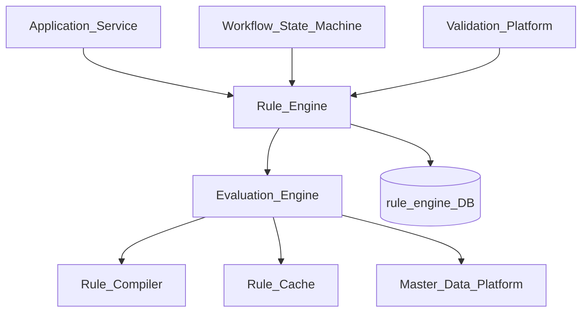
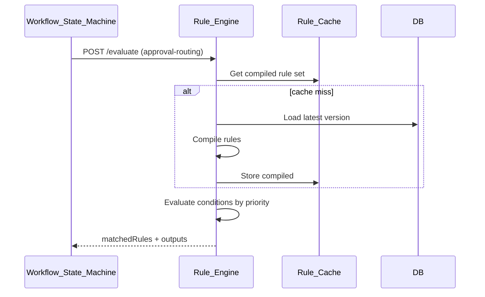
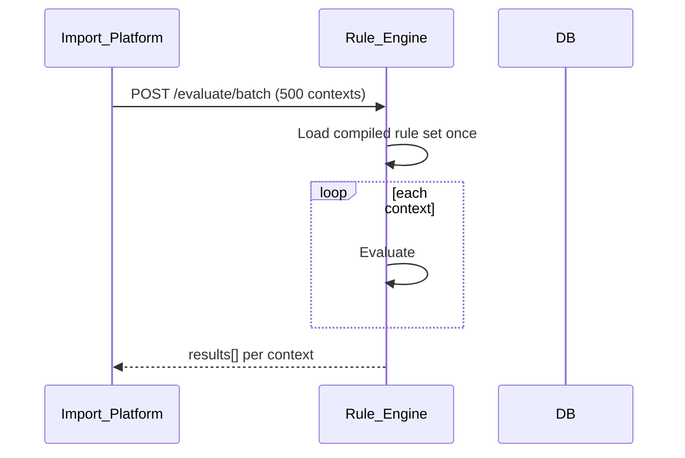

# Rule Engine Evaluation

> **Volume:** 2 | **Chapter ID:** v2-53 | **Status:** reviewed

## Purpose

**Rule Engine Evaluation** is the runtime execution layer within [Rule Engine](20-rule-engine.md) that evaluates business rules against entity context and returns decisions, computed values, or validation outcomes. Rules are declarative — conditions, operators, and actions defined in versioned rule sets — not buried in application `if` statements. Workflow guards, pricing logic, eligibility checks, and approval routing all invoke the evaluation API.

## Architecture



Rules compile to an internal expression tree cached at load time. Evaluation is deterministic and side-effect free unless explicit action rules are configured.

## Responsibilities

### In Scope

- Rule set registration with versioned definitions
- Condition evaluation: comparisons, boolean logic, collection operations
- Expression language: field references, functions, constants
- Context binding — entity data, user attributes, tenant config
- Decision tables — matrix lookup rules
- Rule priority and first-match vs all-match evaluation modes
- Computed output — return derived values (discount %, routing target)
- Validation rules — return pass/fail with messages
- Evaluation trace for debugging (which rules fired)
- Batch evaluation for import and bulk processing

### Out of Scope

- Workflow state transitions ([Workflow State Machine](52-workflow-state-machine.md) invokes rules)
- Input schema validation ([Validation Platform](34-validation-platform.md))
- Rule authoring UI (admin tool or metadata-driven)
- Machine learning models ([AI Services Overview](67-ai-services-overview.md))

## API Design

### Base Path

`/rules/v1`

| Method | Path | Description |
|--------|------|-------------|
| POST | /sets | Register rule set |
| GET | /sets/{setKey} | Get rule set definition |
| GET | /sets/{setKey}/versions | Version history |
| POST | /evaluate | Evaluate rules against context |
| POST | /evaluate/batch | Batch evaluate (up to 100 contexts) |
| POST | /validate-expression | Validate rule syntax without persisting |
| GET | /evaluate/{evalId}/trace | Get evaluation trace (debug) |

### Evaluate Request

```json
{
  "tenantId": "tenant-uuid",
  "ruleSetKey": "entity-approval-routing",
  "version": "latest",
  "evaluationMode": "first_match",
  "context": {
    "entity": {
      "amount": 15000,
      "category": "premium",
      "region": "us-east"
    },
    "user": {
      "role": "manager",
      "organizationId": "org-uuid"
    }
  }
}
```

### Evaluate Response

```json
{
  "evalId": "eval-uuid",
  "matched": true,
  "matchedRules": [
    {
      "ruleId": "route-to-senior-approval",
      "priority": 10,
      "outputs": {
        "approvalLevel": "senior",
        "requiredApprovers": 2,
        "slaHours": 48
      }
    }
  ],
  "evaluatedAt": "2026-08-01T10:00:00Z",
  "durationMs": 3
}
```

### Rule Definition (excerpt)

```json
{
  "ruleId": "route-to-senior-approval",
  "priority": 10,
  "conditions": {
    "and": [
      { "field": "entity.amount", "operator": "gte", "value": 10000 },
      { "field": "entity.category", "operator": "eq", "value": "premium" }
    ]
  },
  "outputs": {
    "approvalLevel": "senior",
    "requiredApprovers": 2,
    "slaHours": 48
  }
}
```

### Supported Operators

`eq`, `ne`, `gt`, `gte`, `lt`, `lte`, `in`, `notIn`, `contains`, `matches`, `isNull`, `isNotNull`, `between`.

Functions: `length()`, `upper()`, `lower()`, `daysBetween()`, `lookup(masterData, key)`.

Follow [API Standards](../Volume-1-Foundation/18-api-standards.md).

## Database Design

| Table | Key Columns | Purpose |
|-------|-------------|---------|
| `rule_sets` | `set_key`, `name`, `description`, `status` | Rule set header |
| `rule_set_versions` | `set_key`, `version`, `rules_json`, `published_at` | Versioned definitions |
| `rule_eval_log` | `eval_id`, `set_key`, `version`, `context_hash`, `result_json` | Optional audit sampling |
| `rule_functions` | `function_name`, `implementation_ref`, `return_type` | Registered functions |
| `rule_decision_tables` | `table_id`, `set_key`, `rows_json`, `input_columns` | Matrix rules |

## Folder Structure

```text
services/rule-engine/
├── domain/
│   └── evaluation/
│       ├── compiler/       # Rule → expression tree
│       ├── executor/       # Tree evaluation
│       ├── decision-table/ # Matrix lookup
│       ├── functions/      # Built-in and custom functions
│       ├── trace/          # Debug trace builder
│       └── cache/          # Compiled rule cache
├── persistence/
└── tests/
```

## Sequence Diagrams

### Single Evaluation



### Batch Evaluation (Import)



## Extension Points

- **Custom functions** — register domain-specific evaluators
- **External data sources** — fetch context from Master Data at evaluation time
- **Rule templates** — parameterized rule patterns for tenant customization
- **A/B rule versions** — percentage traffic split between rule versions

## Integration

- **Part of:** [Rule Engine](20-rule-engine.md)
- **Invoked by:** Workflow State Machine, Validation Platform, applications
- **Depends on:** Master Data Platform, Configuration Service, Cache Platform
- **Events published:** `rule.set.published`, `rule.evaluation.failed` (on syntax errors at runtime)

## Best Practices

1. Keep rules declarative — no imperative code in rule definitions
2. Use `first_match` for routing; `all_match` for validation rule sets
3. Version and publish rule sets — test in staging before production publish
4. Limit context payload to fields rules actually need
5. Enable evaluation trace in non-production for debugging
6. Cache compiled rules; invalidate on `rule.set.published` event

## Anti-Patterns

| Anti-Pattern | Why It Fails | Preferred Approach |
|--------------|--------------|-------------------|
| Business rules in application if-chains | Unchangeable without deploy | Rule Engine evaluate API |
| Mutable rule sets in production | Non-reproducible decisions | Versioned publish workflow |
| Side effects inside conditions | Non-deterministic evaluation | Separate action rules |
| Giant monolithic rule set | Slow evaluation, hard to maintain | Domain-scoped rule sets |
| No evaluation trace in staging | Cannot debug why rule fired | Trace API |

## Related Chapters

- [Previous: Workflow State Machine](52-workflow-state-machine.md)
- [Next: Search Indexing](54-search-indexing.md)
- [Rule Engine](20-rule-engine.md)
- [Validation Platform](34-validation-platform.md)
- [EPB Glossary](../docs/GLOSSARY.md)

---

*Enterprise Platform Blueprint — Volume 2*
