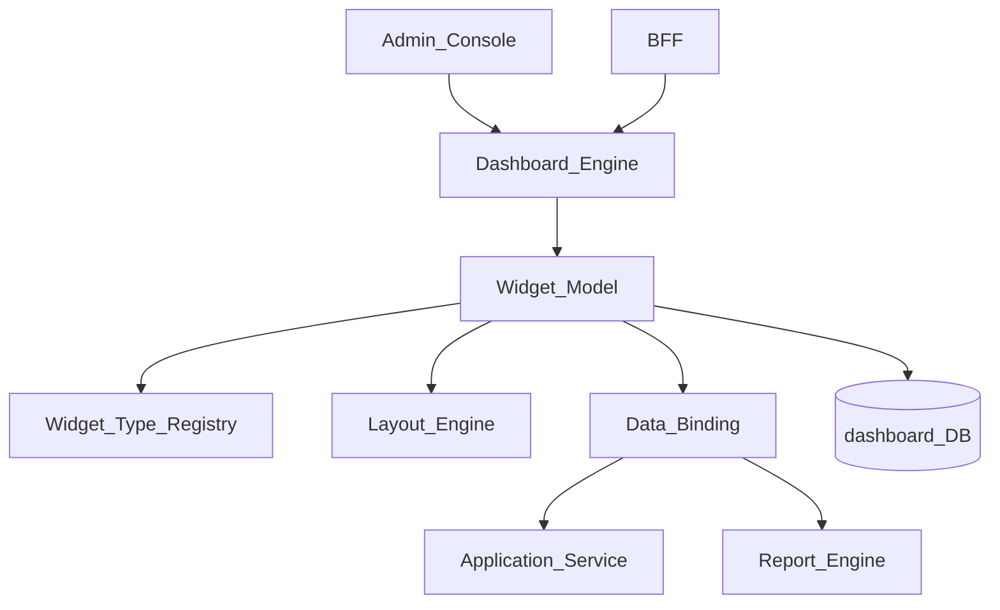
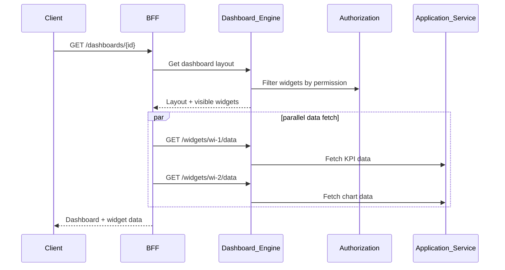
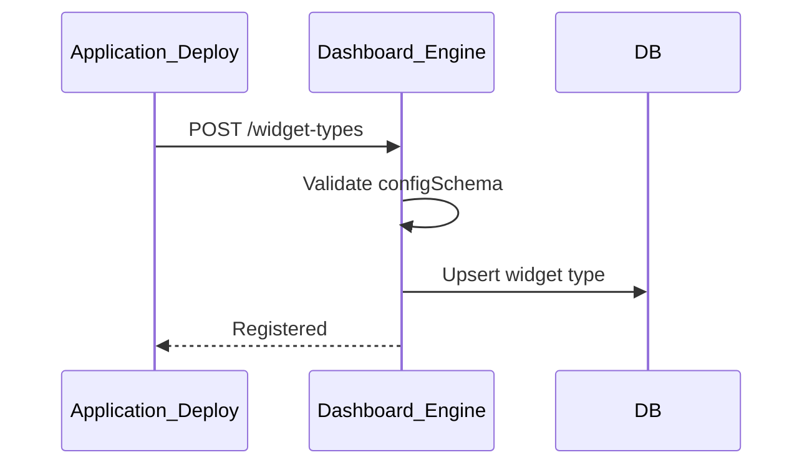

# Dashboard Widget Model

> **Volume:** 2 | **Chapter ID:** v2-55 | **Status:** reviewed

## Purpose

The **Dashboard Widget Model** defines the metadata schema, data binding contracts, and layout structure for dashboard widgets within [Dashboard Engine](22-dashboard-engine.md). Widgets are configurable visual components — charts, KPIs, tables, lists — that bind to data sources and render in tenant-customizable dashboards. Applications register widget types; the model governs how they are composed, positioned, and refreshed.

## Architecture



Widget definitions are JSON documents. Runtime rendering fetches data through registered data source adapters.

## Responsibilities

### In Scope

- Widget type registration: chart, kpi, table, list, map, custom
- Widget instance configuration: title, size, position, refresh interval
- Data source binding: REST endpoint, report query, static value, computed
- Layout model: grid-based (row, column, width, height) and free-form zones
- Widget-level permissions — show only if user has permission
- Parameter binding — dashboard filters passed to widget data sources
- Refresh policies: on-load, interval, on-filter-change, manual
- Widget state: loading, error, empty, ready
- Dashboard composition — ordered widget collection per dashboard
- Tenant and user dashboard variants (shared vs personal)

### Out of Scope

- Chart rendering library (frontend responsibility)
- Report SQL authoring ([Report Engine](23-report-engine.md))
- Real-time streaming data (WebSocket adapter optional)
- Widget marketplace distribution ([Plugin Architecture](71-plugin-architecture.md) for custom types)

## API Design

### Base Path

`/dashboards/v1`

| Method | Path | Description |
|--------|------|-------------|
| GET | /widget-types | List registered widget types |
| POST | /widget-types | Register widget type (application deploy) |
| GET | /dashboards | List dashboards for user/tenant |
| POST | /dashboards | Create dashboard |
| GET | /dashboards/{id} | Get dashboard with widget layout |
| PUT | /dashboards/{id}/layout | Update widget positions |
| POST | /dashboards/{id}/widgets | Add widget instance |
| PATCH | /widgets/{id} | Update widget config |
| DELETE | /widgets/{id} | Remove widget |
| GET | /widgets/{id}/data | Fetch widget data (BFF may aggregate) |

### Widget Type Registration

```json
{
  "widgetTypeKey": "resource-count-kpi",
  "name": "Resource Count KPI",
  "category": "kpi",
  "defaultSize": { "width": 2, "height": 1 },
  "configSchema": {
    "type": "object",
    "properties": {
      "dataSource": { "type": "string" },
      "label": { "type": "string" },
      "format": { "enum": ["number", "currency", "percent"] }
    }
  },
  "dataSourceAdapter": "inventory-service:/analytics/resource-count"
}
```

### Dashboard Layout Document

```json
{
  "dashboardId": "dashboard-uuid",
  "name": "Operations Overview",
  "layout": {
    "gridColumns": 12,
    "widgets": [
      {
        "widgetInstanceId": "wi-1",
        "widgetTypeKey": "resource-count-kpi",
        "position": { "x": 0, "y": 0, "width": 3, "height": 2 },
        "config": {
          "label": "Active Resources",
          "format": "number",
          "dataSource": "resource-count"
        },
        "refreshIntervalSeconds": 300,
        "permissionKey": "inventory.analytics.read"
      },
      {
        "widgetInstanceId": "wi-2",
        "widgetTypeKey": "trend-chart",
        "position": { "x": 3, "y": 0, "width": 9, "height": 4 },
        "config": {
          "chartType": "line",
          "dataSource": "resource-trend",
          "xAxis": "date",
          "yAxis": "count"
        }
      }
    ]
  },
  "filters": [
    { "key": "dateRange", "type": "dateRange", "default": "last30days" },
    { "key": "organizationId", "type": "select", "source": "organizations" }
  ]
}
```

### Widget Data Response

```json
{
  "widgetInstanceId": "wi-1",
  "status": "ready",
  "data": {
    "value": 1247,
    "previousValue": 1180,
    "changePercent": 5.7
  },
  "refreshedAt": "2026-08-01T10:00:00Z"
}
```

Follow [API Standards](../Volume-1-Foundation/18-api-standards.md).

## Database Design

| Table | Key Columns | Purpose |
|-------|-------------|---------|
| `dash_widget_types` | `type_key`, `category`, `config_schema_json`, `adapter_ref` | Type registry |
| `dash_dashboards` | `dashboard_id`, `tenant_id`, `owner_id`, `scope` | Dashboard header |
| `dash_widgets` | `widget_id`, `dashboard_id`, `type_key`, `position_json`, `config_json` | Widget instances |
| `dash_layouts` | `dashboard_id`, `version`, `layout_json` | Layout version history |
| `dash_filters` | `dashboard_id`, `filter_key`, `filter_config_json` | Dashboard-level filters |
| `dash_permissions` | `dashboard_id`, `permission_key` | Access control |

Dashboard scopes: `platform`, `tenant`, `organization`, `user`.

## Folder Structure

```text
services/dashboard-engine/
├── domain/
│   ├── widget-model/
│   │   ├── registry/       # Type registration
│   │   ├── layout/         # Grid position validation
│   │   ├── binding/        # Data source resolution
│   │   └── refresh/        # Refresh scheduler
│   └── render/             # Data fetch orchestration
├── persistence/
└── tests/
```

## Sequence Diagrams

### Dashboard Load



### Widget Type Registration



## Extension Points

- **Custom widget types** — register via Plugin Architecture
- **Data source adapters** — HTTP, report query, event stream
- **Layout templates** — pre-built dashboard layouts per role
- **Widget interactions** — click-through to detail screen with parameter pass

## Integration

- **Part of:** [Dashboard Engine](22-dashboard-engine.md)
- **Depends on:** Authorization, Report Engine, Configuration Service
- **Related:** [Report Template Model](56-report-template-model.md), [Screen Builder](70-screen-builder.md)
- **Events published:** `dashboard.created`, `dashboard.layout.updated`

## Best Practices

1. Register widget types at application deploy with JSON Schema for config validation
2. Enforce permission check on each widget before data fetch
3. Use dashboard-level filters to parameterize all bound widgets
4. Set reasonable refresh intervals — avoid sub-minute polling on heavy queries
5. Version layout changes for rollback capability
6. Return widget `status: error` with message, not fail entire dashboard

## Anti-Patterns

| Anti-Pattern | Why It Fails | Preferred Approach |
|--------------|--------------|-------------------|
| Hardcoded dashboard in frontend | No tenant customization | Widget model + layout API |
| Widget fetches without permission check | Data leak to unauthorized users | permissionKey per widget |
| Unbounded refresh polling | Backend overload | Configurable interval, manual refresh |
| Monolithic dashboard data endpoint | Cannot lazy-load widgets | Per-widget data API |
| No empty state handling | Broken UI on zero data | status: empty in response |

## Related Chapters

- [Previous: Search Indexing](54-search-indexing.md)
- [Next: Report Template Model](56-report-template-model.md)
- [Dashboard Engine](22-dashboard-engine.md)
- [EPB Glossary](../docs/GLOSSARY.md)

---

*Enterprise Platform Blueprint — Volume 2*
