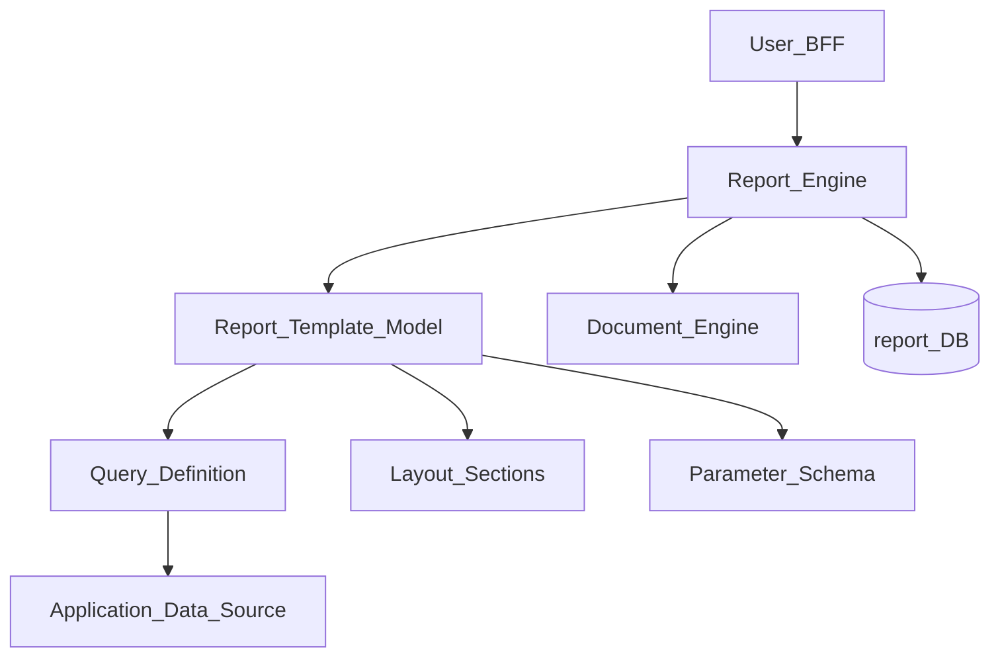
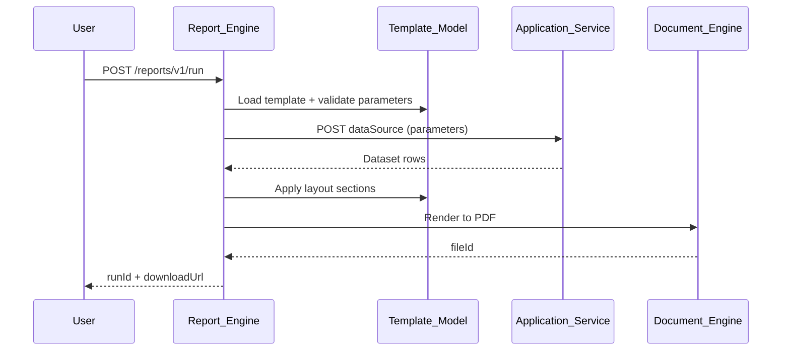
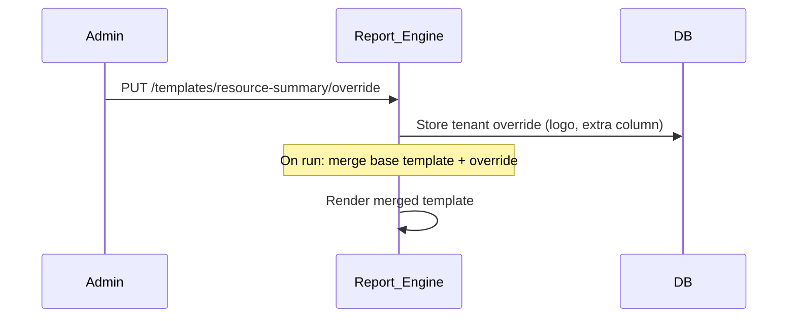

# Report Template Model

> **Volume:** 2 | **Chapter ID:** v2-56 | **Status:** reviewed

## Purpose

The **Report Template Model** defines the structure, parameters, data bindings, and layout sections for reports within [Report Engine](23-report-engine.md). Report templates separate presentation from data retrieval — queries, grouping, sorting, and output formatting are declared in versioned template documents. Applications register templates; users run reports with parameter values without writing SQL or layout code.

## Architecture



Templates support tabular, grouped, chart, and summary report layouts with multiple output formats.

## Responsibilities

### In Scope

- Report template registration with versioned definitions
- Parameter schema: types, defaults, validation, cascading dependencies
- Data source binding: SQL query, API endpoint, stored procedure reference
- Layout sections: header, detail, group header/footer, summary, page footer
- Grouping and sorting configuration
- Calculated fields and aggregations (sum, count, average)
- Sub-report inclusion — nested template reference
- Output format mapping: PDF, XLSX, CSV, HTML
- Template inheritance — base template with tenant overrides
- Scheduled report parameter presets

### Out of Scope

- Ad-hoc query builder UI (may be separate tool)
- Dashboard widgets ([Dashboard Widget Model](55-dashboard-widget-model.md))
- Document merge letters ([Document Template Pipeline](57-document-template-pipeline.md))
- Data warehouse ETL

## API Design

### Base Path

`/reports/v1/templates`

| Method | Path | Description |
|--------|------|-------------|
| GET | / | List report templates |
| POST | / | Register template |
| GET | /{templateKey} | Get template (latest or specific version) |
| PUT | /{templateKey} | Publish new version |
| GET | /{templateKey}/versions | Version history |
| POST | /{templateKey}/validate | Validate template and parameters |
| POST | /{templateKey}/preview | Render preview with sample parameters |
| GET | /{templateKey}/parameters | Parameter schema for UI form |

### Template Definition (excerpt)

```json
{
  "templateKey": "resource-summary",
  "version": 4,
  "name": "Resource Summary Report",
  "category": "operational",
  "parameters": [
    {
      "key": "dateFrom",
      "type": "date",
      "required": true,
      "label": "Start Date"
    },
    {
      "key": "dateTo",
      "type": "date",
      "required": true,
      "label": "End Date"
    },
    {
      "key": "organizationId",
      "type": "lookup",
      "source": "organizations",
      "required": false
    },
    {
      "key": "status",
      "type": "enum",
      "values": ["active", "archived", "all"],
      "default": "active"
    }
  ],
  "dataSource": {
    "type": "api",
    "service": "inventory-service",
    "path": "/internal/v1/reports/resource-summary",
    "method": "POST"
  },
  "layout": {
    "pageSize": "A4",
    "orientation": "landscape",
    "sections": [
      { "type": "header", "template": "report-header" },
      { "type": "detail", "columns": [
        { "field": "code", "header": "Code", "width": 80 },
        { "field": "name", "header": "Name", "width": 200 },
        { "field": "status", "header": "Status", "width": 60 },
        { "field": "createdAt", "header": "Created", "format": "date", "width": 80 }
      ]},
      { "type": "summary", "aggregations": [
        { "field": "id", "function": "count", "label": "Total Resources" }
      ]}
    ]
  },
  "outputFormats": ["pdf", "xlsx", "csv"]
}
```

### Run Report Request

```json
{
  "templateKey": "resource-summary",
  "version": "latest",
  "parameters": {
    "dateFrom": "2026-07-01",
    "dateTo": "2026-07-31",
    "status": "active"
  },
  "outputFormat": "pdf",
  "async": true
}
```

Follow [API Standards](../Volume-1-Foundation/18-api-standards.md).

## Database Design

| Table | Key Columns | Purpose |
|-------|-------------|---------|
| `report_templates` | `template_key`, `name`, `category`, `status` | Template header |
| `report_template_versions` | `template_key`, `version`, `definition_json`, `published_at` | Versioned definitions |
| `report_parameters` | `template_key`, `version`, `param_key`, `param_schema_json` | Parameter definitions |
| `report_layouts` | `template_key`, `version`, `layout_json` | Layout sections |
| `report_template_overrides` | `tenant_id`, `template_key`, `override_json` | Tenant customizations |
| `report_runs` | `run_id`, `template_key`, `parameters_json`, `status`, `file_id` | Execution history |

## Folder Structure

```text
services/report-engine/
├── domain/
│   ├── template-model/
│   │   ├── registry/       # Template CRUD
│   │   ├── parameters/     # Schema validation
│   │   ├── layout/         # Section renderer
│   │   ├── datasource/     # Query/API binding
│   │   └── inheritance/    # Base + override merge
│   └── render/             # Format output
├── persistence/
└── tests/
```

## Sequence Diagrams

### Report Generation



### Tenant Template Override



## Extension Points

- **Custom aggregations** — register calculation functions
- **Conditional sections** — show section based on parameter value
- **Branding packs** — tenant logo, colors, fonts
- **Sub-report plugins** — nested report with independent parameters

## Integration

- **Part of:** [Report Engine](23-report-engine.md)
- **Depends on:** Document Engine, File Management, Scheduler Platform (scheduled reports)
- **Related:** [Dashboard Widget Model](55-dashboard-widget-model.md), [Export Format Handlers](60-export-format-handlers.md)
- **Events published:** `report.run.completed`, `report.run.failed`

## Best Practices

1. Version templates — never mutate published versions in production
2. Validate parameters before data fetch — fail fast on invalid input
3. Use API data sources for tenant-scoped data — not raw cross-tenant SQL
4. Support tenant overrides for branding without forking base template
5. Run large reports async with notification on completion
6. Include parameter schema in API for auto-generated run forms

## Anti-Patterns

| Anti-Pattern | Why It Fails | Preferred Approach |
|--------------|--------------|-------------------|
| SQL embedded in application code | No reuse, no versioning | Report template dataSource |
| Hardcoded report layout in PDF lib | Cannot customize per tenant | Template layout sections |
| Unparameterized reports | SQL injection, wrong data scope | Parameter schema with validation |
| Sync generation of large reports | Timeout | Async run + file download |
| No template versioning | Cannot reproduce historical reports | Versioned definitions |

## Related Chapters

- [Previous: Dashboard Widget Model](55-dashboard-widget-model.md)
- [Next: Document Template Pipeline](57-document-template-pipeline.md)
- [Report Engine](23-report-engine.md)
- [Document Engine](24-document-engine.md)
- [EPB Glossary](../docs/GLOSSARY.md)

---

*Enterprise Platform Blueprint — Volume 2*
