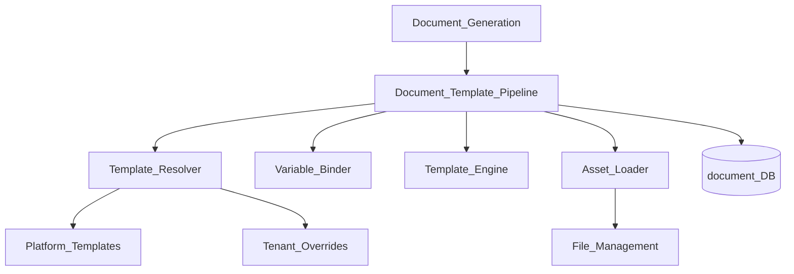
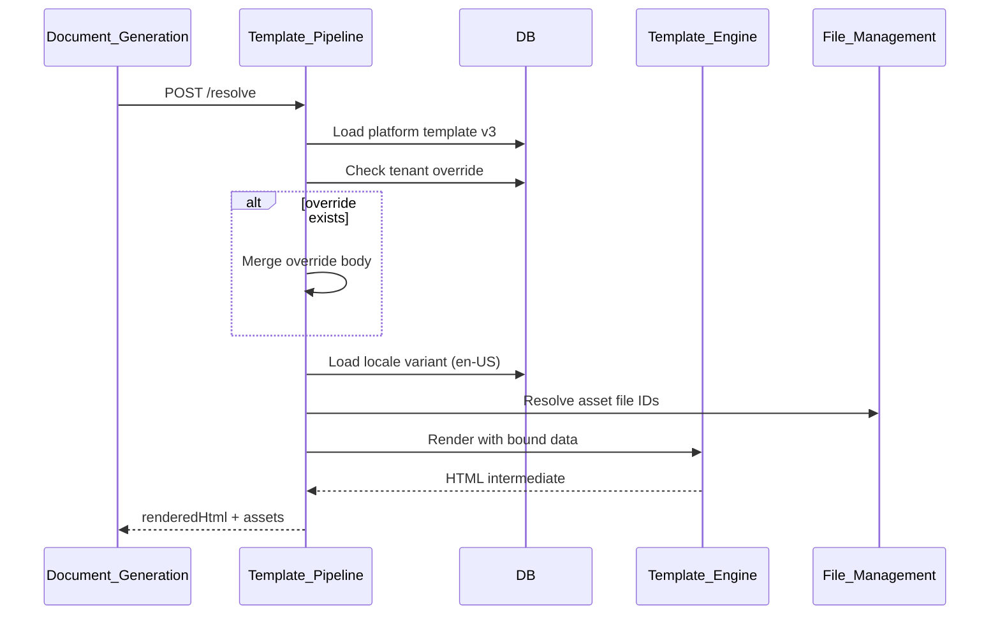
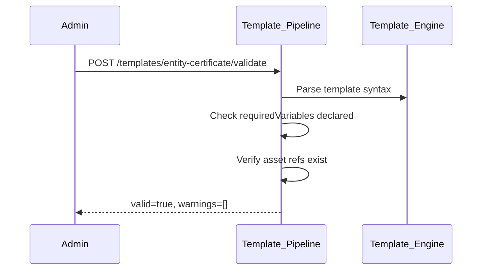

# Document Template Pipeline

> **Volume:** 2 | **Chapter ID:** v2-57 | **Status:** reviewed

## Purpose

The **Document Template Pipeline** orchestrates template resolution, variable binding, asset loading, and intermediate rendering within [Document Engine](24-document-engine.md) and [Document Generation](40-document-generation.md). It implements the resolution chain: platform default → tenant override → runtime data merge → rendered output. Applications reference templates by key; the pipeline handles versioning, locale selection, and missing-variable policy.

## Architecture



```text
Platform Default Template
        ↓
Tenant Override (optional)
        ↓
Locale Variant (optional)
        ↓
Variable Binding
        ↓
Rendered Intermediate (HTML/XML)
```

## Responsibilities

### In Scope

- Template resolution by key, version, and locale
- Override chain: platform → tenant → organization
- Variable binding from structured data payload
- Nested object and collection iteration in templates
- Conditional blocks and partial inclusion
- Asset resolution: images, CSS, fonts from File Management
- Locale-specific template variant selection
- Missing variable policy: fail, empty string, or placeholder
- Template validation before publish
- Preview rendering without persistence

### Out of Scope

- Final PDF/DOCX conversion ([Document Generation](40-document-generation.md))
- Template authoring UI
- Email template rendering ([Template Engine](16-template-engine.md) shares engine)
- Digital signature application

## API Design

### Base Path

`/documents/v1/templates`

| Method | Path | Description |
|--------|------|-------------|
| GET | / | List templates |
| POST | / | Register platform template |
| GET | /{templateKey} | Get resolved template definition |
| PUT | /{templateKey}/override | Set tenant override |
| DELETE | /{templateKey}/override | Remove tenant override |
| POST | /{templateKey}/validate | Validate syntax and variables |
| POST | /{templateKey}/preview | Render preview with sample data |
| POST | /resolve | Resolve template for generation context |

### Resolve Request

```json
{
  "templateKey": "entity-certificate",
  "tenantId": "tenant-uuid",
  "locale": "en-US",
  "version": "latest",
  "data": {
    "entity": {
      "name": "Primary Resource",
      "code": "RES-001",
      "issuedAt": "2026-08-01"
    },
    "organization": {
      "name": "Acme Corp",
      "logoFileId": "file-uuid"
    }
  },
  "options": {
    "missingVariablePolicy": "fail",
    "includeAssets": true
  }
}
```

### Resolve Response

```json
{
  "templateKey": "entity-certificate",
  "resolvedVersion": 3,
  "locale": "en-US",
  "source": "tenant_override",
  "renderedHtml": "<html>...</html>",
  "assets": [
    { "fileId": "file-uuid", "mimeType": "image/png", "resolvedUrl": "..." }
  ],
  "warnings": [],
  "resolvedAt": "2026-08-01T10:00:00Z"
}
```

### Template Definition

```json
{
  "templateKey": "entity-certificate",
  "version": 3,
  "engine": "handlebars",
  "body": "<div class='cert'><h1>{{entity.name}}</h1>...</div>",
  "requiredVariables": ["entity.name", "entity.code", "organization.name"],
  "optionalVariables": ["entity.notes"],
  "assetRefs": ["organization.logoFileId"],
  "locales": ["en-US", "es-MX", "fr-FR"]
}
```

Follow [API Standards](../Volume-1-Foundation/18-api-standards.md).

## Database Design

| Table | Key Columns | Purpose |
|-------|-------------|---------|
| `doc_templates` | `template_key`, `name`, `category`, `engine` | Template header |
| `doc_template_versions` | `template_key`, `version`, `body`, `required_vars_json` | Versioned content |
| `doc_template_overrides` | `tenant_id`, `template_key`, `body`, `version` | Tenant customizations |
| `doc_template_locales` | `template_key`, `version`, `locale`, `body` | Locale variants |
| `doc_template_assets` | `template_key`, `asset_key`, `file_id` | Linked assets |
| `doc_resolve_log` | `template_key`, `tenant_id`, `source`, `resolved_at` | Resolution audit |

## Folder Structure

```text
services/document-engine/
├── pipeline/
│   ├── resolve/        # Override chain resolver
│   ├── bind/           # Variable binding
│   ├── render/         # Template engine invocation
│   ├── assets/         # File Management loader
│   ├── validate/       # Syntax and variable check
│   └── locale/         # Locale variant selector
├── persistence/
└── tests/
```

## Sequence Diagrams

### Template Resolution Chain



### Validation Before Publish



## Extension Points

- **Template engines** — Handlebars, Mustache, custom engine adapter
- **Custom helpers** — register template functions (formatDate, formatCurrency)
- **Pre-processors** — Markdown to HTML, CSS inlining
- **Approval workflow** — template publish requires review (Workflow Engine)

## Integration

- **Invoked by:** [Document Generation](40-document-generation.md), Notification Platform (shared Template Engine)
- **Depends on:** Template Engine, File Management, Localization Platform
- **Events published:** `document.template.published`, `document.template.override.updated`

## Best Practices

1. Declare `requiredVariables` — validate at resolve time with `missingVariablePolicy: fail`
2. Use tenant overrides for branding, not full template forks
3. Store assets in File Management — reference by fileId, not external URLs
4. Version templates; pin version in production document generation jobs
5. Preview with representative sample data before publish
6. Support locale fallback chain: requested → tenant default → platform default

## Anti-Patterns

| Anti-Pattern | Why It Fails | Preferred Approach |
|--------------|--------------|-------------------|
| Templates in application JAR | No tenant override | Document Template Pipeline |
| Hardcoded asset URLs | Broken on CDN change | File Management fileId refs |
| Silent missing variables | Blank certificates in production | fail policy on required vars |
| Full template copy per tenant | Maintenance nightmare | Override diffs only |
| Skipping validation on publish | Runtime render failures | Validate before publish |

## Related Chapters

- [Previous: Report Template Model](56-report-template-model.md)
- [Next: File Upload and Download](58-file-upload-download.md)
- [Document Engine](24-document-engine.md)
- [Document Generation](40-document-generation.md)
- [Template Engine](16-template-engine.md)
- [EPB Glossary](../docs/GLOSSARY.md)

---

*Enterprise Platform Blueprint — Volume 2*
