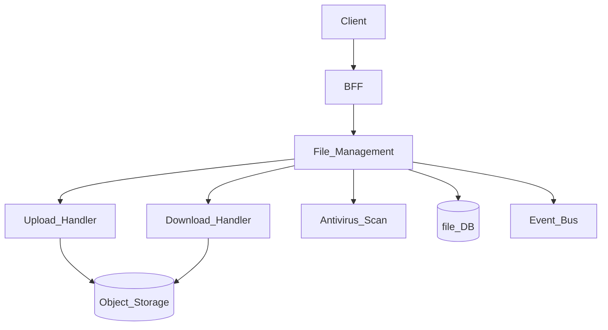
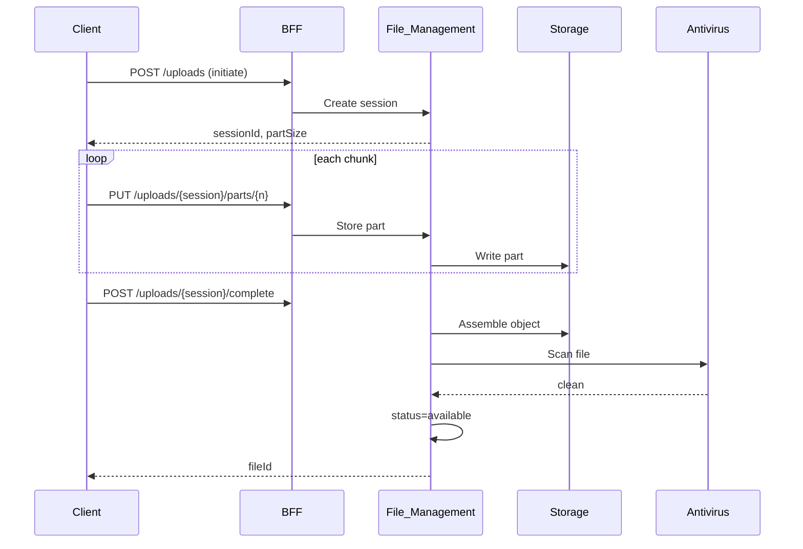
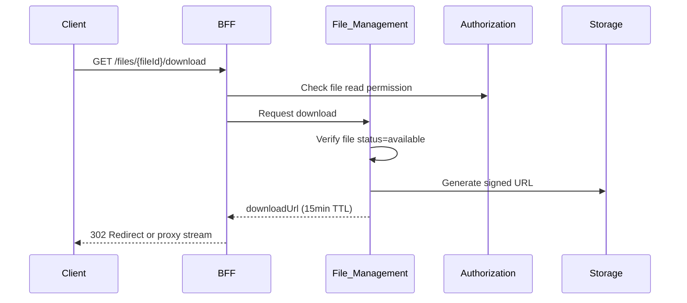

# File Upload and Download

> **Volume:** 2 | **Chapter ID:** v2-58 | **Status:** reviewed

## Purpose

**File Upload and Download** defines the HTTP streaming protocols, chunked transfer, resumable upload, and secure download patterns within [File Management](25-file-management.md). It governs how clients transfer binary content to and from platform storage without exposing storage backend credentials. Applications register file metadata through File Management APIs — they never write directly to S3, blob storage, or filesystem mounts.

## Architecture



Uploads flow: initiate → chunk transfer → complete → scan → available. Downloads flow: authorize → generate signed URL or stream proxy.

## Responsibilities

### In Scope

- Multipart and chunked upload initiation
- Resumable upload with upload session and part tracking
- Direct-to-storage presigned URL upload (optional, for large files)
- Download via signed temporary URL or BFF streaming proxy
- Content-Type and filename validation
- File size limits per tenant and per file category
- Virus/malware scanning before marking file available
- Upload progress reporting
- Range request support for partial downloads and video seeking
- Content-Disposition headers for attachment vs inline display

### Out of Scope

- File metadata CRUD beyond upload/download ([File Management](25-file-management.md))
- Image transformation and thumbnails (optional processing pipeline)
- CDN configuration (infrastructure layer)
- Document template asset management (uses same storage, different API path)

## API Design

### Base Path

`/files/v1`

| Method | Path | Description |
|--------|------|-------------|
| POST | /uploads | Initiate upload session |
| PUT | /uploads/{sessionId}/parts/{partNumber} | Upload chunk |
| POST | /uploads/{sessionId}/complete | Finalize upload |
| DELETE | /uploads/{sessionId} | Abort upload session |
| GET | /uploads/{sessionId}/status | Upload progress |
| GET | /{fileId}/download | Download file (redirect or stream) |
| GET | /{fileId}/download-url | Get signed download URL |
| HEAD | /{fileId} | File metadata without body |

### Initiate Upload

```json
{
  "tenantId": "tenant-uuid",
  "filename": "resource-specification.pdf",
  "contentType": "application/pdf",
  "fileSizeBytes": 5242880,
  "category": "attachment",
  "entityType": "resource",
  "entityId": "entity-uuid",
  "uploadMethod": "chunked"
}
```

Response:

```json
{
  "sessionId": "session-uuid",
  "fileId": "file-uuid",
  "uploadMethod": "chunked",
  "partSizeBytes": 1048576,
  "presignedUrls": null,
  "expiresAt": "2026-08-01T11:00:00Z"
}
```

### Complete Upload

```json
{
  "parts": [
    { "partNumber": 1, "etag": "abc123" },
    { "partNumber": 2, "etag": "def456" }
  ]
}
```

### Download URL Response

```json
{
  "fileId": "file-uuid",
  "downloadUrl": "https://storage.example.com/bucket/key?signature=...",
  "expiresAt": "2026-08-01T10:15:00Z",
  "filename": "resource-specification.pdf",
  "contentType": "application/pdf",
  "contentLength": 5242880
}
```

Signed URLs expire in 15 minutes by default. BFF may proxy stream for additional authorization layer.

Follow [API Standards](../Volume-1-Foundation/18-api-standards.md).

## Database Design

| Table | Key Columns | Purpose |
|-------|-------------|---------|
| `file_records` | `file_id`, `tenant_id`, `filename`, `content_type`, `size_bytes`, `status` | File metadata |
| `file_upload_sessions` | `session_id`, `file_id`, `total_parts`, `completed_parts`, `expires_at` | Active uploads |
| `file_upload_parts` | `session_id`, `part_number`, `etag`, `size_bytes` | Chunk tracking |
| `file_storage_refs` | `file_id`, `bucket`, `object_key`, `storage_class` | Storage location |
| `file_scan_results` | `file_id`, `scanner`, `result`, `scanned_at` | Antivirus results |

File statuses: `uploading`, `scanning`, `available`, `quarantined`, `deleted`.

## Folder Structure

```text
services/file-management/
├── upload/
│   ├── initiate/       # Session creation
│   ├── chunk/          # Part receiver
│   ├── complete/       # Assembly + validation
│   └── presigned/      # Direct-to-storage URLs
├── download/
│   ├── signed-url/     # Temporary URL generator
│   ├── stream/         # Proxy stream handler
│   └── range/          # Partial content support
├── scan/               # Antivirus integration
├── adapters/
│   └── storage/        # S3, Azure Blob, GCS
└── tests/
```

## Sequence Diagrams

### Chunked Upload



### Secure Download



## Extension Points

- **Storage adapters** — S3-compatible, Azure, on-premise
- **Processing pipeline** — thumbnail, PDF preview generation on complete
- **Encryption** — client-side encryption before upload
- **Bandwidth throttling** — per-tenant download rate limits

## Integration

- **Part of:** [File Management](25-file-management.md)
- **Used by:** Document Generation, Import Platform, Notification attachments
- **Depends on:** Authorization, Antivirus service, Configuration Service (size limits)
- **Events published:** `file.upload.completed`, `file.quarantined`, `file.deleted`

## Best Practices

1. Always initiate upload session before transferring bytes
2. Enforce file size and content-type allowlists per category
3. Do not mark file available until antivirus scan passes
4. Use short-lived signed URLs for downloads — never permanent public URLs
5. Support resumable uploads for files over 5MB
6. Set Content-Disposition attachment for user-downloadable files

## Anti-Patterns

| Anti-Pattern | Why It Fails | Preferred Approach |
|--------------|--------------|-------------------|
| Direct storage bucket access from app | Credential exposure | File Management API |
| Permanent public URLs | Unauthorized access if leaked | Signed URL with TTL |
| Skip virus scan | Malware distribution | Scan before available |
| Single-request upload for 100MB files | Timeout, memory pressure | Chunked upload |
| Storing files in database BLOBs | Scale and backup issues | Object storage adapter |

## Related Chapters

- [Previous: Document Template Pipeline](57-document-template-pipeline.md)
- [Next: Import Validation Pipeline](59-import-validation-pipeline.md)
- [File Management](25-file-management.md)
- [EPB Glossary](../docs/GLOSSARY.md)

---

*Enterprise Platform Blueprint — Volume 2*
