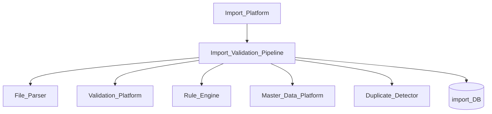
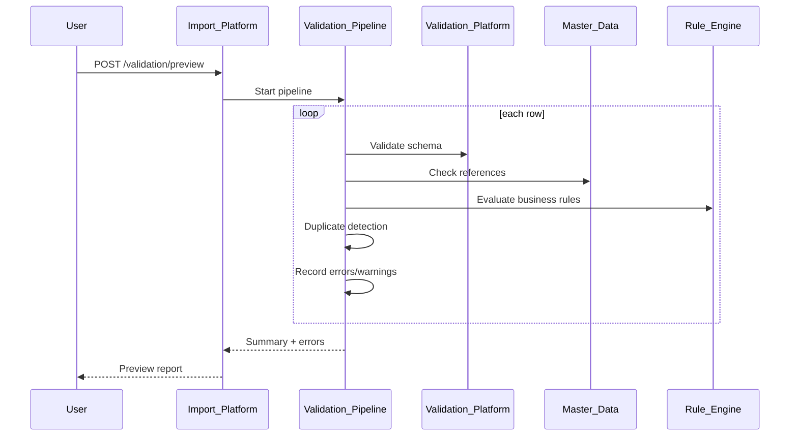
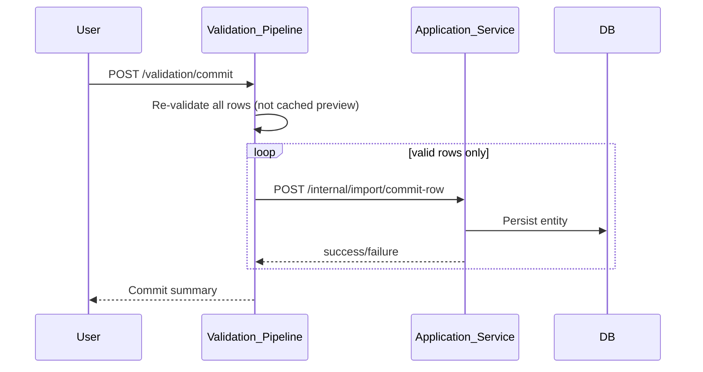

# Import Validation Pipeline

> **Volume:** 2 | **Chapter ID:** v2-59 | **Status:** reviewed

## Purpose

The **Import Validation Pipeline** is the quality gate within [Import Platform](26-import-platform.md) that validates every row of an imported file before persistence. It chains schema validation, business rule evaluation, reference integrity checks, and duplicate detection into a structured error report. Applications define entity import profiles; the pipeline executes validation consistently for preview and commit phases.

## Architecture



Validation runs in two phases: `preview` (report errors, no writes) and `commit` (re-validate + persist valid rows).

## Responsibilities

### In Scope

- Row-level schema validation against entity type
- Cross-field validation rules
- Reference integrity — foreign keys exist in Master Data
- Business rule evaluation via Rule Engine per row
- Duplicate detection: within file and against existing records
- Error aggregation: row number, field, code, message
- Warning vs error severity — warnings allow commit with acknowledgment
- Validation profile selection: strict, standard, lenient
- Batch validation with progress reporting
- Re-validation on commit — preview results are not trusted at commit time

### Out of Scope

- File parsing format handlers ([Import Platform](26-import-platform.md))
- Actual entity persistence (application commit handler)
- Export validation ([Export Format Handlers](60-export-format-handlers.md))
- Real-time streaming import

## API Design

### Base Path

`/import/v1/validation`

| Method | Path | Description |
|--------|------|-------------|
| POST | /preview | Validate file without persisting |
| GET | /preview/{jobId} | Get preview validation results |
| POST | /commit | Re-validate and persist valid rows |
| GET | /commit/{jobId} | Get commit results |
| GET | /jobs/{jobId}/errors | Paginated error list |
| GET | /jobs/{jobId}/errors/export | Download error report CSV |
| POST | /profiles | Register import validation profile |

### Preview Request

```json
{
  "tenantId": "tenant-uuid",
  "importProfileKey": "resource-bulk-import",
  "fileId": "file-uuid",
  "options": {
    "validationProfile": "standard",
    "maxErrorRows": 1000,
    "stopOnFirstError": false
  }
}
```

### Preview Response

```json
{
  "jobId": "job-uuid",
  "status": "completed",
  "summary": {
    "totalRows": 500,
    "validRows": 487,
    "errorRows": 13,
    "warningRows": 5
  },
  "canCommit": true,
  "errors": [
    {
      "row": 42,
      "field": "code",
      "severity": "error",
      "code": "DUPLICATE_IN_FILE",
      "message": "Duplicate code 'RES-042' found in rows 42 and 156."
    },
    {
      "row": 87,
      "field": "categoryId",
      "severity": "error",
      "code": "REFERENCE_NOT_FOUND",
      "message": "Category 'CAT-999' does not exist."
    }
  ]
}
```

### Import Profile Definition

```json
{
  "profileKey": "resource-bulk-import",
  "entityType": "resource",
  "schemaVersion": "2.1",
  "columnMapping": {
    "A": "code",
    "B": "name",
    "C": "categoryId",
    "D": "startDate"
  },
  "rules": ["resource-import-eligibility"],
  "duplicateKeys": ["code"],
  "referenceChecks": [
    { "field": "categoryId", "masterDataType": "category" }
  ]
}
```

Follow [API Standards](../Volume-1-Foundation/18-api-standards.md).

## Database Design

| Table | Key Columns | Purpose |
|-------|-------------|---------|
| `import_validation_jobs` | `job_id`, `profile_key`, `file_id`, `phase`, `status` | Job tracking |
| `import_validation_results` | `job_id`, `row_number`, `severity`, `field`, `error_code` | Per-row errors |
| `import_profiles` | `profile_key`, `entity_type`, `mapping_json`, `rules_json` | Profile definitions |
| `import_row_staging` | `job_id`, `row_number`, `parsed_json`, `validation_status` | Parsed row cache |
| `import_commit_log` | `job_id`, `committed_rows`, `failed_rows`, `committed_at` | Commit audit |

Job phases: `preview`, `commit`. Statuses: `pending`, `validating`, `completed`, `failed`.

## Folder Structure

```text
services/import-platform/
├── validation/
│   ├── pipeline/       # Orchestration
│   ├── schema/         # Validation Platform adapter
│   ├── rules/          # Rule Engine adapter
│   ├── references/     # Master Data lookups
│   ├── duplicates/     # In-file and DB duplicate check
│   └── reporting/      # Error aggregation
├── persistence/
└── tests/
```

## Sequence Diagrams

### Preview Validation



### Commit with Re-validation



## Extension Points

- **Custom validators** — register per-profile validation hooks
- **Transformation rules** — normalize data before validation
- **Error auto-fix suggestions** — suggest corrected values
- **Partial commit** — commit valid rows when errors exist (with acknowledgment)

## Integration

- **Part of:** [Import Platform](26-import-platform.md)
- **Depends on:** Validation Platform, Rule Engine, Master Data Platform, File Management
- **Events published:** `import.validation.completed`, `import.commit.completed`
- **Related:** [Export Format Handlers](60-export-format-handlers.md)

## Best Practices

1. Always re-validate on commit — data may have changed since preview
2. Return row numbers matching source file (1-based, including header offset)
3. Cap `maxErrorRows` in response — paginate full error export separately
4. Use validation profiles for import vs API strictness differences
5. Batch Master Data lookups — avoid per-row N+1 queries
6. Stage parsed rows to avoid re-parsing file on commit

## Anti-Patterns

| Anti-Pattern | Why It Fails | Preferred Approach |
|--------------|--------------|-------------------|
| Commit without re-validation | Stale preview, race conditions | Commit-phase validation |
| Skipping duplicate check | Data corruption | duplicateKeys in profile |
| Per-row synchronous MD API calls | Import timeout | Batch reference lookup |
| Silent warning rows | User unaware of data issues | Explicit warning severity |
| No error export | User cannot fix offline | CSV error report download |

## Related Chapters

- [Previous: File Upload and Download](58-file-upload-download.md)
- [Next: Export Format Handlers](60-export-format-handlers.md)
- [Import Platform](26-import-platform.md)
- [Validation Platform](34-validation-platform.md)
- [EPB Glossary](../docs/GLOSSARY.md)

---

*Enterprise Platform Blueprint — Volume 2*
