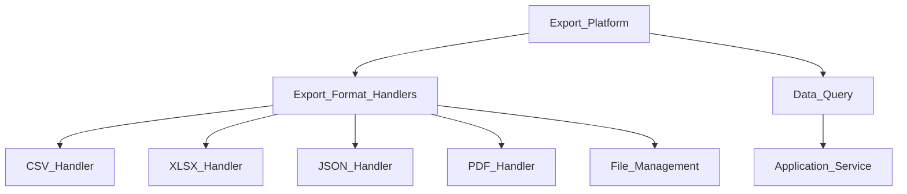
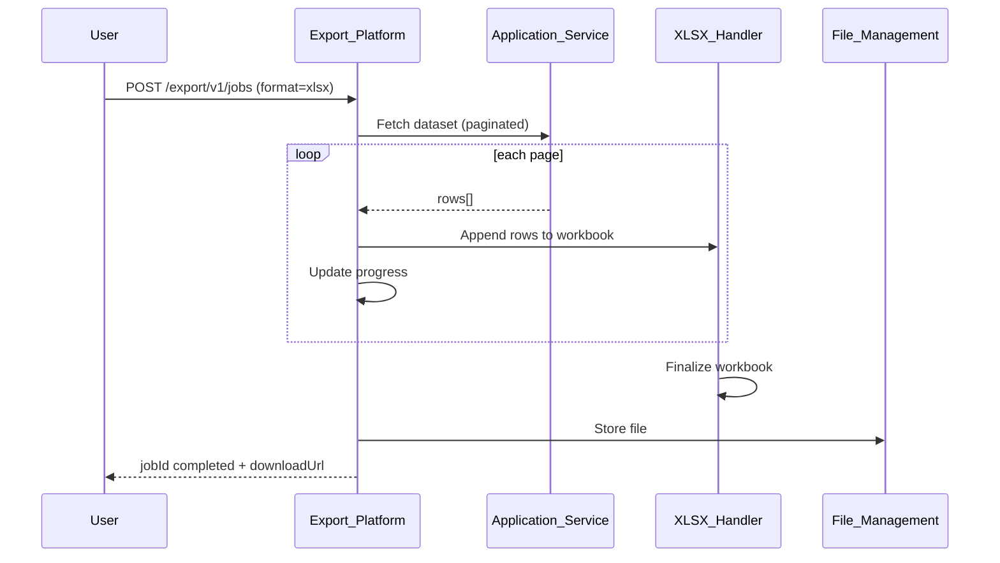
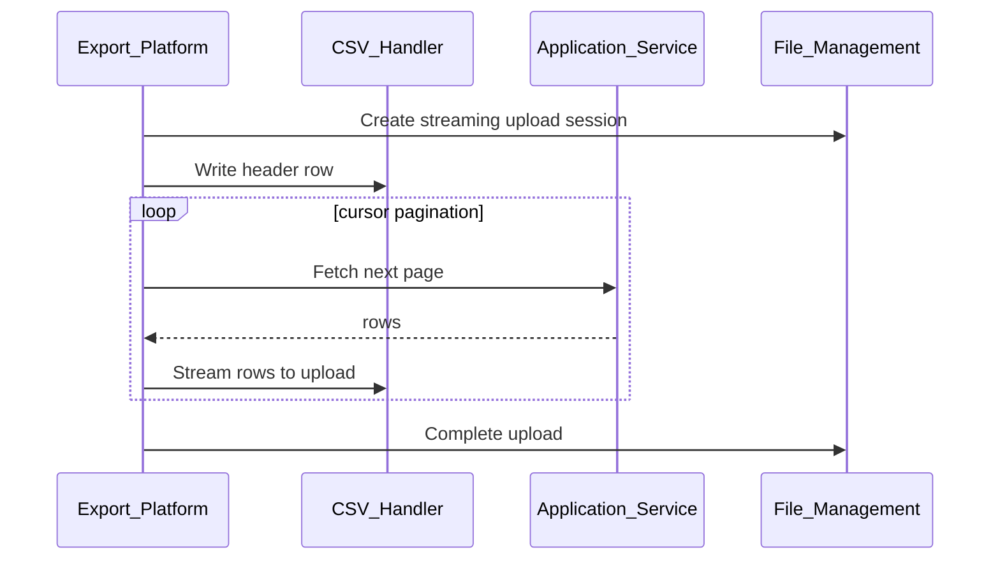

# Export Format Handlers

> **Volume:** 2 | **Chapter ID:** v2-60 | **Status:** reviewed

## Purpose

**Export Format Handlers** are the output adapters within [Export Platform](27-export-platform.md) that transform query result datasets into downloadable files — CSV, XLSX, JSON, XML, PDF. Each handler implements format-specific serialization, encoding, column mapping, and streaming for large datasets. Applications define export profiles; handlers produce files stored via File Management.

## Architecture



Handlers stream output to avoid loading entire datasets in memory. Large exports run asynchronously via Queue Platform.

## Responsibilities

### In Scope

- CSV: delimiter, quoting, encoding (UTF-8 with BOM option), header row
- XLSX: multiple sheets, column widths, number/date formatting, formulas disabled
- JSON: array of objects, NDJSON streaming variant
- XML: schema-compliant element structure
- PDF: tabular layout via Document Generation integration
- Column selection and ordering from export profile
- Header label localization via Localization Platform
- Streaming write for datasets exceeding memory threshold
- Progress reporting for async exports
- Format-specific options per export profile

### Out of Scope

- Data query execution ([Export Platform](27-export-platform.md))
- Import parsing ([Import Validation Pipeline](59-import-validation-pipeline.md))
- Report template layout ([Report Template Model](56-report-template-model.md))
- Real-time data streaming export

## API Design

Export format handlers are invoked internally. External API is through Export Platform.

### Export Platform API

| Method | Path | Description |
|--------|------|-------------|
| POST | /export/v1/jobs | Start export job |
| GET | /export/v1/jobs/{jobId} | Job status |
| GET | /export/v1/jobs/{jobId}/download | Download completed file |
| GET | /export/v1/formats | List supported formats |
| POST | /export/v1/profiles | Register export profile |

### Start Export Request

```json
{
  "tenantId": "tenant-uuid",
  "profileKey": "resource-export",
  "format": "xlsx",
  "parameters": {
    "status": "active",
    "dateFrom": "2026-01-01"
  },
  "options": {
    "locale": "en-US",
    "includeHeaders": true,
    "columns": ["code", "name", "status", "createdAt"],
    "async": true
  }
}
```

### Export Profile Definition

```json
{
  "profileKey": "resource-export",
  "entityType": "resource",
  "dataSource": {
    "type": "api",
    "service": "inventory-service",
    "path": "/internal/v1/export/resources"
  },
  "columns": [
    { "field": "code", "headerKey": "resource.code", "width": 15 },
    { "field": "name", "headerKey": "resource.name", "width": 30 },
    { "field": "status", "headerKey": "resource.status", "width": 10 },
    { "field": "createdAt", "headerKey": "resource.createdAt", "format": "date", "width": 12 }
  ],
  "supportedFormats": ["csv", "xlsx", "json"]
}
```

### Format-Specific Options

| Format | Options |
|--------|---------|
| CSV | `delimiter`, `quoteChar`, `encoding`, `includeBom` |
| XLSX | `sheetName`, `freezeHeader`, `autoFilter` |
| JSON | `pretty`, `ndjson` |
| PDF | `pageSize`, `orientation`, `templateKey` |

Follow [API Standards](../Volume-1-Foundation/18-api-standards.md).

## Database Design

| Table | Key Columns | Purpose |
|-------|-------------|---------|
| `export_profiles` | `profile_key`, `entity_type`, `datasource_json`, `columns_json` | Profile definitions |
| `export_jobs` | `job_id`, `profile_key`, `format`, `status`, `file_id` | Job tracking |
| `export_job_progress` | `job_id`, `rows_processed`, `total_rows`, `percent` | Progress |
| `export_format_config` | `format`, `default_options_json` | Format defaults |

Job statuses: `pending`, `querying`, `formatting`, `completed`, `failed`.

## Folder Structure

```text
services/export-platform/
├── handlers/
│   ├── csv/
│   ├── xlsx/
│   ├── json/
│   ├── xml/
│   ├── pdf/
│   └── base/           # Streaming writer interface
├── orchestrator/
├── persistence/
└── tests/
```

## Sequence Diagrams

### Async XLSX Export



### Streaming CSV Export



## Extension Points

- **Custom format handlers** — register via Plugin Architecture
- **Column transformers** — mask PII, format currency per locale
- **Compression** — gzip wrapper for CSV/JSON
- **Split files** — multiple files when row count exceeds limit

## Integration

- **Part of:** [Export Platform](27-export-platform.md)
- **Depends on:** File Management, Localization Platform, Queue Platform, Document Generation (PDF)
- **Events published:** `export.job.completed`, `export.job.failed`
- **Related:** [Import Validation Pipeline](59-import-validation-pipeline.md)

## Best Practices

1. Stream large exports — never buffer entire dataset in memory
2. Localize column headers via `headerKey` + Localization Platform
3. Use async jobs for exports over 10,000 rows
4. Apply column selection to reduce file size and PII exposure
5. Include UTF-8 BOM option for CSV Excel compatibility
6. Report progress percentage for long-running exports

## Anti-Patterns

| Anti-Pattern | Why It Fails | Preferred Approach |
|--------------|--------------|-------------------|
| In-memory export of 1M rows | OOM crash | Streaming handler |
| Hardcoded column headers | No localization | headerKey references |
| Sync export of large datasets | Gateway timeout | Async job + download |
| Exporting all columns by default | PII leakage | Explicit column list |
| Custom CSV per application | Inconsistent format | Export profile + handlers |

## Related Chapters

- [Previous: Import Validation Pipeline](59-import-validation-pipeline.md)
- [Next: Queue Dead Letter Handling](61-queue-dead-letter-handling.md)
- [Export Platform](27-export-platform.md)
- [File Upload and Download](58-file-upload-download.md)
- [EPB Glossary](../docs/GLOSSARY.md)

---

*Enterprise Platform Blueprint — Volume 2*
