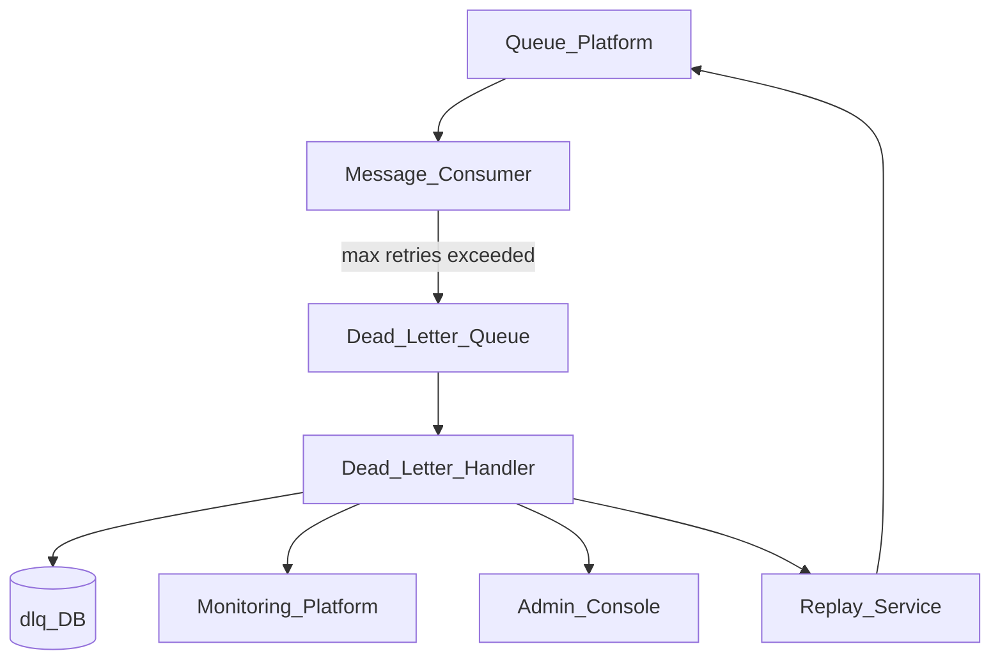
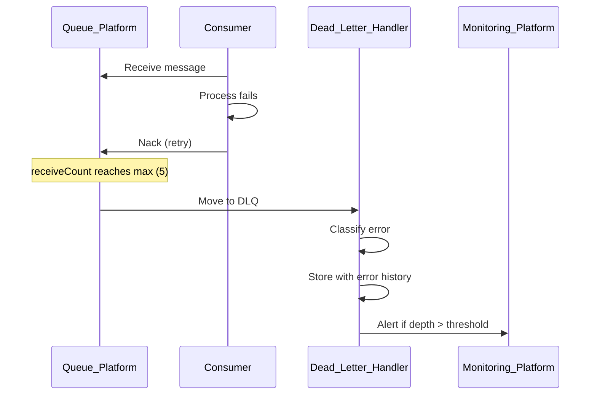
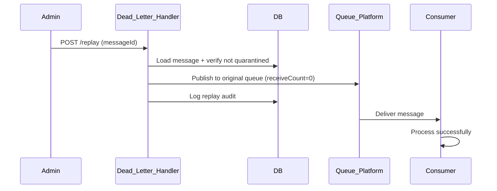

# Queue Dead Letter Handling

> **Volume:** 2 | **Chapter ID:** v2-61 | **Status:** reviewed

## Purpose

**Queue Dead Letter Handling** manages messages that exhaust retry attempts within [Queue Platform](28-queue-platform.md). Failed messages move to a dead-letter queue (DLQ) with full context preservation, alerting, manual inspection, replay, and purge capabilities. Without DLQ discipline, failed async work disappears silently — dead letter handling ensures every permanent failure is visible and recoverable.

## Architecture



Each primary queue has a paired DLQ. Message movement is automatic on retry exhaustion.

## Responsibilities

### In Scope

- Automatic routing to DLQ after configurable max receive count
- Dead letter message preservation: original payload, headers, error history
- DLQ inspection API for operators
- Manual replay to original queue or alternate queue
- Bulk replay with filtering (by error code, date range, source)
- Purge with retention policy and audit
- Alert emission on DLQ depth threshold
- Poison message identification and quarantine
- DLQ metrics: depth, age, error category distribution
- Integration with Scheduler retry exhausted runs

### Out of Scope

- Primary queue message processing (consumer responsibility)
- Retry backoff configuration ([Scheduler Retry Processing](48-scheduler-retry-processing.md))
- Message schema validation ([Event Bus Schema Registry](63-event-bus-schema-registry.md))
- Business compensation logic on replay

## API Design

### Base Path

`/queues/v1/dead-letter`

| Method | Path | Description |
|--------|------|-------------|
| GET | /queues | List DLQs with depth metrics |
| GET | /{dlqName}/messages | List dead letter messages (paginated) |
| GET | /{dlqName}/messages/{messageId} | Get message detail and error history |
| POST | /{dlqName}/messages/{messageId}/replay | Replay single message |
| POST | /{dlqName}/replay | Bulk replay with filter |
| DELETE | /{dlqName}/messages/{messageId} | Purge single message |
| DELETE | /{dlqName}/purge | Purge messages older than retention |
| GET | /{dlqName}/metrics | DLQ depth, age, error distribution |

### Dead Letter Message Detail

```json
{
  "messageId": "msg-uuid",
  "originalQueue": "entity-processing",
  "dlqName": "entity-processing-dlq",
  "payload": { "entityId": "uuid", "action": "sync" },
  "headers": {
    "correlationId": "corr-uuid",
    "tenantId": "tenant-uuid",
    "receiveCount": 5
  },
  "errorHistory": [
    { "attempt": 1, "error": "Connection timeout", "at": "2026-08-01T09:00:00Z" },
    { "attempt": 5, "error": "Validation failed: invalid status", "at": "2026-08-01T09:15:00Z" }
  ],
  "deadLetteredAt": "2026-08-01T09:15:30Z",
  "classification": "non_retryable"
}
```

### Bulk Replay Request

```json
{
  "filter": {
    "errorClassification": "transient",
    "deadLetteredAfter": "2026-08-01T00:00:00Z",
    "maxMessages": 100
  },
  "targetQueue": "entity-processing",
  "resetReceiveCount": true
}
```

### Error Classifications

| Classification | Typical Cause | Replay Strategy |
|----------------|---------------|-----------------|
| `transient` | Network, timeout, 503 | Safe to replay |
| `non_retryable` | Validation, 400, schema | Fix payload before replay |
| `poison` | Repeated crash on same message | Quarantine, manual review |

Follow [API Standards](../Volume-1-Foundation/18-api-standards.md).

## Database Design

| Table | Key Columns | Purpose |
|-------|-------------|---------|
| `dlq_messages` | `message_id`, `dlq_name`, `original_queue`, `payload_json`, `dead_lettered_at` | DLQ storage |
| `dlq_error_history` | `message_id`, `attempt`, `error_message`, `occurred_at` | Retry log |
| `dlq_replay_log` | `message_id`, `replayed_at`, `replayed_by`, `target_queue`, `result` | Replay audit |
| `dlq_config` | `queue_name`, `max_receive_count`, `dlq_name`, `alert_threshold` | Queue-DLQ pairing |
| `dlq_quarantine` | `message_id`, `reason`, `quarantined_at` | Poison messages |

Indexes: `(dlq_name, dead_lettered_at DESC)` for listing; `(classification)` for filtered replay.

## Folder Structure

```text
services/queue-platform/
├── dead-letter/
│   ├── router/         # Move to DLQ on exhaustion
│   ├── inspector/      # Message detail API
│   ├── replay/         # Single and bulk replay
│   ├── purge/          # Retention cleanup
│   ├── classify/       # Error categorization
│   └── alert/          # Monitoring integration
├── persistence/
└── tests/
```

## Sequence Diagrams

### Message Dead Lettering



### Manual Replay



## Extension Points

- **Custom classifiers** — application-specific error categorization
- **Replay transformers** — modify payload before replay
- **Escalation rules** — notify on-call after N messages in DLQ
- **Auto-replay** — scheduled replay of transient failures only

## Integration

- **Part of:** [Queue Platform](28-queue-platform.md)
- **Works with:** [Scheduler Retry Processing](48-scheduler-retry-processing.md)
- **Depends on:** Monitoring Platform, Audit Platform
- **Events published:** `queue.message.dead_lettered`, `queue.dlq.replayed`, `queue.dlq.threshold_exceeded`

## Best Practices

1. Every primary queue must have a paired DLQ configured
2. Alert when DLQ depth exceeds threshold — do not wait for user reports
3. Classify errors at dead-letter time for replay guidance
4. Quarantine poison messages after N failed replays
5. Audit every replay and purge operation
6. Set retention policy — purge DLQ messages after 30-90 days

## Anti-Patterns

| Anti-Pattern | Why It Fails | Preferred Approach |
|--------------|--------------|-------------------|
| No DLQ configured | Lost failed messages | Paired DLQ per queue |
| Infinite replay of poison messages | Consumer crash loop | Quarantine after N replays |
| DLQ without monitoring | Silent failure accumulation | Depth threshold alerts |
| Replay without reset receive count | Immediate re-dead-letter | resetReceiveCount: true |
| Purging without audit | Compliance gap | Replay/purge audit log |

## Related Chapters

- [Previous: Export Format Handlers](60-export-format-handlers.md)
- [Next: Cache Invalidation Strategy](62-cache-invalidation-strategy.md)
- [Queue Platform](28-queue-platform.md)
- [Scheduler Retry Processing](48-scheduler-retry-processing.md)
- [EPB Glossary](../docs/GLOSSARY.md)

---

*Enterprise Platform Blueprint — Volume 2*
