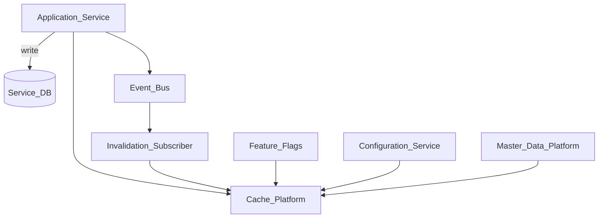
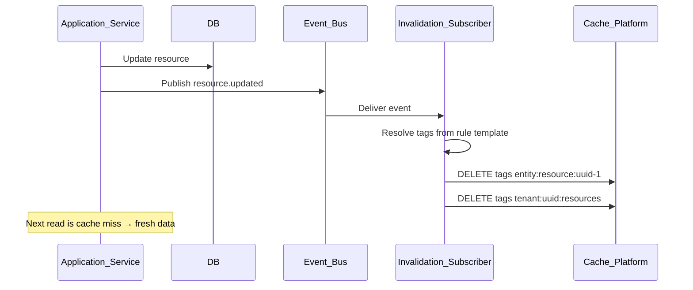
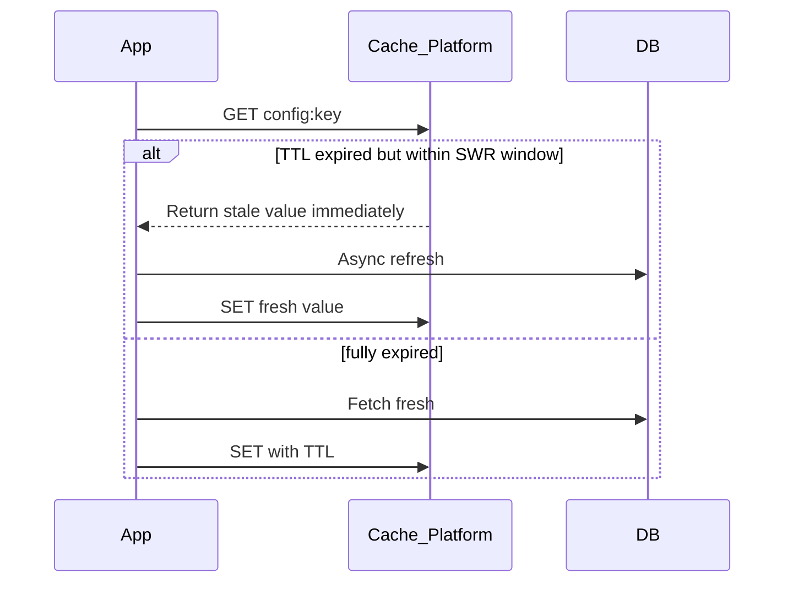

# Cache Invalidation Strategy

> **Volume:** 2 | **Chapter ID:** v2-62 | **Status:** reviewed

## Purpose

**Cache Invalidation Strategy** defines how [Cache Platform](29-cache-platform.md) entries are invalidated consistently across EPB services when underlying data changes. It implements tag-based invalidation, event-driven purge, TTL policies, and cache-aside patterns so applications benefit from caching without serving stale data. Every service that caches platform data must follow these strategies — ad-hoc key deletion leads to inconsistent reads.

## Architecture



Invalidation propagates through Event Bus subscriptions and explicit tag purge API calls.

## Responsibilities

### In Scope

- Tag-based cache grouping — invalidate all keys with tag `tenant:uuid:resources`
- Event-driven invalidation — subscribe to domain events, purge matching tags
- TTL policies per cache namespace: short (30s), medium (5m), long (1h)
- Cache-aside pattern implementation guidance
- Write-through vs write-behind invalidation triggers
- Stale-while-revalidate for non-critical reads
- Version-based invalidation — cache key includes entity version
- Bulk invalidation on tenant config change
- Invalidation audit log for debugging stale data reports
- Local in-process cache coordination with distributed cache

### Out of Scope

- Cache storage implementation ([Cache Platform](29-cache-platform.md))
- CDN edge cache invalidation (infrastructure layer)
- Database query cache
- Session token cache ([Authentication](02-authentication.md) owns token cache policy)

## API Design

### Cache Platform Invalidation API

| Method | Path | Description |
|--------|------|-------------|
| DELETE | /cache/v1/keys/{key} | Delete single key |
| DELETE | /cache/v1/tags/{tag} | Invalidate all keys with tag |
| DELETE | /cache/v1/tags | Bulk tag invalidation |
| POST | /cache/v1/purge/tenant/{tenantId} | Purge all tenant-scoped cache |
| GET | /cache/v1/tags/{tag}/keys | List keys in tag (debug, non-prod) |

### Tag Invalidation Request

```json
{
  "tags": [
    "tenant:tenant-uuid:resources",
    "entity:resource:uuid-1",
    "config:integration"
  ],
  "reason": "resource.updated event",
  "correlationId": "corr-uuid"
}
```

### Cache Entry with Tags (set pattern)

```json
{
  "key": "resource:uuid-1:detail",
  "value": { "id": "uuid-1", "name": "Primary Resource" },
  "ttlSeconds": 300,
  "tags": [
    "tenant:tenant-uuid:resources",
    "entity:resource:uuid-1"
  ]
}
```

### Event-to-Tag Mapping Registration

```json
{
  "eventType": "resource.updated",
  "invalidationTags": [
    "entity:resource:{{entityId}}",
    "tenant:{{tenantId}}:resources",
    "search:resource-index"
  ]
}
```

### TTL Policy Registry

| Namespace | Default TTL | Stale-While-Revalidate |
|-----------|-------------|------------------------|
| `config` | 60s | 30s |
| `feature-flags` | 30s | 15s |
| `master-data` | 300s | 60s |
| `entity-detail` | 120s | none |
| `list-query` | 60s | none |

Follow [API Standards](../Volume-1-Foundation/18-api-standards.md).

## Database Design

Invalidation strategy configuration is persisted; cache data itself is in Cache Platform (Redis, etc.).

| Table | Key Columns | Purpose |
|-------|-------------|---------|
| `cache_invalidation_rules` | `event_type`, `tags_template_json`, `service` | Event→tag mapping |
| `cache_ttl_policies` | `namespace`, `ttl_seconds`, `swr_seconds` | TTL registry |
| `cache_invalidation_log` | `tags`, `reason`, `keys_affected`, `invalidated_at` | Debug audit |
| `cache_tag_registry` | `tag`, `key_count`, `last_invalidated_at` | Tag metadata |

## Folder Structure

```text
libs/cache-invalidation/
├── tags/               # Tag naming conventions
├── subscriber/         # Event Bus invalidation handler
├── policies/           # TTL policy resolver
└── patterns/           # Cache-aside, SWR helpers

services/cache-platform/
├── invalidation/
│   ├── tag-purge/
│   ├── bulk/
│   └── audit/
└── tests/
```

## Sequence Diagrams

### Event-Driven Invalidation



### Stale-While-Revalidate



## Extension Points

- **Custom tag templates** — per-application event mapping
- **Selective invalidation** — invalidate only changed fields' dependent keys
- **Cascade rules** — resource update invalidates related dashboard widget cache
- **Warm cache** — pre-populate after invalidation for hot keys

## Integration

- **Part of:** [Cache Platform](29-cache-platform.md)
- **Used by:** Feature Flags, Configuration Service, Master Data, all caching services
- **Depends on:** Event Bus
- **Events consumed:** All domain `*.updated`, `*.deleted`, `config.updated`, `tenant.provisioned`

## Best Practices

1. Always tag cache entries at write time — untagged keys cannot be bulk-invalidated
2. Use hierarchical tags: `tenant:{id}:{entity-type}`, `entity:{type}:{id}`
3. Subscribe to domain events for invalidation — do not rely on TTL alone for mutable data
4. Include entity version in cache key when optimistic locking is used
5. Log invalidation with correlationId for stale-data debugging
6. Never cache authorization decisions beyond request scope

## Anti-Patterns

| Anti-Pattern | Why It Fails | Preferred Approach |
|--------------|--------------|-------------------|
| TTL-only invalidation | Stale data until expiry | Event-driven tag purge |
| Untagged cache entries | Cannot invalidate on update | Tag at set time |
| Global cache flush | Thundering herd on all services | Targeted tag invalidation |
| Caching per-user permissions long-term | Stale after role change | Short TTL + role.assigned event |
| Invalidating before DB commit | Cache miss returns old data | Invalidate after commit |

## Related Chapters

- [Previous: Queue Dead Letter Handling](61-queue-dead-letter-handling.md)
- [Next: Event Bus Schema Registry](63-event-bus-schema-registry.md)
- [Cache Platform](29-cache-platform.md)
- [Event Bus](30-event-bus.md)
- [EPB Glossary](../docs/GLOSSARY.md)

---

*Enterprise Platform Blueprint — Volume 2*
