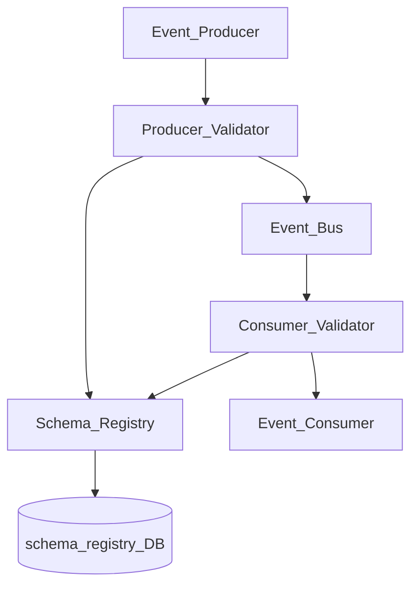
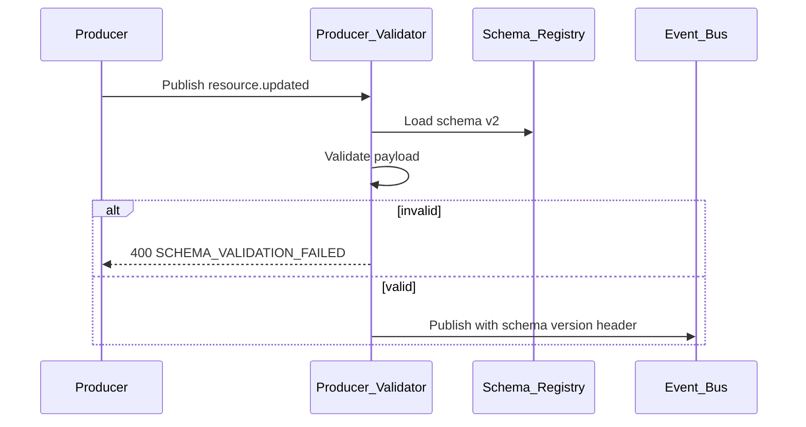
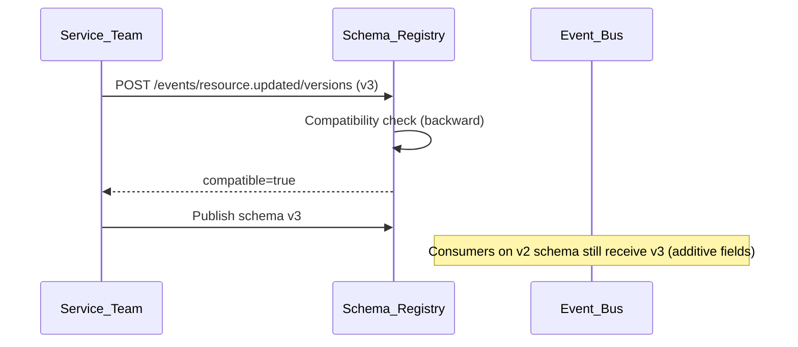

# Event Bus Schema Registry

> **Volume:** 2 | **Chapter ID:** v2-63 | **Status:** reviewed

## Purpose

The **Event Bus Schema Registry** governs event contract definitions within [Event Bus](30-event-bus.md). Every published event has a registered JSON Schema describing payload structure, required fields, and versioning rules. Producers validate before publish; consumers validate on receive — preventing schema drift, breaking changes, and silent deserialization failures across EPB services.

## Architecture



Schema registry is the contract authority. Event Bus enforces compatibility rules on schema evolution.

## Responsibilities

### In Scope

- Event type registration with JSON Schema payload definition
- Schema versioning: major (breaking), minor (backward compatible)
- Compatibility modes: backward, forward, full, none
- Producer-side validation before publish
- Consumer-side validation on receive (configurable strict/lenient)
- Schema evolution rules — additive fields allowed in minor versions
- Event catalog API for documentation and code generation
- Deprecation lifecycle for event types
- Dead-letter on schema validation failure (optional strict mode)
- Sample payload generation for testing

### Out of Scope

- Message transport and routing ([Event Bus](30-event-bus.md))
- Event sourcing and replay storage
- Business event semantics (application defines meaning)
- AsyncAPI documentation generation (optional export)

## API Design

### Base Path

`/event-schemas/v1`

| Method | Path | Description |
|--------|------|-------------|
| GET | /events | List registered event types |
| POST | /events | Register new event type |
| GET | /events/{eventType} | Get latest schema |
| GET | /events/{eventType}/versions | Version history |
| POST | /events/{eventType}/versions | Publish new schema version |
| POST | /validate | Validate payload against schema |
| POST | /compatibility-check | Check new schema against existing |
| GET | /events/{eventType}/sample | Generate sample payload |

### Register Event Type

```json
{
  "eventType": "resource.updated",
  "description": "Published when a resource is created or updated",
  "owner": "inventory-service",
  "compatibilityMode": "backward",
  "schema": {
    "$schema": "https://json-schema.org/draft/2020-12/schema",
    "type": "object",
    "required": ["tenantId", "entityId", "updatedAt"],
    "properties": {
      "tenantId": { "type": "string", "format": "uuid" },
      "entityId": { "type": "string", "format": "uuid" },
      "updatedAt": { "type": "string", "format": "date-time" },
      "changedFields": {
        "type": "array",
        "items": { "type": "string" }
      },
      "correlationId": { "type": "string" }
    },
    "additionalProperties": false
  }
}
```

### Compatibility Check Request

```json
{
  "eventType": "resource.updated",
  "proposedSchema": { "...": "..." },
  "againstVersion": "latest"
}
```

Response:

```json
{
  "compatible": true,
  "mode": "backward",
  "warnings": [
    "New required field 'version' may break old producers"
  ]
}
```

### Validate Payload

```json
{
  "eventType": "resource.updated",
  "version": "2",
  "payload": {
    "tenantId": "tenant-uuid",
    "entityId": "entity-uuid",
    "updatedAt": "2026-08-01T10:00:00Z"
  }
}
```

Follow [API Standards](../Volume-1-Foundation/18-api-standards.md).

## Database Design

| Table | Key Columns | Purpose |
|-------|-------------|---------|
| `event_schema_types` | `event_type`, `owner`, `compatibility_mode`, `status` | Event catalog |
| `event_schema_versions` | `event_type`, `version`, `schema_json`, `published_at` | Versioned schemas |
| `event_schema_compatibility` | `event_type`, `from_version`, `to_version`, `compatible` | Compatibility matrix |
| `event_validation_log` | `event_type`, `direction`, `valid`, `errors_json` | Sampling audit |
| `event_deprecations` | `event_type`, `deprecated_at`, `replacement_type` | Lifecycle |

Event type statuses: `active`, `deprecated`, `retired`.

## Folder Structure

```text
services/event-bus/
├── schema-registry/
│   ├── register/       # CRUD and versioning
│   ├── validate/       # JSON Schema validation
│   ├── compatibility/  # Evolution rules engine
│   ├── catalog/        # Documentation API
│   └── codegen/        # Type generation export
├── middleware/
│   ├── producer-validate/
│   └── consumer-validate/
└── tests/
```

## Sequence Diagrams

### Publish with Validation



### Schema Evolution



## Extension Points

- **Avro/Protobuf adapters** — alternate schema formats
- **Schema linting** — custom rules beyond JSON Schema
- **Auto-registration** — CI registers schemas on service deploy
- **Consumer schema pinning** — consumer opts into specific version

## Integration

- **Part of:** [Event Bus](30-event-bus.md)
- **Used by:** All event producers and consumers
- **Works with:** [Queue Dead Letter Handling](61-queue-dead-letter-handling.md) (validation failures)
- **Events published:** `schema.registered`, `schema.deprecated`

## Best Practices

1. Register schema before first publish — unregistered events rejected in strict mode
2. Use backward compatibility for additive changes only
3. Never remove required fields — deprecate event type and create new one
4. Include `correlationId` in every event schema
5. Run compatibility check in CI before schema version publish
6. Version event schemas independently from service API versions

## Anti-Patterns

| Anti-Pattern | Why It Fails | Preferred Approach |
|--------------|--------------|-------------------|
| Unvalidated event payloads | Consumer crashes on unknown shape | Schema registry validation |
| Breaking schema without version bump | Silent consumer failures | Major version + compatibility check |
| additionalProperties: true everywhere | Undocumented contract drift | Explicit property definitions |
| Shared event types without owner | No one maintains schema | owner field per event type |
| Retiring event without deprecation period | Broken downstream consumers | Deprecation lifecycle |

## Related Chapters

- [Previous: Cache Invalidation Strategy](62-cache-invalidation-strategy.md)
- [Next: Integration Adapter Pattern](64-integration-adapter-pattern.md)
- [Event Bus](30-event-bus.md)
- [EPB Glossary](../docs/GLOSSARY.md)

---

*Enterprise Platform Blueprint — Volume 2*
