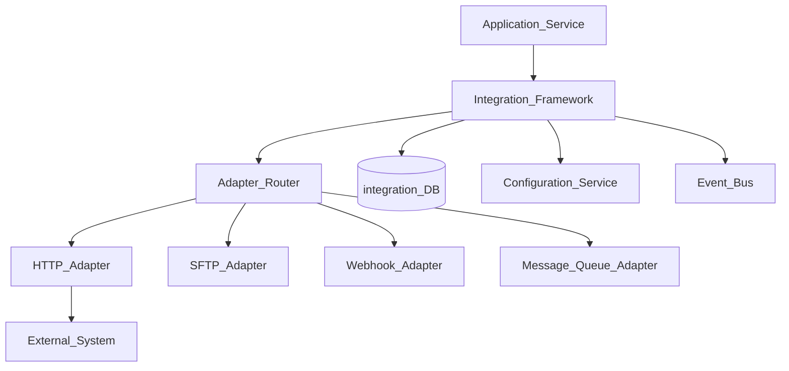
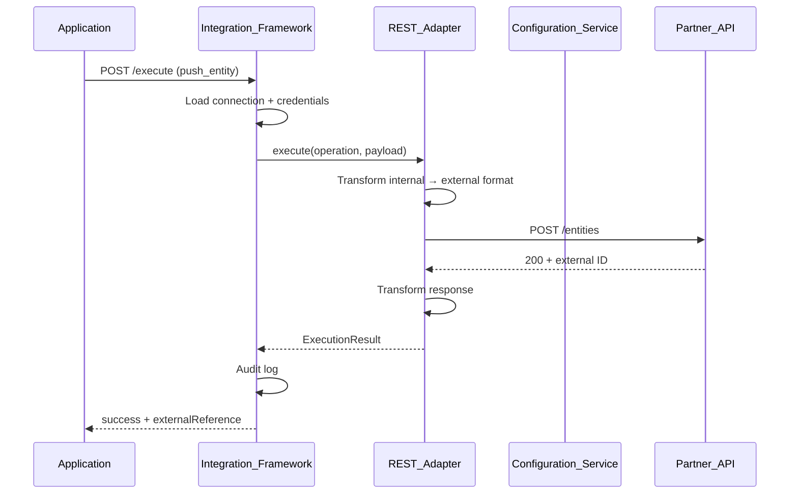
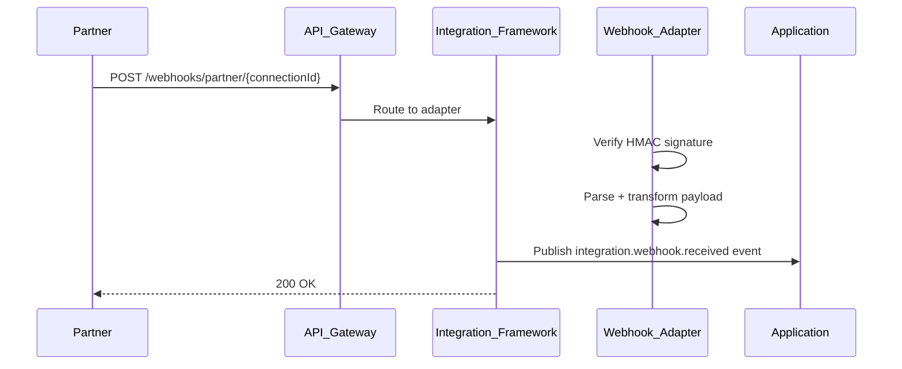

# Integration Adapter Pattern

> **Volume:** 2 | **Chapter ID:** v2-64 | **Status:** reviewed

## Purpose

The **Integration Adapter Pattern** is the standard architecture for connecting EPB to external systems within [Integration Framework](31-integration-framework.md). Adapters encapsulate protocol translation, authentication, retry logic, and error mapping behind a uniform internal interface. Applications invoke integration operations through the framework — they never embed partner API clients, webhook parsers, or SFTP logic directly.

## Architecture



Each adapter implements a common `IntegrationAdapter` interface: `connect`, `execute`, `healthCheck`, `disconnect`.

## Responsibilities

### In Scope

- Adapter registration with capability declaration
- Protocol adapters: REST, SOAP, GraphQL, SFTP, AS2, webhook inbound/outbound
- Authentication adapters: OAuth2, API key, mutual TLS, HMAC signature
- Request/response transformation — internal DTO ↔ external format
- Retry and circuit breaker per adapter configuration
- Idempotency key forwarding for safe retries
- Connection pooling and rate limiting per external system
- Health check and connectivity test endpoints
- Integration execution audit log
- Error mapping to platform error codes

### Out of Scope

- Business decision when to integrate (application logic)
- Data mapping rules for specific entities (application or Metadata Engine)
- ETL batch pipelines (may use adapter for extract step)
- VPN/network connectivity (infrastructure)

## API Design

### Base Path

`/integrations/v1`

| Method | Path | Description |
|--------|------|-------------|
| GET | /adapters | List registered adapters |
| POST | /adapters | Register adapter (plugin deploy) |
| GET | /connections | List tenant connections |
| POST | /connections | Configure connection to external system |
| POST | /connections/{id}/test | Test connectivity |
| POST | /execute | Execute integration operation |
| GET | /executions | List execution history |
| GET | /executions/{id} | Execution detail with request/response log |

### Register Adapter

```json
{
  "adapterKey": "partner-rest-v2",
  "name": "Partner REST API v2",
  "protocol": "rest",
  "capabilities": ["push_entity", "pull_status", "webhook_receive"],
  "configSchema": {
    "baseUrl": { "type": "string", "required": true },
    "authType": { "enum": ["oauth2", "api_key"] },
    "timeoutSeconds": { "type": "integer", "default": 30 }
  }
}
```

### Execute Request

```json
{
  "tenantId": "tenant-uuid",
  "connectionId": "connection-uuid",
  "operation": "push_entity",
  "payload": {
    "entityType": "resource",
    "entityId": "entity-uuid",
    "action": "upsert",
    "data": { "code": "RES-001", "name": "Primary Resource" }
  },
  "options": {
    "idempotencyKey": "push-entity-uuid",
    "async": false
  }
}
```

### Execute Response

```json
{
  "executionId": "exec-uuid",
  "status": "success",
  "externalReference": "EXT-12345",
  "durationMs": 342,
  "response": {
    "statusCode": 200,
    "body": { "id": "EXT-12345", "status": "accepted" }
  }
}
```

### Adapter Interface (conceptual)

```text
interface IntegrationAdapter {
  connect(config: ConnectionConfig): Promise<Connection>
  execute(connection, operation, payload): Promise<ExecutionResult>
  healthCheck(connection): Promise<HealthStatus>
  disconnect(connection): Promise<void>
}
```

Follow [API Standards](../Volume-1-Foundation/18-api-standards.md).

## Database Design

| Table | Key Columns | Purpose |
|-------|-------------|---------|
| `int_adapters` | `adapter_key`, `protocol`, `capabilities_json`, `config_schema` | Adapter registry |
| `int_connections` | `connection_id`, `tenant_id`, `adapter_key`, `config_json`, `status` | Tenant connections |
| `int_credentials` | `connection_id`, `credential_ref` | Encrypted secrets |
| `int_executions` | `execution_id`, `connection_id`, `operation`, `status`, `duration_ms` | Execution log |
| `int_execution_payloads` | `execution_id`, `request_json`, `response_json` | Payload audit (retention limited) |
| `int_circuit_breaker` | `connection_id`, `state`, `failure_count` | Per-connection health |

## Folder Structure

```text
services/integration-framework/
├── core/
│   ├── router/         # Adapter selection
│   ├── executor/       # Operation dispatch
│   └── audit/          # Execution logging
├── adapters/
│   ├── rest/
│   ├── soap/
│   ├── sftp/
│   ├── webhook-inbound/
│   └── webhook-outbound/
├── transforms/         # DTO mapping library
├── persistence/
└── tests/

plugins/integration-adapters/   # Third-party adapter plugins
```

## Sequence Diagrams

### Outbound Integration Execute



### Inbound Webhook



## Extension Points

- **Custom adapters** — implement IntegrationAdapter interface, register as plugin
- **Transform pipelines** — chain mapping steps before/after adapter call
- **Async execution** — queue long-running integrations
- **Webhook signature validators** — per-partner HMAC algorithms

## Integration

- **Part of:** [Integration Framework](31-integration-framework.md)
- **Depends on:** Configuration Service, Event Bus, [Plugin Architecture](71-plugin-architecture.md)
- **Events published:** `integration.execution.completed`, `integration.execution.failed`, `integration.webhook.received`
- **Used by:** All applications with external system connectivity

## Best Practices

1. Store credentials in Configuration Service secrets — never in connection config JSON
2. Use idempotency keys on every outbound execute call
3. Map external errors to platform error codes — do not leak partner error text to clients
4. Test connectivity after connection configuration change
5. Implement circuit breaker per connection — stop calling failing partners
6. Retain execution payloads with limited retention and PII masking

## Anti-Patterns

| Anti-Pattern | Why It Fails | Preferred Approach |
|--------------|--------------|-------------------|
| Partner SDK in application service | Tight coupling, no audit | Integration adapter |
| Hardcoded partner URLs | Environment/tenant inflexibility | Connection config |
| No execution audit | Cannot debug integration failures | Execution log |
| Synchronous long partner calls in API | Timeout, poor UX | Async execute + polling |
| Shared credentials across tenants | Security isolation breach | Per-tenant connections |

## Related Chapters

- [Previous: Event Bus Schema Registry](63-event-bus-schema-registry.md)
- [Next: Master Data Versioning](65-master-data-versioning.md)
- [Integration Framework](31-integration-framework.md)
- [Plugin Architecture](71-plugin-architecture.md)
- [EPB Glossary](../docs/GLOSSARY.md)

---

*Enterprise Platform Blueprint — Volume 2*
