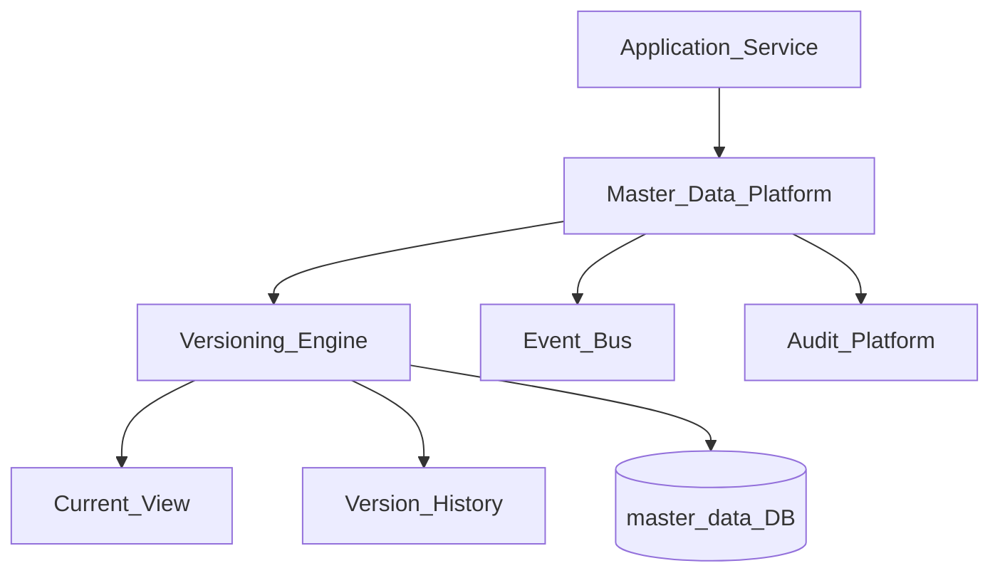
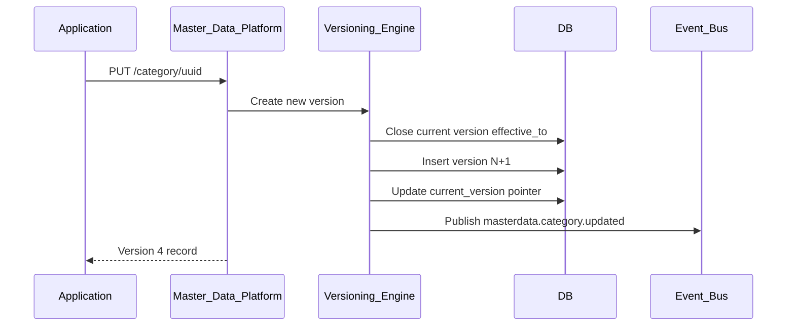
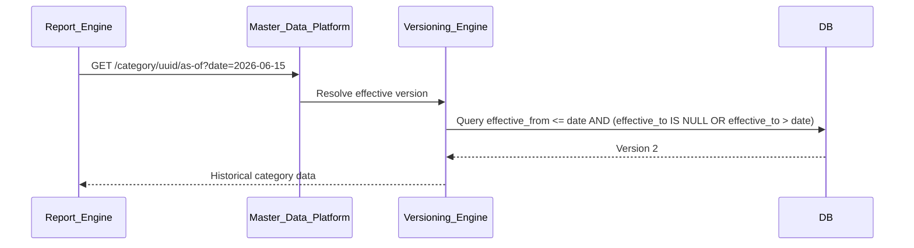

# Master Data Versioning

> **Volume:** 2 | **Chapter ID:** v2-65 | **Status:** reviewed

## Purpose

**Master Data Versioning** extends [Master Data Platform](32-master-data-platform.md) with temporal versioning, effective-dated records, change history, and point-in-time queries. Reference data — categories, regions, units of measure, status codes — changes over time; applications must query "what was the value on date X" for audit and historical reporting. Versioning is built into the platform — applications do not maintain shadow history tables.

## Architecture



Each master data record has a version chain. The current version is the effective record; historical versions are immutable.

## Responsibilities

### In Scope

- Version creation on every update — immutable version records
- Effective dating: `effectiveFrom`, `effectiveTo` on each version
- Point-in-time query: resolve value as of specific date
- Version comparison — diff between two versions
- Soft deprecation — mark version inactive without deletion
- Bulk version import with effective date alignment
- Version numbering: monotonic integer per record
- Current version pointer for fast lookup
- Change attribution: who changed, when, why (reason code)
- Cascade notification on reference data change

### Out of Scope

- Transactional entity versioning (application entity tables)
- Master data CRUD without versioning ([Master Data Platform](32-master-data-platform.md))
- Approval workflow for changes (optional Workflow Engine integration)
- Cross-tenant master data sharing

## API Design

### Base Path

`/master-data/v1`

| Method | Path | Description |
|--------|------|-------------|
| GET | /{type}/{id} | Get current version |
| GET | /{type}/{id}/versions | List all versions |
| GET | /{type}/{id}/versions/{version} | Get specific version |
| GET | /{type}/{id}/as-of | Get version effective on date |
| POST | /{type} | Create with initial version |
| PUT | /{type}/{id} | Create new version (update) |
| GET | /{type}/{id}/diff | Compare two versions |
| POST | /{type}/bulk-import | Import with effective dates |

### Update Creates New Version

```json
{
  "tenantId": "tenant-uuid",
  "data": {
    "code": "CAT-PREMIUM",
    "name": "Premium Category",
    "description": "Updated description",
    "sortOrder": 10
  },
  "effectiveFrom": "2026-09-01",
  "changeReason": "Annual category restructure",
  "actorId": "user-uuid"
}
```

### As-Of Query

```http
GET /master-data/v1/category/uuid/as-of?date=2026-06-15
```

Response returns the version effective on that date.

### Version Record

```json
{
  "id": "record-uuid",
  "type": "category",
  "version": 4,
  "data": {
    "code": "CAT-PREMIUM",
    "name": "Premium Category",
    "sortOrder": 10
  },
  "effectiveFrom": "2026-09-01",
  "effectiveTo": null,
  "isCurrent": true,
  "createdAt": "2026-08-01T10:00:00Z",
  "createdBy": "user-uuid",
  "changeReason": "Annual category restructure"
}
```

### Version Diff Response

```json
{
  "fromVersion": 3,
  "toVersion": 4,
  "changes": [
    { "field": "name", "oldValue": "Premium", "newValue": "Premium Category" },
    { "field": "sortOrder", "oldValue": 5, "newValue": 10 }
  ]
}
```

Follow [API Standards](../Volume-1-Foundation/18-api-standards.md).

## Database Design

| Table | Key Columns | Purpose |
|-------|-------------|---------|
| `md_records` | `id`, `type`, `tenant_id`, `current_version` | Record header |
| `md_versions` | `id`, `version`, `data_json`, `effective_from`, `effective_to` | Immutable versions |
| `md_version_audit` | `id`, `version`, `change_reason`, `actor_id`, `created_at` | Change attribution |
| `md_type_registry` | `type`, `schema_json`, `versioning_enabled` | Type configuration |
| `md_effective_index` | `id`, `effective_from`, `effective_to`, `version` | As-of query index |

Unique: `(id, version)`. Index: `(id, effective_from, effective_to)` for temporal queries.

Versioning rule: updating closes previous version's `effective_to` and creates new version with `effective_from`.

## Folder Structure

```text
services/master-data-platform/
├── versioning/
│   ├── create/         # New version on update
│   ├── temporal/       # As-of resolution
│   ├── diff/           # Version comparison
│   ├── import/         # Bulk effective-dated import
│   └── notify/         # Change event publisher
├── persistence/
└── tests/
```

## Sequence Diagrams

### Versioned Update



### Point-in-Time Query



## Extension Points

- **Approval gate** — new version pending until Workflow approves
- **Scheduled effective date** — version activates on future date via Scheduler
- **Version labels** — named snapshots (e.g., "FY2026 structure")
- **Reference cascade** — notify dependent entities when reference changes

## Integration

- **Part of:** [Master Data Platform](32-master-data-platform.md)
- **Used by:** Validation Platform, Import Pipeline, Rule Engine, reports
- **Depends on:** Audit Platform, Event Bus, Cache Invalidation
- **Events published:** `masterdata.{type}.updated`, `masterdata.{type}.version.created`

## Best Practices

1. Never mutate existing versions — always create new version on change
2. Set `effectiveFrom` explicitly for scheduled changes
3. Use as-of queries in historical reports — not current version
4. Include `changeReason` for audit compliance
5. Invalidate master-data cache tags on version create
6. Close previous version `effectiveTo` atomically with new version insert

## Anti-Patterns

| Anti-Pattern | Why It Fails | Preferred Approach |
|--------------|--------------|-------------------|
| UPDATE in place on master data | Lost history | Versioning engine |
| No effective dates | Cannot query historical state | effectiveFrom/effectiveTo |
| Deleting old versions | Audit failure | Immutable version retention |
| Current-only queries in reports | Wrong historical values | as-of API |
| Versioning in application tables | Inconsistent across apps | Master Data Platform |

## Related Chapters

- [Previous: Integration Adapter Pattern](64-integration-adapter-pattern.md)
- [Next: Localization Resource Bundles](66-localization-resource-bundles.md)
- [Master Data Platform](32-master-data-platform.md)
- [Cache Invalidation Strategy](62-cache-invalidation-strategy.md)
- [EPB Glossary](../docs/GLOSSARY.md)

---

*Enterprise Platform Blueprint — Volume 2*
