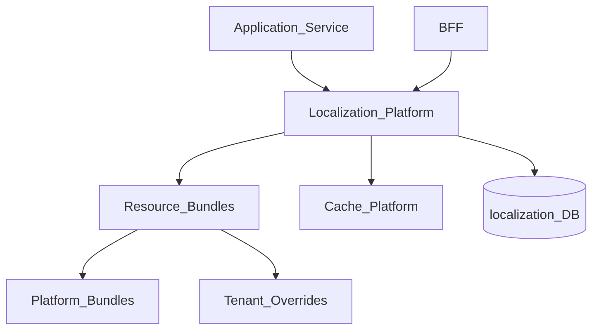
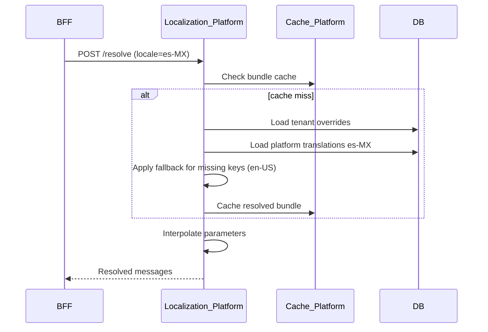
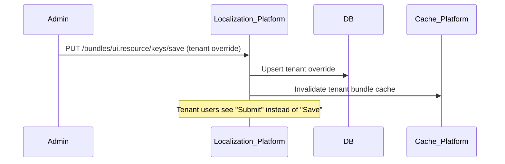

# Localization Resource Bundles

> **Volume:** 2 | **Chapter ID:** v2-66 | **Status:** reviewed

## Purpose

**Localization Resource Bundles** are the string catalog mechanism within [Localization Platform](33-localization-platform.md). They store translatable messages, labels, validation errors, and UI text keyed by locale with fallback chains. Applications reference message keys — never hardcode user-facing strings. Bundles support platform defaults, tenant overrides, and runtime locale resolution.

## Architecture



Resolution order: tenant override → platform bundle for locale → platform bundle for fallback locale (en-US).

## Responsibilities

### In Scope

- Message key registration with namespace (`validation.required`, `ui.save`)
- Locale-specific translations: en-US, es-MX, fr-FR, ar-SA, etc.
- Pluralization rules — `{count, plural, one {# item} other {# items}}`
- Parameter interpolation — `Hello, {userName}!`
- Fallback locale chain: requested → tenant default → platform default
- Tenant translation overrides for white-label customization
- Bundle versioning and publish workflow
- Import/export of translation files (JSON, XLIFF)
- Missing key policy: return key, empty, or fallback English
- RTL locale metadata for UI direction hints

### Out of Scope

- Date/number/currency formatting (Localization Platform separate formatters)
- Content translation of entity data (application or AI Services)
- Machine translation automation ([AI Services Overview](67-ai-services-overview.md) optional)
- UI component rendering

## API Design

### Base Path

`/localization/v1`

| Method | Path | Description |
|--------|------|-------------|
| GET | /bundles | List bundles by namespace |
| POST | /bundles | Register bundle namespace |
| GET | /bundles/{namespace}/keys | List keys in bundle |
| PUT | /bundles/{namespace}/keys/{key} | Set translation for locale |
| POST | /bundles/{namespace}/import | Import translation file |
| GET | /bundles/{namespace}/export | Export translations for locale |
| POST | /resolve | Resolve keys for locale (bulk) |
| GET | /locales | Supported locales list |

### Resolve Request

```json
{
  "tenantId": "tenant-uuid",
  "locale": "es-MX",
  "keys": [
    "validation.required",
    "ui.resource.save",
    "notification.booking.confirmed"
  ],
  "parameters": {
    "validation.required": { "field": "Nombre" },
    "notification.booking.confirmed": { "date": "15 de agosto" }
  }
}
```

### Resolve Response

```json
{
  "locale": "es-MX",
  "fallbackUsed": false,
  "messages": {
    "validation.required": "Nombre es obligatorio.",
    "ui.resource.save": "Guardar",
    "notification.booking.confirmed": "Su cita del 15 de agosto está confirmada."
  },
  "missingKeys": []
}
```

### Bundle Key Definition

```json
{
  "namespace": "ui.resource",
  "key": "save",
  "description": "Save button label on resource form",
  "translations": {
    "en-US": "Save",
    "es-MX": "Guardar",
    "fr-FR": "Enregistrer"
  },
  "parameters": []
}
```

### Pluralization Key

```json
{
  "key": "item.count",
  "translations": {
    "en-US": "{count, plural, =0 {No items} one {# item} other {# items}}",
    "es-MX": "{count, plural, =0 {Sin elementos} one {# elemento} other {# elementos}}"
  },
  "parameters": ["count"]
}
```

Follow [API Standards](../Volume-1-Foundation/18-api-standards.md).

## Database Design

| Table | Key Columns | Purpose |
|-------|-------------|---------|
| `loc_bundles` | `namespace`, `description`, `owner_service` | Bundle registry |
| `loc_keys` | `namespace`, `key`, `description`, `parameters_json` | Key definitions |
| `loc_translations` | `namespace`, `key`, `locale`, `value`, `version` | Platform translations |
| `loc_tenant_overrides` | `tenant_id`, `namespace`, `key`, `locale`, `value` | Tenant customizations |
| `loc_locales` | `locale`, `name`, `direction`, `fallback_locale` | Locale registry |
| `loc_missing_log` | `namespace`, `key`, `locale`, `occurred_at` | Missing key tracking |

## Folder Structure

```text
services/localization-platform/
├── bundles/
│   ├── registry/       # Namespace and key CRUD
│   ├── resolve/        # Lookup with fallback
│   ├── plural/         # ICU message format
│   ├── import-export/  # JSON, XLIFF
│   └── override/       # Tenant customization
├── persistence/
├── adapters/
│   └── cache/
└── tests/
```

## Sequence Diagrams

### Message Resolution with Fallback



### Tenant Override



## Extension Points

- **ICU message format** — full plural, select, gender rules
- **Translation workflow** — submit keys for professional translation
- **AI-assisted translation** — draft translations via AI Services
- **Context-aware keys** — same key different translation by screen context

## Integration

- **Part of:** [Localization Platform](33-localization-platform.md)
- **Used by:** Validation Platform, Exception Handling, Notification templates, UI via BFF
- **Depends on:** Cache Platform, Configuration Service (tenant default locale)
- **Events published:** `localization.bundle.published`, `localization.override.updated`

## Best Practices

1. Namespace keys by domain: `validation.*`, `ui.{screen}.*`, `error.*`
2. Never concatenate translated strings — use parameters for word order flexibility
3. Register keys before use — track missing keys in non-production
4. Use tenant overrides for white-label text, not code forks
5. Cache resolved bundles per tenant+locale with event invalidation
6. Export/import XLIFF for professional translation workflows

## Anti-Patterns

| Anti-Pattern | Why It Fails | Preferred Approach |
|--------------|--------------|-------------------|
| Hardcoded UI strings in code | Cannot localize | Message keys + resolve API |
| String concatenation for sentences | Broken grammar in other languages | Parameterized messages |
| Per-tenant code branches for text | Unmaintainable | Tenant override bundles |
| Missing fallback locale | Blank UI in unsupported locale | Fallback chain to en-US |
| Caching without tenant scope | Wrong translations shown | Tenant-scoped cache keys |

## Related Chapters

- [Previous: Master Data Versioning](65-master-data-versioning.md)
- [Next: AI Services Overview](67-ai-services-overview.md)
- [Localization Platform](33-localization-platform.md)
- [EPB Glossary](../docs/GLOSSARY.md)

---

*Enterprise Platform Blueprint — Volume 2*
