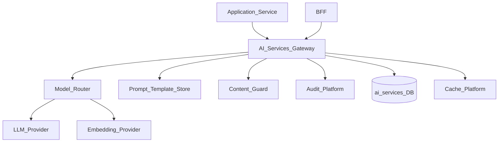
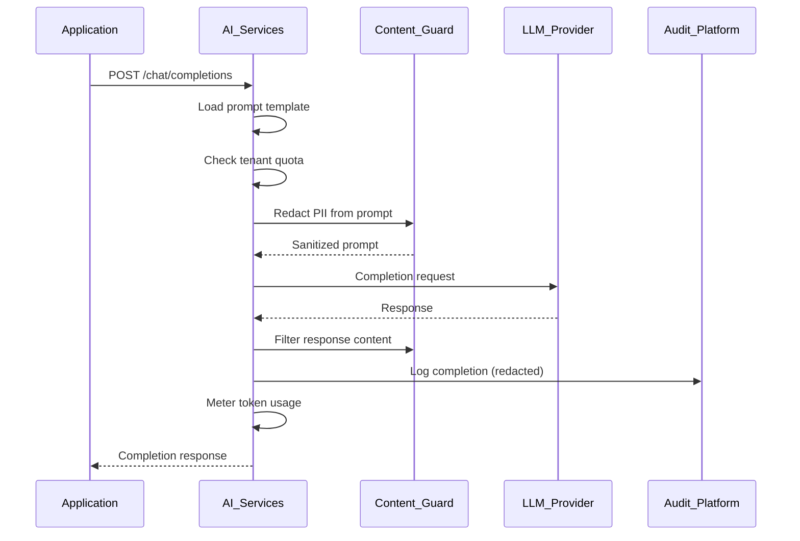
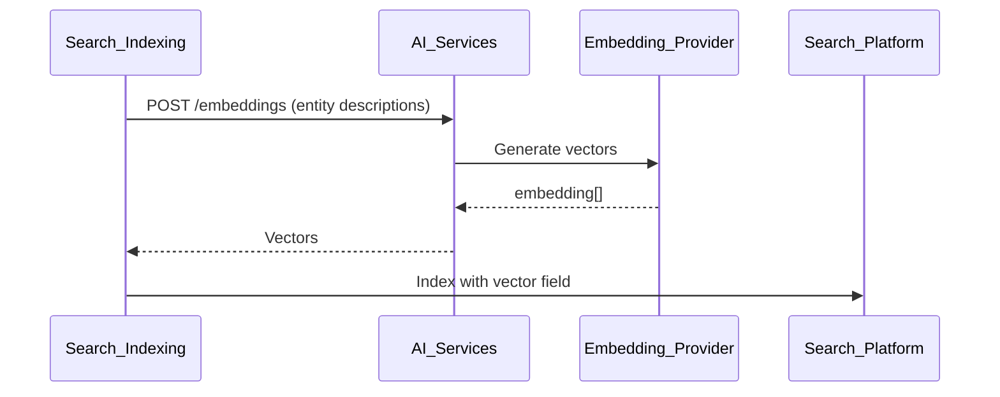

# AI Services Overview

> **Volume:** 2 | **Chapter ID:** v2-67 | **Status:** reviewed

## Purpose

**AI Services** provides a governed platform layer for large language model (LLM) inference, embeddings, classification, and content generation across EPB. Applications invoke AI capabilities through standardized APIs with tenant quotas, prompt templates, audit logging, and PII redaction — they never call OpenAI, Azure OpenAI, or local model endpoints directly. AI augments platform features; it does not replace business rules or authorization decisions.

## Architecture



The gateway abstracts provider specifics, enforces policies, and meters usage per tenant.

## Responsibilities

### In Scope

- Chat completion API with system and user prompts
- Text embedding generation for semantic search
- Classification and entity extraction from unstructured text
- Summarization of long documents and conversation threads
- Prompt template management with variable binding
- Model routing: cost, latency, capability-based selection
- Token usage metering and tenant quotas
- PII detection and redaction before external provider call
- Response content filtering (safety guardrails)
- Audit log of prompts and responses (configurable retention)
- Streaming response support for real-time UI

### Out of Scope

- Authorization decisions — AI suggestions are not permissions
- Training or fine-tuning models (MLOps infrastructure)
- Autonomous agent loops without human approval
- Replacing Rule Engine business logic
- Storing conversation history in application databases without policy

## API Design

### Base Path

`/ai/v1`

| Method | Path | Description |
|--------|------|-------------|
| POST | /chat/completions | Chat completion (sync or stream) |
| POST | /embeddings | Generate text embeddings |
| POST | /classify | Classify text into categories |
| POST | /extract | Extract structured entities from text |
| POST | /summarize | Summarize document or text |
| GET | /prompts | List prompt templates |
| POST | /prompts | Register prompt template |
| GET | /usage | Tenant token usage and quota |
| GET | /models | Available models and capabilities |

### Chat Completion Request

```json
{
  "tenantId": "tenant-uuid",
  "templateKey": "entity-description-assist",
  "variables": {
    "entityType": "resource",
    "entityName": "Primary Resource",
    "context": "Used for primary operations in organization Alpha"
  },
  "messages": [
    { "role": "user", "content": "Suggest a professional description." }
  ],
  "options": {
    "model": "gpt-4",
    "maxTokens": 500,
    "temperature": 0.7,
    "stream": false
  },
  "metadata": {
    "userId": "user-uuid",
    "purpose": "content-assist"
  }
}
```

### Chat Completion Response

```json
{
  "completionId": "completion-uuid",
  "content": "Primary Resource serves as the central operational asset for Organization Alpha, supporting core workflow activities and resource allocation.",
  "model": "gpt-4",
  "usage": {
    "promptTokens": 120,
    "completionTokens": 45,
    "totalTokens": 165
  },
  "guardrailResult": "passed",
  "completedAt": "2026-08-01T10:00:05Z"
}
```

### Embedding Request

```json
{
  "tenantId": "tenant-uuid",
  "input": ["Primary Resource", "Secondary Resource for backup operations"],
  "model": "text-embedding-3-small"
}
```

### Prompt Template

```json
{
  "templateKey": "entity-description-assist",
  "systemPrompt": "You are a professional technical writer. Generate concise entity descriptions.",
  "userPromptTemplate": "Entity type: {{entityType}}\nName: {{entityName}}\nContext: {{context}}\n\nWrite a 2-sentence description.",
  "requiredVariables": ["entityType", "entityName"],
  "maxTokens": 500
}
```

Follow [API Standards](../Volume-1-Foundation/18-api-standards.md).

## Database Design

| Table | Key Columns | Purpose |
|-------|-------------|---------|
| `ai_prompt_templates` | `template_key`, `system_prompt`, `user_template`, `owner` | Prompt registry |
| `ai_completions` | `completion_id`, `tenant_id`, `template_key`, `model`, `token_count` | Request audit |
| `ai_completion_content` | `completion_id`, `prompt_redacted`, `response` | Content log (retention policy) |
| `ai_usage_meter` | `tenant_id`, `period`, `tokens_used`, `request_count` | Quota tracking |
| `ai_tenant_config` | `tenant_id`, `quota_tokens_monthly`, `allowed_models_json` | Tenant policy |
| `ai_model_registry` | `model_id`, `provider`, `capabilities_json`, `cost_per_1k` | Model catalog |

## Folder Structure

```text
services/ai-services/
├── api/
├── gateway/
│   ├── router/         # Model selection
│   ├── guard/          # PII redaction, content filter
│   ├── meter/          # Token usage tracking
│   └── stream/         # SSE streaming handler
├── prompts/
├── adapters/
│   ├── openai/
│   ├── azure-openai/
│   └── local/          # On-premise model
├── persistence/
└── tests/
```

## Sequence Diagrams

### Chat Completion with Guardrails



### Embedding for Semantic Search



## Extension Points

- **Provider adapters** — plug in new LLM providers
- **Custom guardrails** — tenant-specific content policies
- **RAG pipeline** — retrieve context from Search Platform before completion
- **Fine-tuned model routing** — tenant-specific model endpoints

## Integration

- **Used by:** Global Search (semantic), Localization (draft translation), Form Builder (assist), applications
- **Depends on:** Audit Platform, Configuration Service, Cache Platform
- **Events published:** `ai.completion.completed`, `ai.quota.exceeded`
- **Must not replace:** Rule Engine, Authorization, Validation Platform

## Best Practices

1. Always use prompt templates — never send raw user input as system prompt
2. Redact PII before external provider calls
3. Enforce tenant token quotas — reject over-quota requests gracefully
4. Log completions with retention policy — not indefinite storage
5. Never use AI output as authorization or validation decision
6. Cache embeddings for unchanged text content

## Anti-Patterns

| Anti-Pattern | Why It Fails | Preferred Approach |
|--------------|--------------|-------------------|
| Direct OpenAI API from app | No audit, quota, or PII guard | AI Services gateway |
| AI for permission checks | Non-deterministic security | Authorization service |
| Storing full prompts with PII | Compliance violation | Redacted audit log |
| No token metering | Unbounded cost | Tenant quotas |
| Hardcoded prompts in code | Cannot tune without deploy | Prompt template store |

## Related Chapters

- [Previous: Localization Resource Bundles](66-localization-resource-bundles.md)
- [Next: Metadata Engine](68-metadata-engine.md)
- [Global Search](38-global-search.md)
- [Search Indexing](54-search-indexing.md)
- [EPB Glossary](../docs/GLOSSARY.md)

---

*Enterprise Platform Blueprint — Volume 2*
