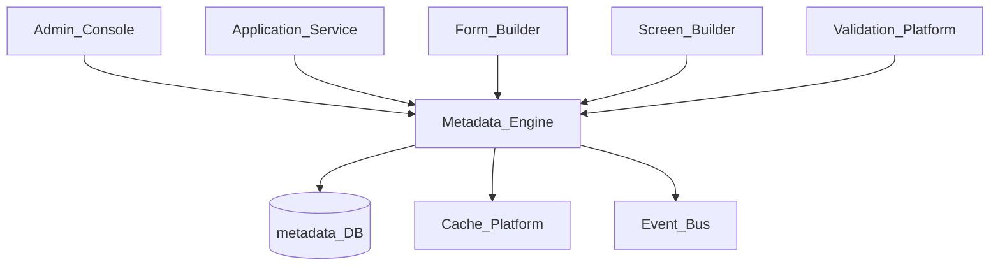
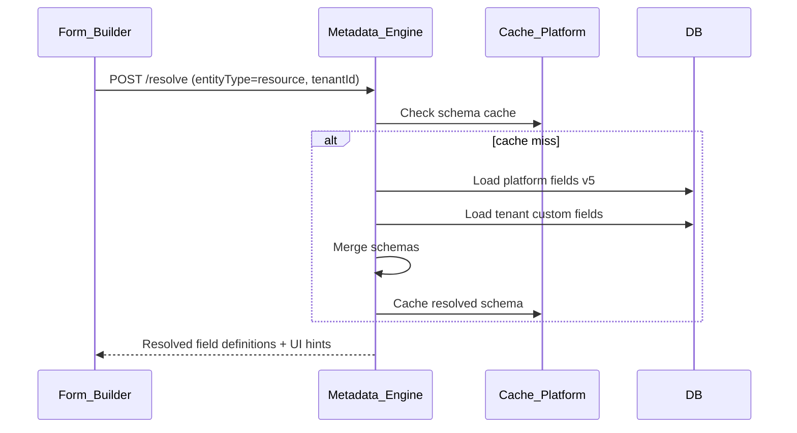
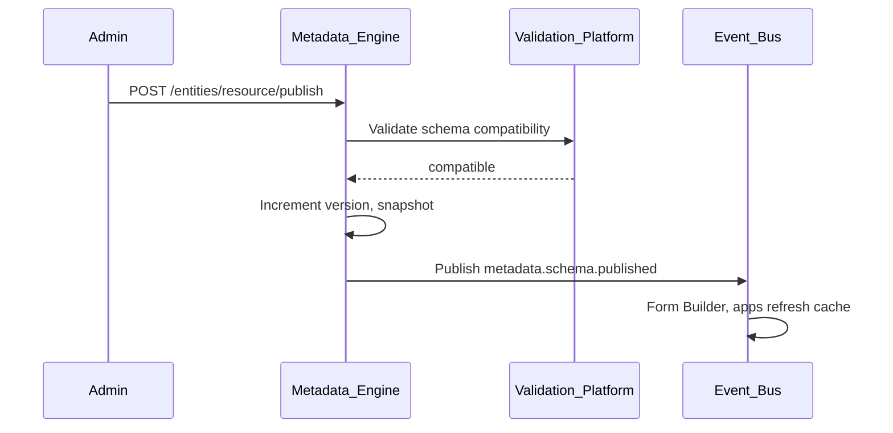

# Metadata Engine

> **Volume:** 2 | **Chapter ID:** v2-68 | **Status:** reviewed

## Purpose

The **Metadata Engine** is the runtime schema registry for dynamic entity definitions across EPB. It stores field definitions, relationships, validation rules, UI hints, and permissions for entities that tenants extend without code deployment. [Form Builder](69-form-builder.md) and [Screen Builder](70-screen-builder.md) consume metadata to render UI; [Validation Platform](34-validation-platform.md) and applications consume it for data integrity.

## Architecture



Metadata follows a layered model: platform base schema → application extension → tenant custom fields.

## Responsibilities

### In Scope

- Entity type registration with field catalog
- Field types: string, number, boolean, date, lookup, collection, computed
- Field constraints: required, min/max, pattern, enum values
- Relationship definitions: one-to-one, one-to-many, many-to-many
- Tenant custom field extension on platform entities
- UI metadata: label, placeholder, display order, visibility conditions
- Permission metadata: field-level read/write by role
- Schema versioning with publish workflow
- Metadata diff and migration between versions
- Runtime schema resolution API for forms, validation, and queries

### Out of Scope

- Actual entity data storage (application service databases)
- Static code-generated entities without metadata registration
- Full database DDL migration (metadata informs, application applies)
- Business rule logic ([Rule Engine](20-rule-engine.md))

## API Design

### Base Path

`/metadata/v1`

| Method | Path | Description |
|--------|------|-------------|
| GET | /entities | List registered entity types |
| POST | /entities | Register entity type |
| GET | /entities/{type} | Get resolved schema for entity type |
| GET | /entities/{type}/versions | Schema version history |
| POST | /entities/{type}/fields | Add field definition |
| PATCH | /entities/{type}/fields/{fieldKey} | Update field |
| DELETE | /entities/{type}/fields/{fieldKey} | Remove custom field |
| POST | /entities/{type}/publish | Publish schema version |
| POST | /resolve | Resolve merged schema for tenant |
| GET | /entities/{type}/diff | Compare schema versions |

### Entity Type Registration

```json
{
  "entityType": "resource",
  "applicationId": "inventory-service",
  "displayNameKey": "entity.resource.name",
  "baseFields": [
    {
      "fieldKey": "code",
      "type": "string",
      "required": true,
      "maxLength": 50,
      "unique": true,
      "ui": { "order": 1, "labelKey": "field.resource.code" }
    },
    {
      "fieldKey": "name",
      "type": "string",
      "required": true,
      "maxLength": 200,
      "ui": { "order": 2, "labelKey": "field.resource.name" }
    },
    {
      "fieldKey": "status",
      "type": "enum",
      "values": ["active", "archived"],
      "default": "active",
      "ui": { "order": 3, "widget": "select" }
    },
    {
      "fieldKey": "categoryId",
      "type": "lookup",
      "lookupType": "category",
      "required": false,
      "ui": { "order": 4, "widget": "autocomplete" }
    }
  ]
}
```

### Tenant Custom Field Extension

```json
{
  "tenantId": "tenant-uuid",
  "entityType": "resource",
  "customFields": [
    {
      "fieldKey": "customPriority",
      "type": "enum",
      "values": ["low", "medium", "high"],
      "required": false,
      "ui": { "order": 10, "labelKey": "field.resource.priority" }
    }
  ]
}
```

### Resolved Schema Response

```json
{
  "entityType": "resource",
  "version": 5,
  "fields": [
    { "fieldKey": "code", "type": "string", "required": true, "source": "platform" },
    { "fieldKey": "name", "type": "string", "required": true, "source": "platform" },
    { "fieldKey": "customPriority", "type": "enum", "source": "tenant" }
  ],
  "relationships": [
    { "name": "category", "type": "many-to-one", "targetEntity": "category", "field": "categoryId" }
  ],
  "resolvedAt": "2026-08-01T10:00:00Z"
}
```

Follow [API Standards](../Volume-1-Foundation/18-api-standards.md).

## Database Design

| Table | Key Columns | Purpose |
|-------|-------------|---------|
| `meta_entity_types` | `entity_type`, `application_id`, `display_name_key` | Entity registry |
| `meta_field_definitions` | `entity_type`, `version`, `field_key`, `definition_json` | Platform fields |
| `meta_tenant_fields` | `tenant_id`, `entity_type`, `field_key`, `definition_json` | Tenant extensions |
| `meta_relationships` | `entity_type`, `version`, `relationship_json` | Entity relationships |
| `meta_versions` | `entity_type`, `version`, `published_at`, `published_by` | Publish history |
| `meta_ui_hints` | `entity_type`, `field_key`, `ui_json` | Display metadata |

## Folder Structure

```text
services/metadata-engine/
├── api/
├── domain/
│   ├── registry/       # Entity and field CRUD
│   ├── resolve/        # Layer merge: platform + tenant
│   ├── version/        # Publish and diff
│   ├── relationships/
│   └── permissions/    # Field-level access metadata
├── persistence/
├── adapters/
│   └── cache/
├── events/
└── tests/
```

## Sequence Diagrams

### Schema Resolution for Form Render



### Publish New Schema Version



## Extension Points

- **Computed fields** — derive value from expression or Rule Engine
- **Conditional visibility** — show field when other field matches value
- **Custom field types** — register via Plugin Architecture
- **Schema import** — generate metadata from existing database

## Integration

- **Consumed by:** Form Builder, Screen Builder, Validation Platform, Import/Export profiles
- **Depends on:** Cache Platform, Event Bus, Localization Platform (label keys)
- **Events published:** `metadata.schema.published`, `metadata.field.added`, `metadata.field.removed`
- **Events consumed:** `tenant.provisioned` (empty custom field set)

## Best Practices

1. Namespace custom field keys with tenant prefix or validate uniqueness
2. Publish schema versions — never mutate published field definitions
3. Resolve schema at runtime — do not hardcode field lists in frontend
4. Include UI hints in metadata — Form Builder should not guess widgets
5. Invalidate metadata cache on publish event
6. Validate backward compatibility before publish

## Anti-Patterns

| Anti-Pattern | Why It Fails | Preferred Approach |
|--------------|--------------|-------------------|
| Hardcoded form fields in frontend | Cannot extend per tenant | Metadata-driven forms |
| Tenant fields in application code | Requires deploy per tenant | Metadata Engine extensions |
| Mutating published schema | Breaks existing data validation | Versioned publish |
| Metadata without validation sync | Form allows invalid data | Validation Platform registration |
| Storing entity data in metadata tables | Wrong abstraction | Metadata defines shape only |

## Related Chapters

- [Previous: AI Services Overview](67-ai-services-overview.md)
- [Next: Form Builder](69-form-builder.md)
- [Form Builder](69-form-builder.md)
- [Screen Builder](70-screen-builder.md)
- [Validation Platform](34-validation-platform.md)
- [EPB Glossary](../docs/GLOSSARY.md)

---

*Enterprise Platform Blueprint — Volume 2*
