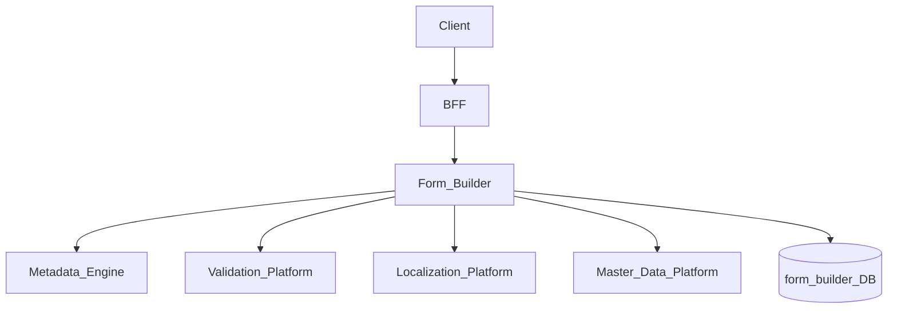
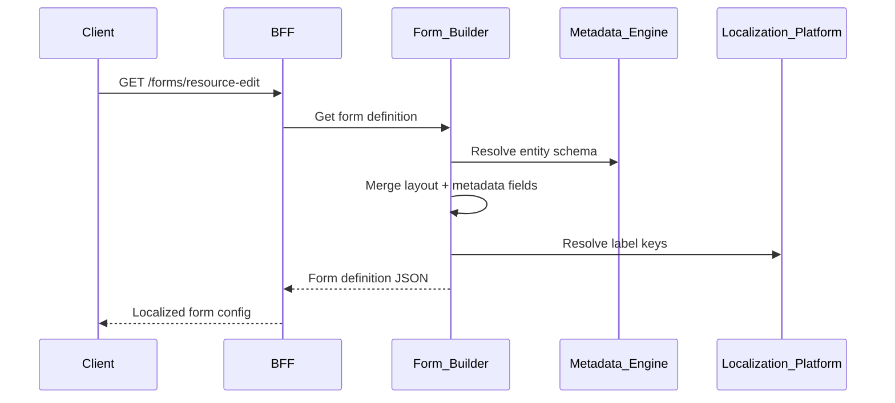
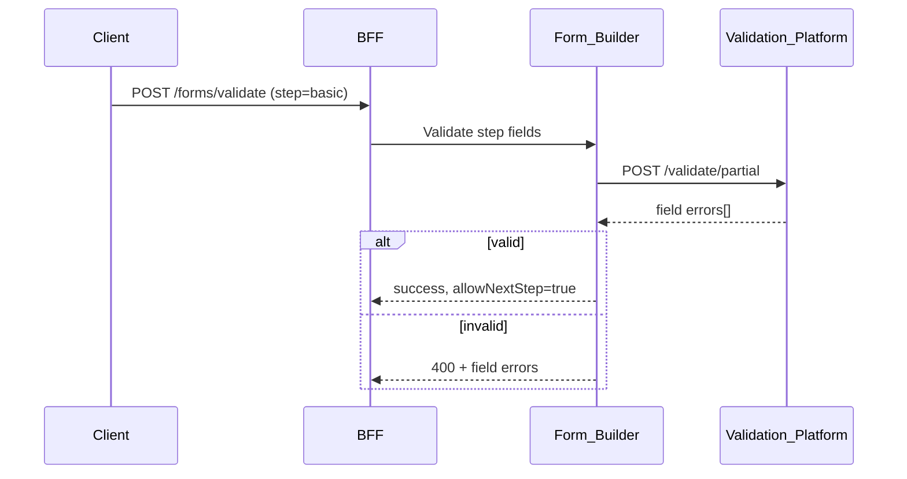

# Form Builder

> **Volume:** 2 | **Chapter ID:** v2-69 | **Status:** reviewed

## Purpose

The **Form Builder** renders dynamic data entry forms from [Metadata Engine](68-metadata-engine.md) schema definitions and stored form layouts. It produces form configuration JSON consumed by frontend renderers, handles multi-step wizards, conditional field visibility, and integrates with [Validation Platform](34-validation-platform.md) for client- and server-side validation. Applications define entity forms through metadata — they do not hand-code form components per field.

## Architecture



Form Builder is API-driven. The frontend form renderer consumes form definition JSON and posts data to application APIs.

## Responsibilities

### In Scope

- Form layout definition: sections, rows, columns, field placement
- Widget mapping: text, textarea, select, datepicker, lookup, checkbox, file
- Multi-step wizard forms with step validation gates
- Conditional visibility: show/hide fields based on other field values
- Read-only and disabled state per field based on mode (create, edit, view)
- Default value resolution from metadata and context
- Lookup field data source binding to Master Data Platform
- Form-level and field-level validation rule attachment
- Partial save (draft) form state
- Form definition versioning per entity type and tenant

### Out of Scope

- Full page layout ([Screen Builder](70-screen-builder.md))
- Form submission persistence (application service responsibility)
- Custom React/Vue component code (low-code components via Plugin Architecture)
- PDF form rendering

## API Design

### Base Path

`/forms/v1`

| Method | Path | Description |
|--------|------|-------------|
| GET | /definitions | List form definitions |
| GET | /definitions/{formKey} | Get form definition for render |
| POST | /definitions | Create form layout |
| PUT | /definitions/{formKey} | Update form layout |
| POST | /definitions/{formKey}/publish | Publish form version |
| POST | /validate | Validate form data (partial or full) |
| GET | /definitions/{formKey}/preview | Preview with sample data |
| GET | /widgets | List available widget types |

### Get Form Definition (render)

```http
GET /forms/v1/definitions/resource-edit?tenantId=uuid&mode=edit&locale=en-US
```

### Form Definition Response

```json
{
  "formKey": "resource-edit",
  "entityType": "resource",
  "version": 3,
  "mode": "edit",
  "titleKey": "form.resource.edit.title",
  "steps": [
    {
      "stepId": "basic",
      "titleKey": "form.resource.step.basic",
      "sections": [
        {
          "sectionId": "identity",
          "titleKey": "form.resource.section.identity",
          "rows": [
            {
              "fields": [
                {
                  "fieldKey": "code",
                  "widget": "text",
                  "labelKey": "field.resource.code",
                  "required": true,
                  "readOnly": true,
                  "colSpan": 6
                },
                {
                  "fieldKey": "name",
                  "widget": "text",
                  "labelKey": "field.resource.name",
                  "required": true,
                  "colSpan": 6
                }
              ]
            },
            {
              "fields": [
                {
                  "fieldKey": "status",
                  "widget": "select",
                  "labelKey": "field.resource.status",
                  "options": [
                    { "value": "active", "labelKey": "status.active" },
                    { "value": "archived", "labelKey": "status.archived" }
                  ],
                  "colSpan": 6
                },
                {
                  "fieldKey": "categoryId",
                  "widget": "lookup",
                  "labelKey": "field.resource.category",
                  "lookupType": "category",
                  "colSpan": 6
                }
              ]
            }
          ]
        }
      ]
    }
  ],
  "validationProfile": "api-strict",
  "conditionalRules": [
    {
      "targetField": "customPriority",
      "condition": { "field": "status", "operator": "eq", "value": "active" },
      "action": "show"
    }
  ]
}
```

### Validate Form Data

```json
{
  "formKey": "resource-edit",
  "entityType": "resource",
  "stepId": "basic",
  "data": {
    "code": "RES-001",
    "name": "Primary Resource",
    "status": "active"
  }
}
```

Follow [API Standards](../Volume-1-Foundation/18-api-standards.md).

## Database Design

| Table | Key Columns | Purpose |
|-------|-------------|---------|
| `form_definitions` | `form_key`, `entity_type`, `version`, `status` | Form header |
| `form_layouts` | `form_key`, `version`, `layout_json` | Layout structure |
| `form_conditional_rules` | `form_key`, `version`, `rules_json` | Visibility logic |
| `form_tenant_overrides` | `tenant_id`, `form_key`, `override_json` | Tenant layout customizations |
| `form_drafts` | `form_key`, `user_id`, `entity_id`, `data_json` | Partial save state |

## Folder Structure

```text
services/form-builder/
├── api/
├── domain/
│   ├── layout/         # Section/row/field builder
│   ├── widget/         # Widget type registry
│   ├── conditional/    # Visibility rule engine
│   ├── resolve/        # Metadata + layout merge
│   ├── validate/       # Validation Platform adapter
│   └── draft/          # Partial save
├── persistence/
└── tests/
```

## Sequence Diagrams

### Form Render Flow



### Step Validation in Wizard



## Extension Points

- **Custom widgets** — register via [Low-Code Components](72-low-code-components.md)
- **Dynamic options** — load select options from API at render time
- **AI assist** — field value suggestions via AI Services
- **Form templates** — clone layout from template form key

## Integration

- **Depends on:** Metadata Engine, Validation Platform, Localization Platform, Master Data Platform
- **Used by:** Screen Builder (embeds forms), BFF, admin consoles
- **Events published:** `form.definition.published`
- **Related:** [Screen Builder](70-screen-builder.md), [Metadata Engine](68-metadata-engine.md)

## Best Practices

1. Drive field list from Metadata Engine — layout only controls placement and widgets
2. Validate each wizard step before allowing navigation
3. Localize all labels via labelKey — never embed display text in layout
4. Version form definitions — pin version in production screens
5. Use conditional rules for dynamic UX — not separate forms per scenario
6. Support create, edit, and view modes with readOnly metadata

## Anti-Patterns

| Anti-Pattern | Why It Fails | Preferred Approach |
|--------------|--------------|-------------------|
| Hardcoded form JSX per entity | No tenant customization | Form Builder definitions |
| Layout fields not in metadata | Validation gaps | Metadata-driven field list |
| Skipping server validation | Client bypass | Validation Platform on submit |
| Duplicate forms per status value | Maintenance burden | Conditional visibility rules |
| Embedding business logic in layout | Wrong layer | Rule Engine or application |

## Related Chapters

- [Previous: Metadata Engine](68-metadata-engine.md)
- [Next: Screen Builder](70-screen-builder.md)
- [Metadata Engine](68-metadata-engine.md)
- [Validation Platform](34-validation-platform.md)
- [EPB Glossary](../docs/GLOSSARY.md)

---

*Enterprise Platform Blueprint — Volume 2*
