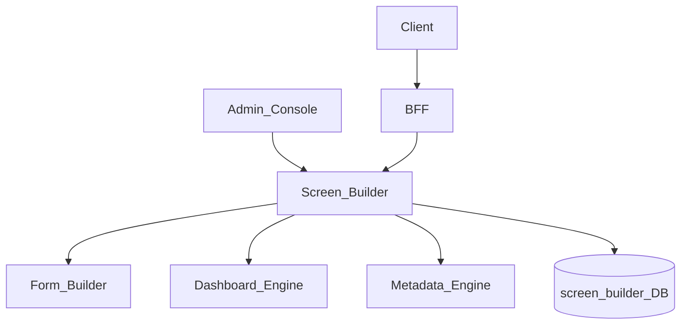
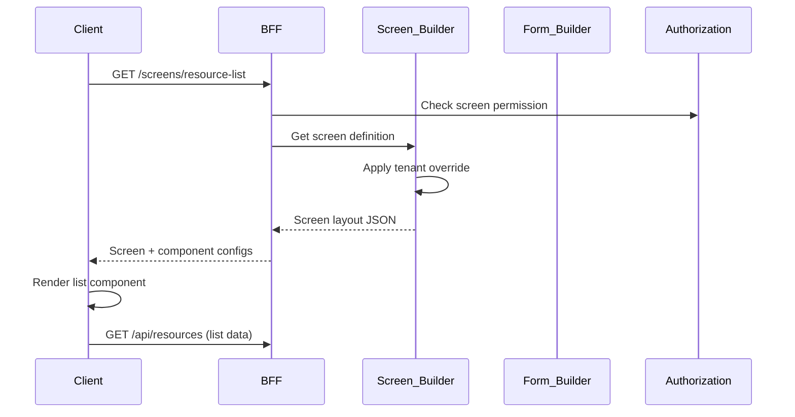
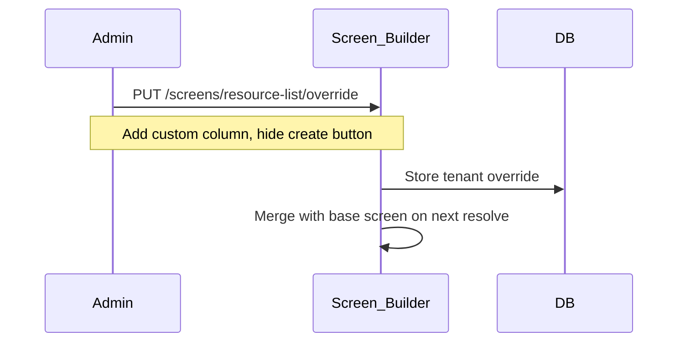

# Screen Builder

> **Volume:** 2 | **Chapter ID:** v2-70 | **Status:** reviewed

## Purpose

The **Screen Builder** composes full application screens from reusable components — forms, lists, dashboards, detail panels, and actions — into page layouts stored as metadata. It extends [Form Builder](69-form-builder.md) to page level, enabling tenant-specific screen customization without frontend redeployment. BFF serves screen definitions; frontend shell renders components dynamically.

## Architecture



Screens reference component instances by type and configuration. Navigation, permissions, and data bindings are declared in screen metadata.

## Responsibilities

### In Scope

- Screen definition: layout zones, component placement, responsive breakpoints
- Component types: form, list, detail, chart, kpi, tabs, actions, custom
- Embed Form Builder forms by formKey reference
- Embed Dashboard Engine widgets by dashboardId reference
- List component: entity type, columns, filters, actions
- Detail component: entity type, field display, related entity tabs
- Action bar: buttons with permission keys and navigation targets
- Screen-level permissions and visibility by role
- Screen versioning and tenant override
- Navigation menu registration from screen definitions
- Route mapping: screenKey → URL path

### Out of Scope

- Frontend framework implementation (React shell consumes screen JSON)
- Business API implementation (application services)
- Low-code component implementation ([Low-Code Components](72-low-code-components.md))
- Mobile-native screen layout (may share metadata with responsive rules)

## API Design

### Base Path

`/screens/v1`

| Method | Path | Description |
|--------|------|-------------|
| GET | /definitions | List screen definitions |
| GET | /definitions/{screenKey} | Get screen for render |
| POST | /definitions | Create screen |
| PUT | /definitions/{screenKey} | Update screen layout |
| POST | /definitions/{screenKey}/publish | Publish screen version |
| GET | /components | List available component types |
| GET | /navigation | Navigation menu for tenant/user |
| POST | /definitions/{screenKey}/preview | Preview with mock data |

### Screen Definition

```json
{
  "screenKey": "resource-list",
  "version": 2,
  "titleKey": "screen.resource.list.title",
  "route": "/resources",
  "permissionKey": "inventory.resource.read",
  "layout": {
    "type": "standard",
    "zones": {
      "header": {
        "components": [
          {
            "componentId": "page-title",
            "type": "heading",
            "config": { "titleKey": "screen.resource.list.title" }
          },
          {
            "componentId": "create-action",
            "type": "action",
            "config": {
              "labelKey": "action.create",
              "action": "navigate",
              "target": "/resources/new",
              "permissionKey": "inventory.resource.write"
            }
          }
        ]
      },
      "main": {
        "components": [
          {
            "componentId": "resource-table",
            "type": "list",
            "config": {
              "entityType": "resource",
              "columns": [
                { "field": "code", "labelKey": "field.resource.code", "sortable": true },
                { "field": "name", "labelKey": "field.resource.name", "sortable": true },
                { "field": "status", "labelKey": "field.resource.status", "filterable": true }
              ],
              "defaultSort": "name:asc",
              "rowAction": {
                "action": "navigate",
                "target": "/resources/{id}"
              },
              "apiEndpoint": "/api/resources"
            }
          }
        ]
      }
    }
  }
}
```

### Detail Screen with Embedded Form

```json
{
  "screenKey": "resource-detail",
  "route": "/resources/:id",
  "layout": {
    "zones": {
      "main": {
        "components": [
          {
            "componentId": "resource-form",
            "type": "form",
            "config": {
              "formKey": "resource-edit",
              "mode": "edit",
              "entityIdParam": "id",
              "submitAction": {
                "method": "PUT",
                "endpoint": "/api/resources/{id}"
              }
            }
          },
          {
            "componentId": "related-tab",
            "type": "tabs",
            "config": {
              "tabs": [
                { "labelKey": "tab.audit", "componentType": "list", "config": { "entityType": "audit-log" } }
              ]
            }
          }
        ]
      }
    }
  }
}
```

### Navigation Menu Response

```json
{
  "items": [
    {
      "labelKey": "nav.resources",
      "icon": "database",
      "screenKey": "resource-list",
      "route": "/resources",
      "permissionKey": "inventory.resource.read",
      "children": []
    }
  ]
}
```

Follow [API Standards](../Volume-1-Foundation/18-api-standards.md).

## Database Design

| Table | Key Columns | Purpose |
|-------|-------------|---------|
| `screen_definitions` | `screen_key`, `application_id`, `version`, `route`, `status` | Screen header |
| `screen_layouts` | `screen_key`, `version`, `layout_json` | Zone and component layout |
| `screen_components` | `screen_key`, `version`, `component_id`, `type`, `config_json` | Component instances |
| `screen_permissions` | `screen_key`, `permission_key` | Access control |
| `screen_navigation` | `tenant_id`, `menu_json`, `version` | Menu structure |
| `screen_tenant_overrides` | `tenant_id`, `screen_key`, `override_json` | Tenant customizations |

## Folder Structure

```text
services/screen-builder/
├── api/
├── domain/
│   ├── layout/         # Zone and responsive layout
│   ├── components/     # Component type registry
│   ├── resolve/        # Merge base + tenant override
│   ├── navigation/     # Menu builder
│   ├── permissions/    # Screen access filter
│   └── publish/        # Version management
├── persistence/
└── tests/
```

## Sequence Diagrams

### Screen Render



### Tenant Screen Override



## Extension Points

- **Custom component types** — register via Low-Code Components / Plugin Architecture
- **Responsive breakpoints** — hide/show components per viewport
- **Screen templates** — starter layouts per application
- **Deep linking** — query param binding to list filters

## Integration

- **Depends on:** Form Builder, Dashboard Engine, Metadata Engine, Authorization
- **Used by:** BFF, admin consoles, tenant customization tools
- **Events published:** `screen.definition.published`, `screen.navigation.updated`
- **Related:** [Form Builder](69-form-builder.md), [Low-Code Components](72-low-code-components.md)

## Best Practices

1. Reference forms by formKey — do not duplicate form field definitions in screen
2. Enforce permissionKey on screen and action components
3. Version screen definitions; test overrides in staging tenant first
4. Keep list column definitions aligned with Metadata Engine fields
5. Register navigation from screen definitions — single source for menu
6. Use route parameters consistently (`:id`) for detail screens

## Anti-Patterns

| Anti-Pattern | Why It Fails | Preferred Approach |
|--------------|--------------|-------------------|
| Hardcoded routes in frontend | Cannot customize per tenant | Screen Builder routes |
| Duplicate form fields in screen config | Drift from metadata | Form Builder embed |
| Screen without permission gate | Unauthorized access | permissionKey on screen |
| Monolithic screen JSON without zones | Poor responsive layout | Zone-based layout model |
| Navigation separate from screens | Menu/route drift | Navigation from screen registry |

## Related Chapters

- [Previous: Form Builder](69-form-builder.md)
- [Next: Plugin Architecture](71-plugin-architecture.md)
- [Form Builder](69-form-builder.md)
- [Dashboard Engine](22-dashboard-engine.md)
- [Metadata Engine](68-metadata-engine.md)
- [EPB Glossary](../docs/GLOSSARY.md)

---

*Enterprise Platform Blueprint — Volume 2*
