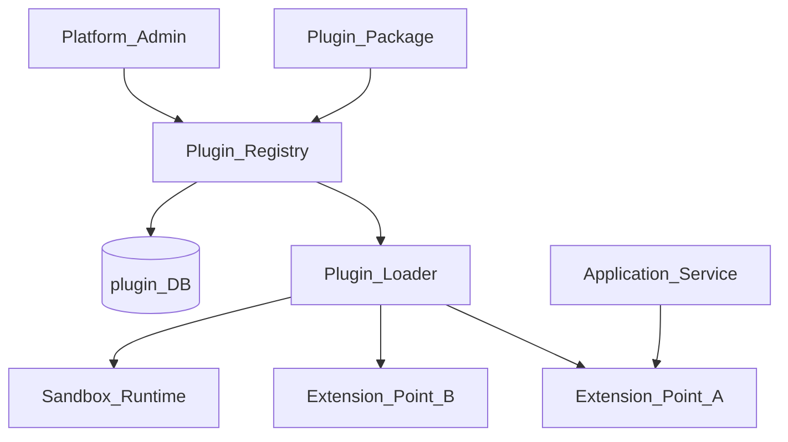
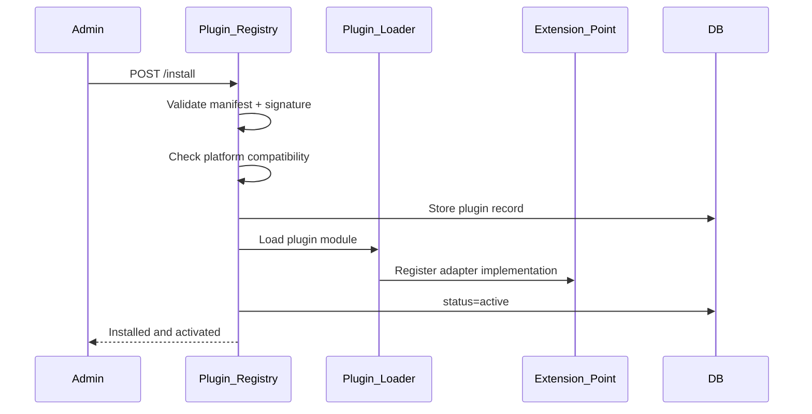
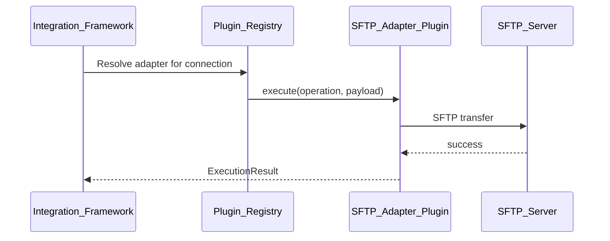

# Plugin Architecture

> **Volume:** 2 | **Chapter ID:** v2-71 | **Status:** reviewed

## Purpose

The **Plugin Architecture** defines how third-party and internal extensions integrate with EPB platform services safely. Plugins register adapters, components, and hooks through declared extension points without modifying platform core code. [Integration Framework](31-integration-framework.md), [Form Builder](69-form-builder.md), [Notification Platform](15-notification-platform.md), and export handlers all expose plugin slots governed by this architecture.

## Architecture



Plugins are versioned packages with manifest, permissions, and lifecycle hooks: `install`, `activate`, `deactivate`, `uninstall`.

## Responsibilities

### In Scope

- Plugin manifest schema: id, version, extension points, permissions
- Extension point registry — platform declares available hook interfaces
- Plugin discovery, installation, and activation per tenant
- Dependency resolution between plugins and platform version
- Sandboxed execution for untrusted plugins (resource limits, API allowlist)
- Plugin permission model — declared capabilities, admin approval
- Hot reload for development; restart-required for production
- Plugin health check and version compatibility validation
- Marketplace metadata (optional): author, description, signature
- Audit log of plugin lifecycle events

### Out of Scope

- Application business logic deployment (separate service deployment)
- Platform core service modification
- Arbitrary code execution without sandbox (prohibited)
- Plugin billing and marketplace payments

## API Design

### Base Path

`/plugins/v1`

| Method | Path | Description |
|--------|------|-------------|
| GET | /extension-points | List platform extension points |
| GET | / | List installed plugins |
| POST | /install | Install plugin package |
| POST | /{pluginId}/activate | Activate for tenant |
| POST | /{pluginId}/deactivate | Deactivate |
| DELETE | /{pluginId} | Uninstall |
| GET | /{pluginId}/health | Plugin health status |
| GET | /marketplace | Browse available plugins (optional) |

### Plugin Manifest

```json
{
  "pluginId": "acme.sftp-adapter",
  "name": "ACME SFTP Integration Adapter",
  "version": "2.1.0",
  "minPlatformVersion": "3.0.0",
  "author": "ACME Corp",
  "extensionPoints": [
    {
      "point": "integration.adapter",
      "implementation": "AcmeSftpAdapter",
      "configSchema": {
        "host": { "type": "string", "required": true },
        "port": { "type": "integer", "default": 22 }
      }
    }
  ],
  "permissions": [
    "integration.execute",
    "file.read",
    "config.read"
  ],
  "signature": "base64-signature..."
}
```

### Extension Point Definition

```json
{
  "pointKey": "integration.adapter",
  "interface": "IntegrationAdapter",
  "description": "External system connectivity adapters",
  "methods": ["connect", "execute", "healthCheck", "disconnect"],
  "maxInstancesPerTenant": 5
}
```

### Install Request

```json
{
  "tenantId": "tenant-uuid",
  "packageUrl": "https://registry.example.com/plugins/acme.sftp-adapter-2.1.0.zip",
  "activate": true,
  "config": {
    "host": "sftp.partner.com",
    "port": 22
  }
}
```

Follow [API Standards](../Volume-1-Foundation/18-api-standards.md).

## Database Design

| Table | Key Columns | Purpose |
|-------|-------------|---------|
| `plugin_registry` | `plugin_id`, `version`, `manifest_json`, `status` | Installed plugins |
| `plugin_extension_points` | `point_key`, `interface_json`, `description` | Platform hooks |
| `plugin_tenant_activation` | `tenant_id`, `plugin_id`, `config_json`, `activated_at` | Per-tenant state |
| `plugin_permissions` | `plugin_id`, `permission_key` | Declared permissions |
| `plugin_lifecycle_log` | `plugin_id`, `tenant_id`, `event`, `actor_id`, `occurred_at` | Audit |
| `plugin_compatibility` | `plugin_id`, `platform_version`, `compatible` | Version matrix |

Plugin statuses: `installed`, `active`, `inactive`, `failed`, `uninstalled`.

## Folder Structure

```text
platform/plugin-runtime/
├── registry/           # Install, activate, discovery
├── loader/             # Dynamic module loading
├── sandbox/            # Isolated execution
├── manifest/           # Schema validation
├── compatibility/      # Version checking
└── marketplace/        # Optional catalog

plugins/                # Plugin packages directory
└── {plugin-id}/
    ├── manifest.json
    ├── src/
    └── tests/
```

## Sequence Diagrams

### Plugin Install and Activate



### Runtime Extension Invocation



## Extension Points

Platform extension points include:

| Extension Point | Used By |
|-----------------|---------|
| `integration.adapter` | Integration Framework |
| `notification.channel` | Notification Platform |
| `export.format` | Export Platform |
| `form.widget` | Form Builder |
| `screen.component` | Screen Builder |
| `auth.idp` | Authentication |
| `cache.store` | Cache Platform |

## Integration

- **Governed by:** Platform security review for marketplace plugins
- **Used by:** Integration Framework, Form Builder, Screen Builder, Notification Platform
- **Depends on:** Configuration Service, Audit Platform
- **Events published:** `plugin.installed`, `plugin.activated`, `plugin.deactivated`, `plugin.failed`

## Best Practices

1. Declare all permissions in manifest — runtime enforces allowlist
2. Validate platform version compatibility before install
3. Sign plugin packages — verify signature on install
4. Sandbox untrusted plugins with resource and API limits
5. Deactivate before uninstall — graceful cleanup hook
6. Version plugins independently from platform releases

## Anti-Patterns

| Anti-Pattern | Why It Fails | Preferred Approach |
|--------------|--------------|-------------------|
| Modifying platform core for extensions | Upgrade breaks customizations | Plugin extension points |
| Unsandboxed third-party code | Security vulnerability | Sandbox runtime |
| Undeclared permissions | Privilege escalation | Manifest permission model |
| Plugin without compatibility range | Runtime crashes on upgrade | minPlatformVersion |
| Direct database access from plugin | Violates service boundaries | Platform APIs only |

## Related Chapters

- [Previous: Screen Builder](70-screen-builder.md)
- [Next: Low-Code Components](72-low-code-components.md)
- [Integration Adapter Pattern](64-integration-adapter-pattern.md)
- [Form Builder](69-form-builder.md)
- [EPB Glossary](../docs/GLOSSARY.md)

---

*Enterprise Platform Blueprint — Volume 2*
