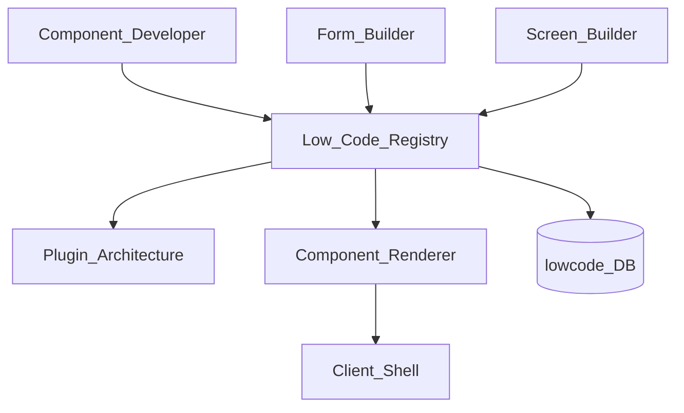
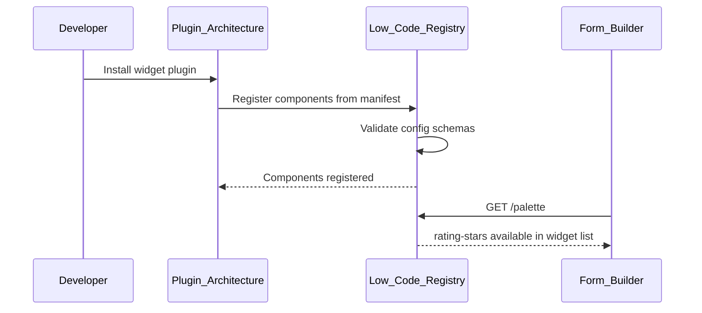
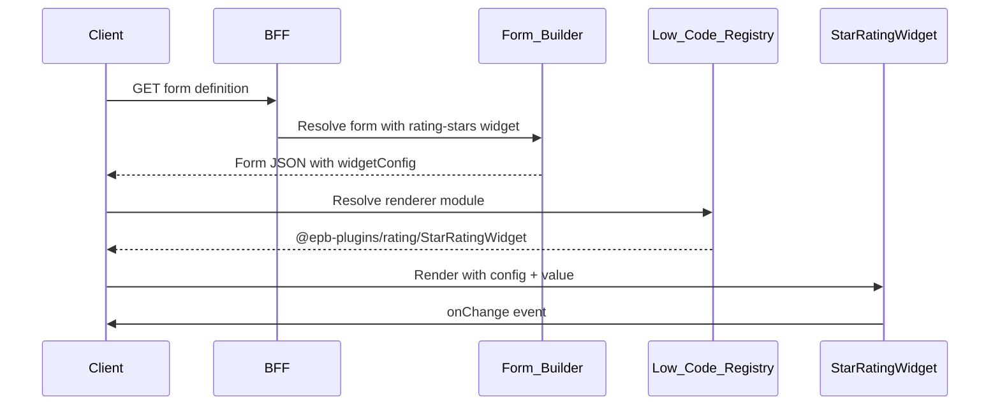

# Low-Code Components

> **Volume:** 2 | **Chapter ID:** v2-72 | **Status:** reviewed

## Purpose

**Low-Code Components** are reusable UI building blocks registered through [Plugin Architecture](71-plugin-architecture.md) and consumed by [Form Builder](69-form-builder.md) and [Screen Builder](70-screen-builder.md). They extend the standard widget and component library with custom renderers, validators, and data bindings — without forking the frontend shell. Component definitions include schema, default config, and renderer reference.

## Architecture



Components ship as frontend plugin bundles plus metadata registration. The client shell dynamically imports renderer modules.

## Responsibilities

### In Scope

- Component type registration: widget (form field) and screen component
- Component schema: config properties, data binding, events
- Default configuration and design-time preview
- Custom validation hooks for form widgets
- Data source binding declarations (API, Master Data, static)
- Event emission: onChange, onClick, onSubmit handlers
- Styling tokens integration with platform design system
- Component versioning and deprecation
- Tenant-enabled component allowlist
- Design-time palette metadata for Screen Builder drag-and-drop

### Out of Scope

- Full application screens (Screen Builder composes components)
- Backend business logic (application services)
- Platform core widgets (text, select, date — built-in, not low-code)
- Native mobile component bridges (separate SDK)

## API Design

### Base Path

`/low-code/v1`

| Method | Path | Description |
|--------|------|-------------|
| GET | /components | List registered components |
| POST | /components | Register component (via plugin) |
| GET | /components/{componentKey} | Get component definition |
| PUT | /components/{componentKey} | Update component metadata |
| GET | /components/{componentKey}/schema | Config JSON Schema |
| GET | /palette | Design-time palette for builder UI |
| POST | /components/{componentKey}/validate-config | Validate instance config |

### Component Registration

```json
{
  "componentKey": "rating-stars",
  "name": "Star Rating",
  "category": "form-widget",
  "description": "Interactive star rating input (1-5)",
  "pluginId": "widgets.rating-pack",
  "rendererModule": "@epb-plugins/rating/StarRatingWidget",
  "configSchema": {
    "type": "object",
    "properties": {
      "maxStars": { "type": "integer", "default": 5, "minimum": 1, "maximum": 10 },
      "allowHalf": { "type": "boolean", "default": false },
      "readOnly": { "type": "boolean", "default": false }
    }
  },
  "dataBinding": {
    "valueType": "number",
    "supportsValidation": true
  },
  "events": ["onChange"],
  "designTimePreview": true
}
```

### Screen Component Registration

```json
{
  "componentKey": "timeline-view",
  "name": "Activity Timeline",
  "category": "screen-component",
  "pluginId": "components.timeline-pack",
  "rendererModule": "@epb-plugins/timeline/TimelineView",
  "configSchema": {
    "type": "object",
    "properties": {
      "entityType": { "type": "string", "required": true },
      "entityIdParam": { "type": "string", "default": "id" },
      "apiEndpoint": { "type": "string", "required": true },
      "maxItems": { "type": "integer", "default": 50 }
    }
  },
  "zones": ["main", "sidebar"],
  "minHeight": 200
}
```

### Palette Response (for Screen Builder)

```json
{
  "categories": [
    {
      "name": "Form Widgets",
      "components": [
        { "componentKey": "rating-stars", "name": "Star Rating", "icon": "star" },
        { "componentKey": "color-picker", "name": "Color Picker", "icon": "palette" }
      ]
    },
    {
      "name": "Display",
      "components": [
        { "componentKey": "timeline-view", "name": "Activity Timeline", "icon": "timeline" }
      ]
    }
  ]
}
```

### Usage in Form Builder

```json
{
  "fieldKey": "satisfactionRating",
  "widget": "rating-stars",
  "widgetConfig": {
    "maxStars": 5,
    "allowHalf": true
  },
  "labelKey": "field.feedback.rating",
  "required": true
}
```

Follow [API Standards](../Volume-1-Foundation/18-api-standards.md).

## Database Design

| Table | Key Columns | Purpose |
|-------|-------------|---------|
| `lc_components` | `component_key`, `category`, `plugin_id`, `renderer_module` | Component registry |
| `lc_component_schemas` | `component_key`, `version`, `config_schema_json` | Config validation |
| `lc_component_bindings` | `component_key`, `value_type`, `events_json` | Data contract |
| `lc_tenant_allowlist` | `tenant_id`, `component_key`, `enabled` | Tenant enablement |
| `lc_palette_order` | `category`, `component_key`, `sort_order` | Builder palette |

## Folder Structure

```text
platform/low-code/
├── registry/           # Component CRUD API
├── schema/             # Config validation
├── palette/            # Design-time catalog
└── loader/             # Renderer module resolution

plugins/widget-packs/
└── rating-pack/
    ├── manifest.json
    ├── src/
    │   └── StarRatingWidget.tsx
    └── metadata/
        └── component.json
```

## Sequence Diagrams

### Component Registration via Plugin



### Runtime Render



## Extension Points

- **Custom validators** — register validation function per widget
- **Theme variants** — component style presets per tenant
- **Composite components** — bundle of sub-components as single palette item
- **Server-driven options** — dynamic config from API at design time

## Integration

- **Depends on:** Plugin Architecture, Form Builder, Screen Builder
- **Events published:** `lowcode.component.registered`, `lowcode.component.deprecated`
- **Used by:** Tenant admins via Screen Builder drag-and-drop palette
- **Related:** [Plugin Architecture](71-plugin-architecture.md), [Form Builder](69-form-builder.md)

## Best Practices

1. Register components through plugins — not ad-hoc frontend imports
2. Define configSchema for design-time validation in builders
3. Declare valueType for correct form data binding and validation
4. Use platform design tokens — do not hardcode colors/fonts
5. Version components; deprecate before removal with migration guide
6. Tenant allowlist for enterprise tenants restricting third-party widgets

## Anti-Patterns

| Anti-Pattern | Why It Fails | Preferred Approach |
|--------------|--------------|-------------------|
| Custom widget without registry | Screen Builder cannot discover | Low-Code component registration |
| Business logic in component renderer | Untestable, wrong layer | API calls from component, logic in service |
| No configSchema | Invalid configs at runtime | JSON Schema on registration |
| Forking frontend for one widget | Upgrade pain | Plugin widget pack |
| Unrestricted third-party widgets | Security and UX risk | Tenant allowlist |

## Related Chapters

- [Previous: Plugin Architecture](71-plugin-architecture.md)
- [Form Builder](69-form-builder.md)
- [Screen Builder](70-screen-builder.md)
- [Plugin Architecture](71-plugin-architecture.md)
- [EPB Glossary](../docs/GLOSSARY.md)

---

*Enterprise Platform Blueprint — Volume 2*
