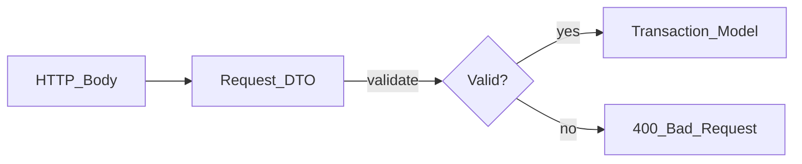

# How to Create a Request DTO

> **Volume:** 3 | **Chapter ID:** v3-06 | **Status:** reviewed

## What You Will Accomplish

You will define a Request DTO (Data Transfer Object) in the shared contracts package, add validation rules, publish the package, and wire it into the BFF and service ingress layers. This guide creates `CreateResourceRequest` for the catalog service.

## Prerequisites

- [Create New API](05-create-new-api.md) in progress or completed
- [DTO Standards](../Volume-1-Foundation/15-dto-standards.md) reviewed
- Shared contracts package builds (`make build-packages`)
- Familiarity with [Model Separation](../Volume-1-Foundation/11-model-separation.md)

## Request DTO Rules

Request DTOs are the **write contract** at the API boundary. They:

- Validate and deserialize incoming payloads
- Contain **no business logic**, no ORM annotations, no computed domain state
- Are scoped to **one operation** (`CreateResourceRequest` ≠ `UpdateResourceRequest`)
- Never trust client-supplied `tenantId` without verification against auth context



## Steps

### Step 1: Choose the bounded context package

Request DTOs live in `packages/shared-contracts`, organized by bounded context:

```text
packages/shared-contracts/
└── src/
    └── catalog/
        ├── requests/
        │   ├── CreateResourceRequest.ts
        │   └── UpdateResourceRequest.ts
        ├── responses/
        └── index.ts
```

Create the directory if it does not exist:

```bash
mkdir -p packages/shared-contracts/src/catalog/requests
```

**Expected result:** Folder path matches the owning service domain (`catalog`).

### Step 2: Define the Request DTO type

Create `packages/shared-contracts/src/catalog/requests/CreateResourceRequest.ts`:

```typescript
/**
 * API contract for POST /api/v1/resources
 * @version 1.0
 */
export interface CreateResourceRequest {
  /** Unique code within tenant. Max 64 chars. */
  code: string;

  /** Human-readable name. Max 256 chars. */
  displayName: string;

  /** Organization that owns this resource. */
  organizationId: string;

  /** Optional key-value metadata. */
  metadata?: Record<string, string>;
}
```

Use separate types per operation. Do not add `id`, `createdAt`, or `status` to a create request — those are server-assigned.

**Expected result:** Type exports with XML/JSDoc describing constraints.

### Step 3: Add validation schema

Colocate validation with the DTO (framework-specific adapter) or define a portable schema:

```typescript
// packages/shared-contracts/src/catalog/requests/CreateResourceRequest.schema.ts
export const createResourceRequestSchema = {
  type: 'object',
  required: ['code', 'displayName', 'organizationId'],
  properties: {
    code: { type: 'string', minLength: 1, maxLength: 64, pattern: '^[A-Z0-9_-]+$' },
    displayName: { type: 'string', minLength: 1, maxLength: 256 },
    organizationId: { type: 'string', format: 'uuid' },
    metadata: {
      type: 'object',
      additionalProperties: { type: 'string' },
    },
  },
  additionalProperties: false,
};
```

Validation runs at:

1. **BFF** — fast failure before downstream calls
2. **Service** — defense in depth before mapping to Transaction Model

**Expected result:** Invalid payloads fail with field-level error messages.

### Step 4: Export from the package index

Update `packages/shared-contracts/src/catalog/index.ts`:

```typescript
export * from './requests/CreateResourceRequest';
export * from './requests/CreateResourceRequest.schema';
export * from './requests/UpdateResourceRequest';
```

Rebuild:

```bash
cd packages/shared-contracts && npm run build
```

**Expected result:** Consumers can `import { CreateResourceRequest } from '@epb/shared-contracts/catalog'`.

### Step 5: Wire validation in the BFF

Add middleware in `apps/bff-web/middleware/validate.ts`:

```typescript
import { createResourceRequestSchema } from '@epb/shared-contracts/catalog';

router.post(
  '/api/v1/resources',
  authenticate,
  validateBody(createResourceRequestSchema),
  resourceHandler.create
);
```

On validation failure, return the standard error envelope:

```json
{
  "success": false,
  "error": {
    "code": "VALIDATION_ERROR",
    "message": "Request validation failed",
    "details": [
      { "field": "code", "message": "must match pattern ^[A-Z0-9_-]+$" }
    ]
  }
}
```

**Expected result:** `POST` with empty `code` returns 400 before calling catalog service.

### Step 6: Wire validation in the service

Repeat validation in the service controller as defense in depth:

```typescript
async create(req: Request, res: Response) {
  const validation = validateCreateResourceRequest(req.body);
  if (!validation.ok) {
    return res.status(400).json(wrapValidationError(validation.errors));
  }
  const request = req.body as CreateResourceRequest;
  // continue to mapper...
}
```

**Expected result:** Direct calls to the service (bypassing BFF in integration tests) still reject invalid input.

### Step 7: Map to Transaction Model (not Domain Model)

Request DTOs do not enter business logic directly. The mapper converts to a `CreateResourceCommand`:

```typescript
// In mapper — see Create Mapper guide
CreateResourceCommand {
  tenantId: string;      // from auth context, NOT request body
  code: string;          // from request
  displayName: string;
  organizationId: string;
  createdBy: string;     // from auth context
  correlationId: string; // from headers
}
```

**Expected result:** `CreateResourceRequest` never appears in `domain/services/`.

### Step 8: Write validation tests

```bash
cd packages/shared-contracts
npm test -- CreateResourceRequest.test.ts
```

Test cases:

| Input | Expected |
|-------|----------|
| Valid minimal body | Pass |
| Missing `code` | Fail: required field |
| `code` with lowercase | Fail: pattern mismatch |
| `displayName` > 256 chars | Fail: max length |
| Extra unknown field | Fail (if `additionalProperties: false`) |
| `tenantId` in body | Ignored or rejected — never trusted from client |

**Expected result:** All validation tests pass.

### Step 9: Update OpenAPI

Regenerate or manually sync `packages/shared-contracts/openapi/catalog-v1.yaml` from the schema. OpenAPI is the published contract for external consumers.

**Expected result:** `CreateResourceRequest` in OpenAPI matches the TypeScript interface.

## Verification

- [ ] Request DTO in `packages/shared-contracts`, not inside the service
- [ ] One DTO per operation (create vs update separated)
- [ ] Validation schema with required fields, lengths, and patterns
- [ ] BFF validates before proxying
- [ ] Service re-validates before mapping
- [ ] No business logic in the DTO file
- [ ] No `tenantId` trusted from request body
- [ ] Validation unit tests pass
- [ ] OpenAPI schema updated

## Troubleshooting

| Symptom | Cause | Fix |
|---------|-------|-----|
| Import not found after adding DTO | Package not rebuilt | `npm run build` in shared-contracts |
| Validation differs BFF vs service | Duplicate schemas | Single schema in shared-contracts, imported both places |
| 400 with no field details | Generic validator | Return per-field errors in standard envelope |
| Client sends snake_case | Naming mismatch | Document camelCase in OpenAPI; reject or transform at BFF |
| Fat DTO with 30+ fields | Wrong granularity | Split by operation; nest related fields |

## Reference

- DTO template: [Templates/dto-template.md](../Templates/dto-template.md)
- DTO standards: [DTO Standards](../Volume-1-Foundation/15-dto-standards.md)
- Next: map to response — [Create Response DTO](07-create-response-dto.md)
- Mapper: [Create Mapper](09-create-mapper.md)

## Related Chapters

- [Previous: Create New API](05-create-new-api.md)
- [Next: Create Response DTO](07-create-response-dto.md)
- [EPB Glossary](../docs/GLOSSARY.md)

---

*Enterprise Platform Blueprint — Volume 3*
