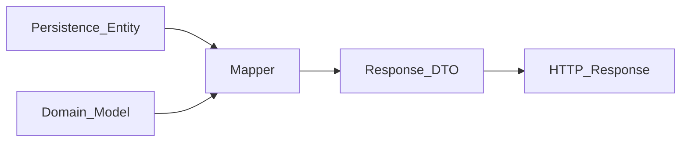

# How to Create a Response DTO

> **Volume:** 3 | **Chapter ID:** v3-07 | **Status:** reviewed

## What You Will Accomplish

You will define Response DTOs in the shared contracts package for single-resource, list, and detail views. You will map from persistence entities through mappers (never expose entities directly) and verify the API returns client-safe shapes.

## Prerequisites

- [Create Request DTO](06-create-request-dto.md) completed
- [DTO Standards](../Volume-1-Foundation/15-dto-standards.md) reviewed
- Persistence entity defined or planned ([Create Entity](08-create-entity.md))

## Response DTO Rules

Response DTOs shape **what clients see**. They:

- Use stable, client-oriented field names (camelCase in JSON)
- Omit internal surrogate keys unless the client needs them for subsequent calls
- Never expose password hashes, row versions, soft-delete flags, or raw tenant discriminators
- Use nested DTOs for related data instead of flat denormalized blobs
- Support list wrappers with pagination metadata



## Steps

### Step 1: Plan response variants

| DTO | Use case | Fields |
|-----|----------|--------|
| `ResourceResponse` | Single resource (create, get, update) | Full client-facing shape |
| `ResourceSummaryResponse` | List rows | Id, code, displayName, status only |
| `ResourceDetailResponse` | Detail screen | Full shape + nested relations |
| `PagedResourceListResponse` | Paginated list | Items + pagination meta |

List and detail views are separate DTOs — do not return 40 fields in a list endpoint.

**Expected result:** You know which response types this API version needs.

### Step 2: Create the primary Response DTO

Add `packages/shared-contracts/src/catalog/responses/ResourceResponse.ts`:

```typescript
/**
 * API response for a single resource.
 * @version 1.0
 */
export interface ResourceResponse {
  id: string;
  code: string;
  displayName: string;
  status: ResourceStatus;
  organization: OrganizationSummaryResponse;
  metadata?: Record<string, string>;
  createdAt: string;   // ISO-8601 UTC
  updatedAt: string;
}

export interface OrganizationSummaryResponse {
  id: string;
  name: string;
}

export enum ResourceStatus {
  ACTIVE = 'ACTIVE',
  INACTIVE = 'INACTIVE',
  ARCHIVED = 'ARCHIVED',
}
```

**Expected result:** Response type has no persistence concerns (no `@Column`, no `rowVersion`).

### Step 3: Create the list wrapper

Add `packages/shared-contracts/src/catalog/responses/PagedResourceListResponse.ts`:

```typescript
export interface PagedResourceListResponse {
  items: ResourceSummaryResponse[];
  pagination: PaginationMeta;
}

export interface ResourceSummaryResponse {
  id: string;
  code: string;
  displayName: string;
  status: ResourceStatus;
}

export interface PaginationMeta {
  page: number;
  pageSize: number;
  totalItems: number;
  totalPages: number;
}
```

Follow [Pagination Implementation](60-pagination-implementation.md) for query parameter conventions.

**Expected result:** List response includes pagination block, not raw arrays.

### Step 4: Export from package index

```typescript
// packages/shared-contracts/src/catalog/index.ts
export * from './responses/ResourceResponse';
export * from './responses/PagedResourceListResponse';
```

Rebuild shared contracts:

```bash
cd packages/shared-contracts && npm run build
```

**Expected result:** Types importable from `@epb/shared-contracts/catalog`.

### Step 5: Implement mapper output (preview)

Response DTOs are **produced by mappers**, not constructed in controllers. Example mapping logic (full detail in [Create Mapper](09-create-mapper.md)):

```typescript
static toResponse(entity: ResourceEntity, org: OrganizationEntity): ResourceResponse {
  return {
    id: entity.publicId,           // expose public ID, not internal surrogate
    code: entity.code,
    displayName: entity.displayName,
    status: entity.status as ResourceStatus,
    organization: {
      id: org.publicId,
      name: org.displayName,
    },
    metadata: entity.metadataJson ?? undefined,
    createdAt: entity.createdAt.toISOString(),
    updatedAt: entity.updatedAt.toISOString(),
  };
}
```

Combine multiple entities in the mapper when the response nests related data.

**Expected result:** Controller calls `ResourceMapper.toResponse(entity, org)` — never returns `entity` directly.

### Step 6: Apply least-exposure rules

Review each field against the checklist:

| Field | Include? | Reason |
|-------|----------|--------|
| `id` (public UUID) | Yes | Client references resource in subsequent calls |
| Internal `serial_id` | No | Database surrogate — never expose |
| `tenantId` | No | Implicit from auth context |
| `deletedAt` | No | Soft-delete is internal unless API supports tombstone view |
| `rowVersion` | No | Optimistic locking is service-internal |
| `createdBy` | Maybe | Include only if UI displays audit attribution |
| `passwordHash` | Never | Security violation |

**Expected result:** Response JSON contains only client-needed fields.

### Step 7: Wrap in standard envelope

EPB APIs return a consistent envelope from the BFF:

```json
{
  "success": true,
  "data": {
    "id": "res_9c4e1d",
    "code": "RES-001",
    "displayName": "Primary Resource",
    "status": "ACTIVE",
    "organization": { "id": "org_7f3a2b", "name": "Central Unit" },
    "createdAt": "2026-08-01T10:30:00Z",
    "updatedAt": "2026-08-01T10:30:00Z"
  },
  "meta": {
    "correlationId": "corr_abc123"
  }
}
```

List endpoints wrap `PagedResourceListResponse` in the same `data` field.

**Expected result:** All catalog endpoints use the shared `wrapSuccess()` helper.

### Step 8: Version response changes

Backward-compatible additions:

- Add **optional** fields to `ResourceResponse`
- Document new fields in OpenAPI with description

Breaking changes:

- Rename or remove fields → new API version (`/api/v2/...`)
- Mark deprecated fields in OpenAPI; maintain for one release cycle

**Expected result:** v1 clients continue working when optional fields are added.

### Step 9: Write mapper and contract tests

```typescript
describe('ResourceMapper.toResponse', () => {
  it('maps entity to response without internal fields', () => {
    const response = ResourceMapper.toResponse(fixtureEntity, fixtureOrg);
    expect(response).not.toHaveProperty('tenantId');
    expect(response).not.toHaveProperty('rowVersion');
    expect(response.id).toBe(fixtureEntity.publicId);
  });

  it('serializes dates as ISO-8601', () => {
    const response = ResourceMapper.toResponse(fixtureEntity, fixtureOrg);
    expect(response.createdAt).toMatch(/^\d{4}-\d{2}-\d{2}T/);
  });
});
```

**Expected result:** Tests fail if internal fields leak into the response.

## Verification

- [ ] Response DTOs in `packages/shared-contracts`
- [ ] Separate summary and detail DTOs where needed
- [ ] List responses use pagination wrapper
- [ ] Mapper produces Response DTO — entity never returned from controller
- [ ] No internal IDs, tenant IDs, or row versions exposed
- [ ] Dates in ISO-8601 UTC format
- [ ] Standard success envelope applied
- [ ] OpenAPI schemas match TypeScript types
- [ ] Mapper tests confirm least-exposure rules

## Troubleshooting

| Symptom | Cause | Fix |
|---------|-------|-----|
| Client sees database column names | Entity returned directly | Map through `ResourceMapper.toResponse` |
| List endpoint slow | Full detail DTO in list | Use `ResourceSummaryResponse` |
| Missing nested organization | Single-entity mapper | Join org in repository; pass both to mapper |
| Date format inconsistent | Local timezone serialization | Always `toISOString()` in UTC |
| Breaking mobile clients | Removed field in minor version | Add v2 endpoint; deprecate v1 field |

## Reference

- DTO template: [Templates/dto-template.md](../Templates/dto-template.md)
- DTO standards: [DTO Standards](../Volume-1-Foundation/15-dto-standards.md)
- Pagination: [Pagination Implementation](60-pagination-implementation.md)
- Mapper: [Create Mapper](09-create-mapper.md)

## Related Chapters

- [Previous: Create Request DTO](06-create-request-dto.md)
- [Next: Create Entity](08-create-entity.md)
- [EPB Glossary](../docs/GLOSSARY.md)

---

*Enterprise Platform Blueprint — Volume 3*
