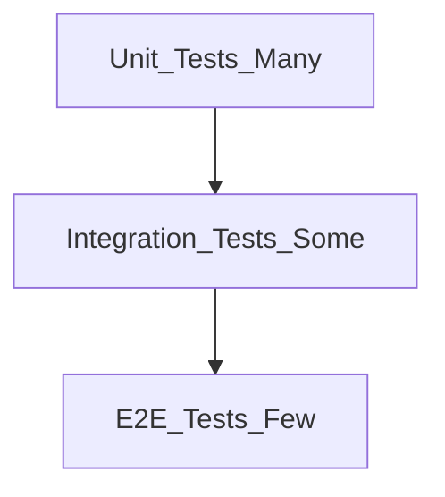

# How to Write Unit Tests

> **Volume:** 3 | **Chapter ID:** v3-16 | **Status:** reviewed

## What You Will Accomplish

You will add unit tests for domain logic in an EPB service, using the standard test layout, naming conventions, and isolation patterns. When finished, business rules run in milliseconds without databases or network calls, and your CI pipeline executes them on every pull request.

## Prerequisites

- [Project Setup](01-project-setup.md) and [Development Environment](02-development-environment.md) completed
- A service with domain logic under `domain/services/` (see [Create New Service](04-create-new-service.md))
- Familiarity with [Testing Standards](../Volume-1-Foundation/27-testing-standards.md) and [Model Separation](../Volume-1-Foundation/11-model-separation.md)

## Test Pyramid Context

EPB expects three test layers. Unit tests form the base — fast, isolated, and numerous.



| Layer | Scope | Speed | Location |
|-------|-------|-------|----------|
| Unit | Single class or function | Milliseconds | `tests/unit/` |
| Integration | API + database + broker | Seconds | `tests/integration/` — see [Integration Testing Guide](17-integration-testing-guide.md) |
| E2E | Frontend through BFF | Minutes | `tests/e2e/` — see [E2E Testing Guide](18-e2e-testing-guide.md) |

## Steps

### Step 1: Locate the test directory

Navigate to your service and confirm the unit test folder exists:

```bash
cd services/application/catalog
ls tests/unit
```

If missing, create it:

```bash
mkdir -p tests/unit
```

**Expected result:** `tests/unit/` exists alongside `tests/integration/`.

### Step 2: Choose what to unit test

Unit tests belong in the **domain layer**. Test business rules, validation, state transitions, and calculations — not HTTP routing or SQL.

| Test | Do unit test | Do not unit test |
|------|--------------|------------------|
| `ResourceService.create()` validation rules | Yes | |
| Mapper field mapping | Yes | |
| Controller HTTP status codes | | Use integration tests |
| Repository SQL queries | | Use integration tests |
| BFF aggregation | | Use integration or E2E tests |

**Expected result:** You have identified one domain service method to test first.

### Step 3: Create the test file

Follow EPB naming: `<source-file>.test.<ext>` mirroring the source path.

```text
domain/services/resource.service.ts  →  tests/unit/resource.service.test.ts
```

Example skeleton (TypeScript illustrative):

```typescript
import { ResourceService } from '../../domain/services/resource.service';
import { MockResourceRepository } from '@epb/shared-testing/mocks';

describe('ResourceService', () => {
  let service: ResourceService;
  let repository: MockResourceRepository;

  beforeEach(() => {
    repository = new MockResourceRepository();
    service = new ResourceService(repository);
  });

  describe('create', () => {
    it('rejects duplicate resource codes within tenant', async () => {
      const tenantId = 'tenant-a';
      repository.seed({ code: 'RES-001', tenantId });

      await expect(
        service.create({ code: 'RES-001', name: 'Duplicate' }, tenantId)
      ).rejects.toMatchObject({ code: 'RESOURCE_CONFLICT' });
    });
  });
});
```

**Expected result:** Test file compiles and imports resolve via `@epb/shared-testing`.

### Step 4: Mock external dependencies

Unit tests must not touch real infrastructure. Replace repositories, HTTP clients, and message publishers with mocks or fakes from `packages/shared-testing`.

Rules:

1. **Inject dependencies** through constructors or interfaces — never `new PostgresClient()` inside domain code
2. **Stub platform calls** (identity, audit, notifications) at the interface boundary
3. **Pass tenant context explicitly** — every method under test receives `tenantId` as a parameter; do not read from global state

```typescript
const auditPublisher = { publish: jest.fn().mockResolvedValue(undefined) };
service = new ResourceService(repository, auditPublisher);
```

**Expected result:** Running the test does not require Docker, Postgres, or Redis.

### Step 5: Apply the Arrange–Act–Assert pattern

Structure every test in three blocks:

```typescript
it('sets status to ACTIVE when validation passes', async () => {
  // Arrange
  const input = { code: 'RES-002', name: 'Valid Resource' };
  const tenantId = 'tenant-a';

  // Act
  const result = await service.create(input, tenantId);

  // Assert
  expect(result.status).toBe('ACTIVE');
  expect(repository.save).toHaveBeenCalledWith(
    expect.objectContaining({ tenantId, code: 'RES-002' })
  );
});
```

Keep one logical assertion per test when possible. Name tests as behavior: `rejects empty code`, not `test create`.

**Expected result:** Test names read as specifications of business behavior.

### Step 6: Cover edge cases and error paths

For each public domain method, test at minimum:

| Category | Example |
|----------|---------|
| Happy path | Valid input produces expected output |
| Validation failure | Missing required field throws `VALIDATION_ERROR` |
| Not found | `getById` with unknown ID throws `RESOURCE_NOT_FOUND` |
| Tenant isolation | Operation with wrong `tenantId` does not access another tenant's data |
| Concurrency | Optimistic lock conflict returns `CONFLICT` |

Align error codes with [Error Handling](../Volume-1-Foundation/19-error-handling.md).

**Expected result:** Each domain method has at least three test cases (success, validation, not-found or conflict).

### Step 7: Run unit tests locally

From the service directory or monorepo root:

```bash
# Service-scoped
cd services/application/catalog
npm test -- --testPathPattern=tests/unit

# Monorepo shortcut
make test-unit-catalog
```

**Expected result:** All unit tests pass in under 10 seconds with no infrastructure running.

### Step 8: Wire into CI

Ensure the service's CI job runs unit tests separately from integration tests:

```yaml
- name: Unit tests
  run: npm test -- --testPathPattern=tests/unit --coverage
```

Set a coverage gate on `domain/` only — do not require 100% on boilerplate controllers.

**Expected result:** Pull requests fail when unit tests fail, before integration tests run.

## Verification

- [ ] Tests live in `tests/unit/` with mirrored naming
- [ ] Domain logic tested; no database or HTTP in unit tests
- [ ] Dependencies mocked via interfaces or `@epb/shared-testing`
- [ ] Tenant context passed explicitly in every test
- [ ] Error codes match EPB standard (`VALIDATION_ERROR`, `RESOURCE_NOT_FOUND`, etc.)
- [ ] Unit test suite completes in seconds locally and in CI
- [ ] Coverage report includes `domain/` directory

## Troubleshooting

| Symptom | Cause | Fix |
|---------|-------|-----|
| Tests hang or timeout | Accidental real DB connection | Mock the repository; check for missing `jest.mock` |
| `Cannot find module @epb/shared-testing` | Package not built | Run `make build-packages` |
| Flaky pass/fail order | Shared mutable state between tests | Reset mocks in `beforeEach`; avoid static singletons |
| Tests pass but miss tenant bugs | `tenantId` not asserted | Add cross-tenant negative tests |
| Coverage shows 0% for domain | Tests import wrong path | Mirror source path under `tests/unit/` |

## Reference

| Topic | Location |
|-------|----------|
| Shared test mocks | `packages/shared-testing/` |
| Error codes | [Error Handling](../Volume-1-Foundation/19-error-handling.md) |
| Model layers | [Model Separation](../Volume-1-Foundation/11-model-separation.md) |
| Integration tests | [Integration Testing Guide](17-integration-testing-guide.md) |
| Code review gate | [Code Review Checklist](22-code-review-checklist.md) |

## Related Chapters

- [Previous: Create Report](15-create-report.md)
- [Next: Integration Testing Guide](17-integration-testing-guide.md)
- [Testing Standards](../Volume-1-Foundation/27-testing-standards.md)
- [EPB Glossary](../docs/GLOSSARY.md)

---

*Enterprise Platform Blueprint — Volume 3*
