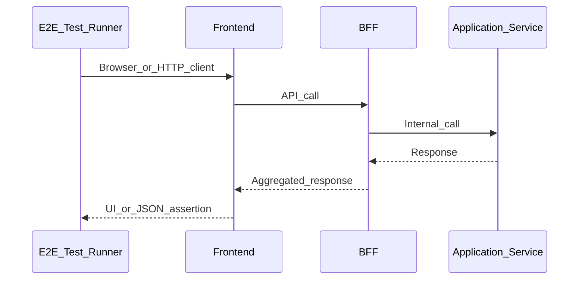

# How to Write E2E Tests

> **Volume:** 3 | **Chapter ID:** v3-18 | **Status:** reviewed

## What You Will Accomplish

You will create end-to-end tests that exercise a user workflow through the frontend, BFF, and backend services. When finished, critical paths (login, create resource, list resources) are validated as a connected system before release.

## Prerequisites

- [Integration Testing Guide](17-integration-testing-guide.md) completed for underlying services
- Local stack running: frontend, BFF, and at least one application service (see [Project Setup](01-project-setup.md))
- Familiarity with [BFF Layer](../Volume-1-Foundation/08-bff-layer.md) — E2E tests never call services directly

## Architecture Under Test

E2E tests simulate a real client. All traffic flows through the BFF.



## Steps

### Step 1: Choose the E2E test location

E2E tests live at the monorepo root or in the frontend app — not inside individual services.

```bash
mkdir -p tests/e2e/specs
mkdir -p tests/e2e/fixtures
```

Typical layout:

```text
tests/e2e/
├── specs/
│   ├── auth.spec.ts
│   └── resource-lifecycle.spec.ts
├── fixtures/
│   ├── test-users.json
│   └── seed-data.sql
├── playwright.config.ts   # or cypress.config.ts
└── docker-compose.e2e.yml
```

**Expected result:** E2E directory exists at repo root with config file for your test runner.

### Step 2: Configure the test environment

Create `tests/e2e/.env.e2e`:

```bash
E2E_BASE_URL=http://localhost:5173
E2E_BFF_URL=http://localhost:3000
E2E_IDENTITY_URL=http://localhost:8081
E2E_TEST_TENANT=tenant-e2e
E2E_TEST_USER=editor@e2e.local
E2E_TEST_PASSWORD=changeme-e2e-only
```

Start the full stack for E2E:

```bash
docker compose -f infrastructure/docker/docker-compose.yml up -d
make dev-all    # or equivalent: BFF + frontend + services
```

**Expected result:** `curl -s $E2E_BFF_URL/health` returns `UP`.

### Step 3: Seed deterministic test data

E2E tests require known tenants, users, and permissions. Seed via a script, not manual setup:

```bash
npm run e2e:seed
```

Seed script responsibilities:

1. Create tenant `tenant-e2e` if missing
2. Create user with `editor` role
3. Truncate application data tables for that tenant
4. Insert baseline resources for list/search tests

**Expected result:** Running `e2e:seed` twice produces the same starting state.

### Step 4: Write an authentication helper

Centralize login so every spec starts authenticated:

```typescript
// tests/e2e/helpers/auth.ts
export async function loginAsEditor(page: Page) {
  await page.goto('/login');
  await page.fill('[data-testid="email"]', process.env.E2E_TEST_USER!);
  await page.fill('[data-testid="password"]', process.env.E2E_TEST_PASSWORD!);
  await page.click('[data-testid="login-submit"]');
  await page.waitForURL('/dashboard');
}
```

For API-only E2E (no browser), obtain a token from the identity service and attach it to BFF requests.

**Expected result:** `loginAsEditor` completes in under five seconds.

### Step 5: Write a critical-path spec

Cover one complete user journey per spec file:

```typescript
// tests/e2e/specs/resource-lifecycle.spec.ts
import { test, expect } from '@playwright/test';
import { loginAsEditor } from '../helpers/auth';

test.describe('Resource lifecycle', () => {
  test.beforeEach(async ({ page }) => {
    await loginAsEditor(page);
  });

  test('creates, views, and archives a resource', async ({ page }) => {
    await page.click('[data-testid="nav-resources"]');
    await page.click('[data-testid="create-resource"]');
    await page.fill('[data-testid="resource-code"]', 'E2E-001');
    await page.fill('[data-testid="resource-name"]', 'E2E Resource');
    await page.click('[data-testid="submit"]');

    await expect(page.locator('[data-testid="toast-success"]')).toBeVisible();
    await expect(page.locator('text=E2E-001')).toBeVisible();

    await page.click('[data-testid="archive-resource"]');
    await expect(page.locator('text=Archived')).toBeVisible();
  });
});
```

Use `data-testid` attributes — never CSS classes or brittle XPath selectors.

**Expected result:** Spec passes against local stack with seeded data.

### Step 6: Add API-level E2E for BFF aggregation

When a screen aggregates multiple services, test the BFF endpoint directly:

```typescript
test('dashboard endpoint returns aggregated data', async ({ request }) => {
  const token = await getServiceToken('editor@e2e.local');

  const response = await request.get('/api/v1/dashboard', {
    headers: { Authorization: `Bearer ${token}` },
  });

  expect(response.status()).toBe(200);
  const body = await response.json();
  expect(body.data).toHaveProperty('recentResources');
  expect(body.data).toHaveProperty('notifications');
});
```

**Expected result:** BFF aggregation response includes all expected sections.

### Step 7: Configure retries and artifacts

E2E tests are inherently slower and occasionally flaky. Configure:

| Setting | Recommended value |
|---------|-------------------|
| Timeout per test | 30–60 seconds |
| Retries in CI | 2 |
| Screenshots on failure | Enabled |
| Video on failure | Enabled (CI only) |
| Parallel workers | 2–4 (not unlimited) |

```typescript
// playwright.config.ts
export default defineConfig({
  retries: process.env.CI ? 2 : 0,
  use: { screenshot: 'only-on-failure', trace: 'on-first-retry' },
});
```

**Expected result:** Failed tests produce screenshots and traces in CI artifacts.

### Step 8: Wire E2E into the pipeline

Run E2E on merge to main or nightly — not on every PR (too slow):

```yaml
e2e-tests:
  if: github.ref == 'refs/heads/main'
  runs-on: ubuntu-latest
  steps:
    - run: docker compose -f tests/e2e/docker-compose.e2e.yml up -d
    - run: npm run e2e:seed
    - run: npm run test:e2e
```

**Expected result:** E2E job runs after integration tests pass on protected branches.

## Verification

- [ ] E2E tests live in `tests/e2e/` at repo root
- [ ] All traffic goes through frontend or BFF — no direct service calls from browser tests
- [ ] Test data seeded deterministically before each run
- [ ] Auth helper reused across specs
- [ ] Selectors use `data-testid`
- [ ] At least one critical user journey covered end-to-end
- [ ] CI captures screenshots/traces on failure
- [ ] E2E runs on schedule or post-merge, not blocking every PR

## Troubleshooting

| Symptom | Cause | Fix |
|---------|-------|-----|
| Login timeout | Identity service not ready | Add `wait-on` for BFF and identity health |
| Element not found | Missing `data-testid` | Add test IDs to frontend components |
| 401 on BFF calls | Expired or wrong test token | Regenerate token in `beforeEach` |
| Flaky list assertions | Stale seed data | Run `e2e:seed` in `beforeAll` |
| Tests pass locally, fail in CI | Headless rendering difference | Increase timeout; check viewport size |

## Reference

| Topic | Location |
|-------|----------|
| BFF routing | [BFF Aggregation Patterns](44-bff-aggregation-patterns.md) |
| Auth integration | [Authentication Integration](46-authentication-integration.md) |
| Integration tests | [Integration Testing Guide](17-integration-testing-guide.md) |
| Deployment gate | [Deployment Guide](19-deployment-guide.md) |

## Related Chapters

- [Previous: Integration Testing Guide](17-integration-testing-guide.md)
- [Next: Deployment Guide](19-deployment-guide.md)
- [Frontend Integration](45-frontend-integration.md)
- [EPB Glossary](../docs/GLOSSARY.md)

---

*Enterprise Platform Blueprint — Volume 3*
