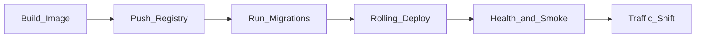

# How to Deploy a Service

> **Volume:** 3 | **Chapter ID:** v3-19 | **Status:** reviewed

## What You Will Accomplish

You will deploy an EPB service to a target environment (staging or production) using container images, Kubernetes manifests, and a safe rollout sequence that includes database migrations and health verification.

## Prerequisites

- All tests pass: unit, integration, and (for releases) E2E — see [Unit Testing Guide](16-unit-testing-guide.md)
- [CI/CD Integration](25-cicd-integration.md) pipeline builds and publishes images
- [Production Readiness](26-production-readiness.md) checklist completed for first deploy
- Access to container registry and cluster credentials
- Familiarity with [Environment Configuration](27-environment-configuration.md) and [Secrets Management](28-secrets-management.md)

## Deployment Flow



## Steps

### Step 1: Confirm release artifact

Identify the image tag to deploy. Production deploys use immutable tags — never `latest`.

```bash
# List recent images built by CI
gh run list --workflow=ci.yml --limit 5

# Expected tag format
# registry.example.com/epb/catalog:1.4.2+abc1234
```

Record:

| Field | Example |
|-------|---------|
| Service | `catalog` |
| Version | `1.4.2` |
| Git SHA | `abc1234` |
| Target environment | `staging` |

**Expected result:** You have a specific image digest or semver tag from a green CI build.

### Step 2: Run pre-deploy checks

Before touching production:

```bash
# Verify tests passed on this commit
gh pr checks <pr-number>

# Confirm no pending migrations are untested
cd services/application/catalog
npm run migrate:status
```

Complete the [Release Checklist](78-release-checklist.md) for production deploys.

**Expected result:** All CI checks green; migration status shows pending revisions (if any) reviewed.

### Step 3: Apply database migrations

Run migrations **before** deploying new application code when changes are backward-compatible. For breaking schema changes, follow expand-contract pattern from [Entity Standards](../Volume-1-Foundation/16-entity-standards.md).

```bash
# Staging example using migration job
kubectl apply -f infrastructure/k8s/jobs/catalog-migrate.yaml

kubectl wait --for=condition=complete job/catalog-migrate -n epb-staging --timeout=300s
kubectl logs job/catalog-migrate -n epb-staging
```

Migration job must:

1. Use the same image tag as the deployment
2. Connect via secrets from the vault — not hardcoded URLs
3. Exit non-zero on failure (blocks deploy)

**Expected result:** Migration job completes with `Completed` status.

### Step 4: Update deployment manifest

Edit the environment-specific manifest:

```bash
# infrastructure/k8s/environments/staging/catalog/deployment.yaml
```

Key fields:

```yaml
spec:
  replicas: 2
  template:
    spec:
      containers:
        - name: catalog
          image: registry.example.com/epb/catalog:1.4.2+abc1234
          env:
            - name: ENVIRONMENT
              value: staging
          envFrom:
            - secretRef:
                name: catalog-secrets
          readinessProbe:
            httpGet:
              path: /ready
              port: 8085
            initialDelaySeconds: 10
            periodSeconds: 5
          livenessProbe:
            httpGet:
              path: /health
              port: 8085
```

**Expected result:** Manifest references the correct image tag and probe paths.

### Step 5: Deploy with rolling update

Apply the manifest:

```bash
kubectl apply -f infrastructure/k8s/environments/staging/catalog/ -n epb-staging

kubectl rollout status deployment/catalog -n epb-staging --timeout=300s
```

Kubernetes performs a rolling update: new pods start, pass readiness, then old pods terminate.

Monitor during rollout:

```bash
kubectl get pods -n epb-staging -l app=catalog -w
```

**Expected result:** `deployment "catalog" successfully rolled out`.

### Step 6: Verify health and smoke tests

After rollout:

```bash
# Direct service health (internal network)
kubectl exec -it deploy/bff-web -n epb-staging -- \
  curl -s http://catalog:8085/health

# Through BFF (external path)
curl -s https://api.staging.example.com/api/v1/resources?limit=1 \
  -H "Authorization: Bearer $STAGING_TOKEN" | jq .
```

Run automated smoke tests if available:

```bash
npm run smoke:staging -- --service=catalog
```

**Expected result:** Health endpoints return `UP`; smoke test creates and reads a test resource.

### Step 7: Update BFF and gateway routing

If this is a new service or port change, update BFF service routes:

```typescript
// apps/bff-web/config/services.ts
catalog: process.env.CATALOG_SERVICE_URL ?? 'http://catalog:8085',
```

Redeploy BFF only if routing changed. Existing services with unchanged contracts do not require BFF redeploy.

**Expected result:** BFF proxies requests to the new service version.

### Step 8: Monitor and validate

Watch dashboards for 15–30 minutes after deploy:

| Signal | Healthy | Investigate |
|--------|---------|-------------|
| Error rate | Flat or lower | Spike > 1% |
| P95 latency | Within SLO | > 2x baseline |
| Pod restarts | 0 | Any restart loop |
| DLQ depth | 0 or stable | Growing queue |

```bash
kubectl logs -l app=catalog -n epb-staging --since=10m | grep ERROR
```

**Expected result:** No elevated error rate; no crash loops.

### Step 9: Roll back if needed

If smoke tests or monitoring fail:

```bash
kubectl rollout undo deployment/catalog -n epb-staging
kubectl rollout status deployment/catalog -n epb-staging
```

Database rollbacks require a forward-fix migration — never downgrade schema in production without a planned migration.

**Expected result:** Previous known-good revision serves traffic again.

### Step 10: Record the deployment

Log the deployment in your change management system:

- Service name and version
- Environment
- Deployer and timestamp
- Migration revision applied
- Link to release notes

**Expected result:** Audit trail exists for compliance and incident correlation.

## Verification

- [ ] Image tag is immutable and traceable to a git commit
- [ ] Migrations applied successfully before or during rollout
- [ ] Readiness and liveness probes configured
- [ ] Rolling update completed without pod crash loops
- [ ] Smoke tests pass through BFF
- [ ] Error rate and latency within SLO for 15+ minutes
- [ ] Deployment recorded with version and timestamp
- [ ] Rollback procedure tested in staging

## Troubleshooting

| Symptom | Cause | Fix |
|---------|-------|-----|
| `CrashLoopBackOff` | Missing env var or bad secret | Check pod logs; verify `secretRef` |
| Readiness probe failing | Database not reachable | Verify network policy and `DATABASE_URL` |
| 502 from BFF | Service DNS or port mismatch | Confirm `CATALOG_SERVICE_URL` and service port |
| Migration job timeout | Long-running DDL | Run during maintenance window; use concurrent indexes |
| Rollout stuck | Insufficient cluster resources | Scale node pool or reduce `maxSurge` |
| Old version still serving | Ingress cache or stale pods | Force rollout restart; check ingress weights |

## Reference

| Topic | Location |
|-------|----------|
| K8s manifests | `infrastructure/k8s/` |
| Health probes | [Health Check Implementation](57-health-check-implementation.md) |
| Migrations | [Database Migrations](29-database-migrations.md) |
| CI/CD pipeline | [CI/CD Integration](25-cicd-integration.md) |
| Release process | [Release Checklist](78-release-checklist.md) |
| Production checklist | [Checklists/production-readiness.md](../Checklists/production-readiness.md) |

## Related Chapters

- [Previous: E2E Testing Guide](18-e2e-testing-guide.md)
- [Next: Performance Tuning](20-performance-tuning.md)
- [Production Readiness](26-production-readiness.md)
- [EPB Glossary](../docs/GLOSSARY.md)

---

*Enterprise Platform Blueprint — Volume 3*
