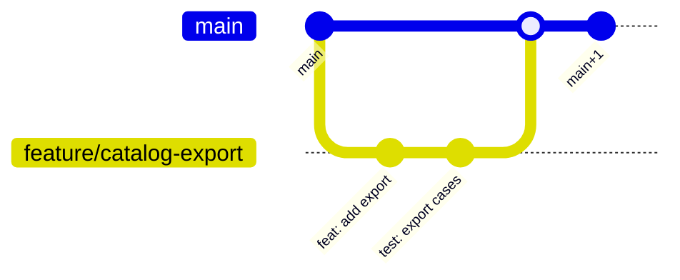

# How to Follow the Git Workflow

> **Volume:** 3 | **Chapter ID:** v3-24 | **Status:** reviewed

## What You Will Accomplish

You will use the EPB Git workflow to branch, commit, review, and merge changes safely in the monorepo. When finished, your work follows team conventions for branch naming, commit messages, and pull request hygiene.

## Prerequisites

- [Project Setup](01-project-setup.md) completed with repository access
- Git 2.40+ configured with your name and email (local config only — do not change repo git config)
- Familiarity with [Development Workflow](../Volume-1-Foundation/26-development-workflow.md)

## Branch Model

EPB uses trunk-based development with short-lived feature branches.



| Branch | Purpose | Lifetime |
|--------|---------|----------|
| `main` | Production-ready code | Permanent |
| `feature/<ticket>-<description>` | New features | Days |
| `fix/<ticket>-<description>` | Bug fixes | Hours to days |
| `chore/<description>` | Tooling, deps, docs | Hours |
| `release/<version>` | Release stabilization (optional) | Days |

Never commit directly to `main`. All changes go through pull requests.

## Steps

### Step 1: Sync with main

Start every task from an up-to-date `main`:

```bash
git checkout main
git pull origin main
```

**Expected result:** `git status` shows `Your branch is up to date with 'origin/main'`.

### Step 2: Create a feature branch

Use the ticket ID and a short kebab-case description:

```bash
git checkout -b feature/EPB-142-catalog-export
```

Naming rules:

- Lowercase, hyphen-separated
- Include ticket or issue ID when available
- Max 60 characters
- No personal names or dates

**Expected result:** `git branch --show-current` shows your new branch.

### Step 3: Make focused commits

Commit logical units of work. Each commit should build and pass unit tests.

Conventional commit format:

```text
<type>(<scope>): <short description>

[optional body]

[optional footer: EPB-142]
```

| Type | When to use |
|------|-------------|
| `feat` | New capability |
| `fix` | Bug fix |
| `refactor` | Code change without behavior change |
| `test` | Adding or fixing tests |
| `docs` | Documentation only |
| `chore` | Tooling, dependencies |

Examples:

```bash
git add services/application/catalog/domain/services/export.service.ts
git commit -m "feat(catalog): add CSV export for resources"

git add services/application/catalog/tests/unit/export.service.test.ts
git commit -m "test(catalog): cover export validation edge cases"
```

**Expected result:** `git log --oneline -3` shows atomic, well-described commits.

### Step 4: Keep branch current

Rebase onto `main` daily or before opening a PR:

```bash
git fetch origin
git rebase origin/main
```

If conflicts occur:

```bash
# Fix conflicts in files
git add <resolved-files>
git rebase --continue
```

Do not merge `main` into your branch with merge commits unless your team explicitly allows it.

**Expected result:** Branch contains your commits on top of latest `main`.

### Step 5: Run local checks before push

```bash
make lint
make test-unit
# If you changed APIs or persistence:
make test-integration
```

Fix failures before pushing. CI is a gate, not a debugger.

**Expected result:** All local checks pass.

### Step 6: Push and open a pull request

```bash
git push -u origin feature/EPB-142-catalog-export
```

Open a PR with:

| Field | Content |
|-------|---------|
| Title | Same as primary commit message |
| Description | What changed, why, how to test |
| Linked issue | `Closes EPB-142` |
| Reviewers | At least one domain owner |
| Labels | `feature`, service name |

PR size guidance: under 400 lines changed when possible. Split large features into stacked PRs.

**Expected result:** PR opens with CI checks running automatically.

### Step 7: Address review feedback

Respond to comments with new commits (do not force-push unless asked):

```bash
git add <files>
git commit -m "fix(catalog): handle empty export result set"
git push
```

Mark resolved threads in the PR UI. Re-request review when ready.

**Expected result:** All review comments addressed; CI still green.

### Step 8: Merge to main

After approval and green CI:

1. Squash merge for feature branches (one commit on `main`)
2. Merge commit for release branches (preserve history)
3. Delete the remote branch after merge

```bash
# After merge (via UI or CLI)
git checkout main
git pull origin main
git branch -d feature/EPB-142-catalog-export
```

**Expected result:** `main` contains your change; feature branch deleted.

### Step 9: Verify post-merge CI

Watch the post-merge pipeline on `main`:

```bash
gh run list --branch main --limit 3
```

If `main` breaks, fix forward immediately — do not revert without team discussion.

**Expected result:** Post-merge CI passes including integration tests.

## Verification

- [ ] Branch created from latest `main` with correct naming
- [ ] Commits follow conventional commit format
- [ ] Local lint and tests pass before push
- [ ] PR has description, linked issue, and reviewer
- [ ] Code review checklist completed ([Code Review Checklist](22-code-review-checklist.md))
- [ ] CI green before merge
- [ ] Branch deleted after merge
- [ ] Post-merge CI passes

## Troubleshooting

| Symptom | Cause | Fix |
|---------|-------|-----|
| Rebase conflicts on `shared-contracts` | Parallel DTO changes | Coordinate with other PR author; merge contracts first |
| CI fails only on PR | Missing env in CI | Check workflow env vars; reproduce with `act` locally |
| Force-push rejected | Branch protection | Use regular push; open new PR if history is messy |
| Large PR hard to review | Feature too broad | Split into smaller PRs with clear dependency order |
| Accidental commit to `main` | Skipped branch | `git revert` the commit; never force-push `main` |

## Reference

| Topic | Location |
|-------|----------|
| Code review | [Code Review Checklist](22-code-review-checklist.md) |
| CI pipeline | [CI/CD Integration](25-cicd-integration.md) |
| Naming | [Naming Standards Reference](23-naming-standards-reference.md) |
| Release | [Release Checklist](78-release-checklist.md) |

## Related Chapters

- [Previous: Naming Standards Reference](23-naming-standards-reference.md)
- [Next: CI/CD Integration](25-cicd-integration.md)
- [Development Workflow](../Volume-1-Foundation/26-development-workflow.md)
- [EPB Glossary](../docs/GLOSSARY.md)

---

*Enterprise Platform Blueprint — Volume 3*
