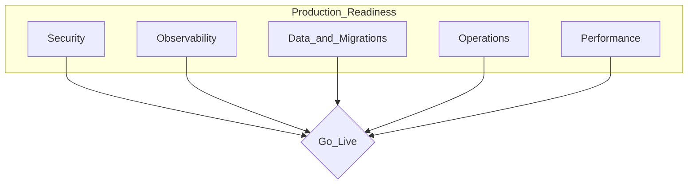

# How to Achieve Production Readiness

> **Volume:** 3 | **Chapter ID:** v3-26 | **Status:** reviewed

## What You Will Accomplish

You will validate that a service or release meets EPB production readiness criteria before it serves real tenant traffic. When finished, you have evidence that security, observability, resilience, and operational procedures are in place.

## Prerequisites

- Service deployed to staging per [Deployment Guide](19-deployment-guide.md)
- [CI/CD Integration](25-cicd-integration.md) pipeline green on the release commit
- Access to staging environment, monitoring dashboards, and secrets manager
- [Production Readiness Checklist](../Checklists/production-readiness.md) printed or open

## Readiness Domains



## Steps

### Step 1: Verify API contract and documentation

Every public endpoint (via BFF) must be versioned and documented.

```bash
# Confirm OpenAPI spec exists and validates
npm run openapi:validate -- --service=catalog

# Check version prefix on all routes
curl -s https://api.staging.example.com/api/v1/resources | head
```

Checklist:

- [ ] All routes under `/api/v1/` (or current version)
- [ ] OpenAPI spec published and matches implementation
- [ ] Breaking changes documented in changelog
- [ ] Deprecation headers on sunset endpoints

**Expected result:** API documentation is current and versioned.

### Step 2: Validate authentication and authorization

```bash
# Unauthenticated request returns 401
curl -s -o /dev/null -w "%{http_code}" \
  https://api.staging.example.com/api/v1/resources
# Expected: 401

# Insufficient role returns 403
curl -s -o /dev/null -w "%{http_code}" \
  -H "Authorization: Bearer $VIEWER_TOKEN" \
  -X DELETE https://api.staging.example.com/api/v1/resources/123
# Expected: 403
```

Verify:

- [ ] Every endpoint requires valid token (except `/health`)
- [ ] Role-based access enforced at BFF and service
- [ ] Service-to-service calls use mTLS or signed tokens
- [ ] Token expiry and refresh documented

**Expected result:** Unauthenticated and unauthorized requests are rejected.

### Step 3: Confirm multi-tenant isolation

Run cross-tenant tests in staging:

```bash
npm run test:tenant-isolation -- --env=staging
```

Manual verification:

1. Create resource as Tenant A
2. Attempt read as Tenant B — expect `404`
3. Verify database queries include `tenant_id` filter (code review + query log)

**Expected result:** No cross-tenant data leakage in API or database queries.

### Step 4: Verify error handling and logging

Trigger known error conditions and inspect responses:

| Trigger | Expected response | Expected log |
|---------|-------------------|--------------|
| Invalid JSON body | 400 + `VALIDATION_ERROR` | WARN with correlation ID |
| Unknown resource ID | 404 + `RESOURCE_NOT_FOUND` | INFO |
| Downstream timeout | 503 + `SERVICE_UNAVAILABLE` | ERROR with stack trace |

```bash
kubectl logs -l app=catalog -n epb-staging --since=5m | jq 'select(.level=="ERROR")'
```

Checklist:

- [ ] Client responses never expose stack traces
- [ ] Server logs include `correlationId`, `tenantId`, `userId`
- [ ] Error format matches [Error Handling](../Volume-1-Foundation/19-error-handling.md)

**Expected result:** Errors are safe for clients and rich for operators.

### Step 5: Configure health probes and metrics

```bash
# Liveness
curl -s http://catalog:8085/health

# Readiness (checks DB + broker)
curl -s http://catalog:8085/ready
```

Verify in Kubernetes manifests:

- [ ] `livenessProbe` on `/health`
- [ ] `readinessProbe` on `/ready`
- [ ] Prometheus metrics exposed on `/metrics`
- [ ] Dashboards exist for request rate, error rate, latency (p50/p95/p99)
- [ ] Alerts configured for error rate > 1% and p95 > SLO

**Expected result:** Monitoring dashboards show live staging traffic with alerts armed.

### Step 6: Validate database and migrations

```bash
# Migration is reversible or has forward-fix plan
cd services/application/catalog
npm run migrate:status

# Backup verified in last 24 hours
# (check your backup system's last-success timestamp)
```

Checklist:

- [ ] Migrations tested on staging before production
- [ ] Rollback plan documented (forward-fix migration, not down)
- [ ] Backup and restore tested within last quarter
- [ ] Connection pooling configured; no unbounded pool size
- [ ] Indexes exist on `tenant_id` and common query columns

**Expected result:** Database is backed up; migrations are idempotent and tested.

### Step 7: Confirm secrets and configuration

```bash
# Secrets NOT in repo
git log --all -p -- '*.env' | head   # should be empty or only .env.example

# Secrets in vault
kubectl get secret catalog-secrets -n epb-staging -o jsonpath='{.data}' | wc -c
```

Checklist:

- [ ] No secrets in source control or container images
- [ ] Secrets loaded from vault at runtime
- [ ] Environment-specific config via env vars, not hardcoded
- [ ] Feature flags configured for gradual rollout

**Expected result:** `git grep -i password` returns only examples and test fixtures.

### Step 8: Run load and security tests

```bash
# Load test (example with k6)
k6 run tests/load/catalog-read.js --env STAGING_URL=https://api.staging.example.com

# Security scan
npm audit --audit-level=high
trivy image registry.example.com/epb/catalog:$VERSION
```

Thresholds:

| Test | Pass criteria |
|------|---------------|
| Load test | p95 < SLO at 2x expected peak traffic |
| Dependency audit | No HIGH or CRITICAL vulnerabilities |
| Container scan | No CRITICAL vulnerabilities |
| OWASP ZAP (optional) | No high-risk findings on BFF |

**Expected result:** Load test report archived; security scans clean.

### Step 9: Complete operational readiness

- [ ] Runbook written: startup, shutdown, common failures, escalation
- [ ] On-call rotation includes service owner
- [ ] Rate limiting configured on BFF public endpoints
- [ ] DLQ monitored for failed events
- [ ] Data retention policy documented

Runbook location: `docs/runbooks/catalog.md`

**Expected result:** On-call engineer can diagnose top three failure modes from the runbook alone.

### Step 10: Sign off

Complete the [Production Readiness Checklist](../Checklists/production-readiness.md) and obtain sign-off:

| Role | Signs off on |
|------|-------------|
| Service owner | Functionality, tests, runbook |
| Platform lead | Architecture, shared dependencies |
| Security | Auth, secrets, scan results |
| SRE / Ops | Monitoring, alerts, deploy procedure |

**Expected result:** Signed checklist attached to the release ticket.

## Verification

- [ ] All items in [Production Readiness Checklist](../Checklists/production-readiness.md) checked
- [ ] Auth, tenant isolation, and error handling verified in staging
- [ ] Health probes, metrics, and alerts operational
- [ ] Migrations tested; backup verified
- [ ] Secrets in vault only
- [ ] Load and security tests passed
- [ ] Runbook published; on-call briefed
- [ ] Sign-off recorded from required roles

## Troubleshooting

| Symptom | Cause | Fix |
|---------|-------|-----|
| Readiness probe flaps | Slow DB connection on cold start | Increase `initialDelaySeconds`; add connection warmup |
| Missing metrics | `/metrics` not exposed or scraped | Add ServiceMonitor; verify Prometheus target |
| Load test fails early | Rate limiting | Raise limit for test IP or use internal endpoint |
| Security scan false positive | Base image CVE | Update base image; document accepted risk with expiry |
| Sign-off blocked | Missing runbook | Draft from staging incident history; iterate |

## Reference

| Topic | Location |
|-------|----------|
| Production checklist | [Checklists/production-readiness.md](../Checklists/production-readiness.md) |
| Security checklist | [Checklists/security-checklist.md](../Checklists/security-checklist.md) |
| Health checks | [Health Check Implementation](57-health-check-implementation.md) |
| Secrets | [Secrets Management](28-secrets-management.md) |
| Release | [Release Checklist](78-release-checklist.md) |

## Related Chapters

- [Previous: CI/CD Integration](25-cicd-integration.md)
- [Next: Environment Configuration](27-environment-configuration.md)
- [Deployment Guide](19-deployment-guide.md)
- [EPB Glossary](../docs/GLOSSARY.md)

---

*Enterprise Platform Blueprint — Volume 3*
