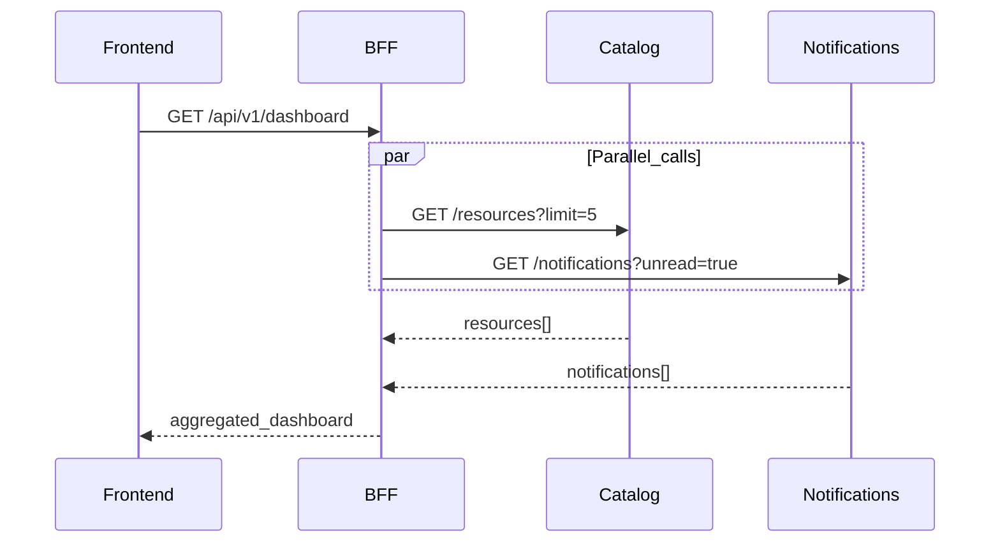

# How to Implement BFF Aggregation Patterns

> **Volume:** 3 | **Chapter ID:** v3-44 | **Status:** reviewed

## What You Will Accomplish

You will implement BFF (Backend For Frontend) endpoints that aggregate data from multiple platform and application services into a single client response. When finished, frontends make one HTTP call per screen while the BFF handles parallel service calls, error mapping, and response shaping.

## Prerequisites

- [BFF Layer](../Volume-1-Foundation/08-bff-layer.md) concepts understood
- BFF project at `apps/bff-web/` running locally
- At least two backend services available (e.g., identity, catalog, notifications)
- Familiarity with [API Standards](../Volume-1-Foundation/18-api-standards.md) and [Model Separation](../Volume-1-Foundation/11-model-separation.md)

## Aggregation Patterns

| Pattern | When to use | Example |
|---------|-------------|---------|
| **Parallel fan-out** | Independent data for one screen | Dashboard: resources + notifications + tasks |
| **Sequential chain** | Later call depends on earlier result | Resource detail + owner profile (need owner ID first) |
| **Partial success** | Non-critical sections can fail | Dashboard shows resources even if notifications are down |
| **Write fan-out** | One user action updates multiple services | Create resource + send notification + audit log |



## Steps

### Step 1: Define the screen contract

Start from the frontend need — not from existing service APIs. Document the BFF response shape:

```typescript
// packages/shared-contracts/bff/dashboard.response.ts
export interface DashboardResponse {
  recentResources: ResourceSummary[];
  unreadNotifications: NotificationSummary[];
  pendingTaskCount: number;
}
```

The BFF owns this contract. Backend services keep their own DTOs; mappers translate between them.

**Expected result:** Response DTO exists in `shared-contracts` before implementation.

### Step 2: Create the BFF route and controller

```typescript
// apps/bff-web/api/routes/dashboard.routes.ts
router.get('/api/v1/dashboard', authenticate, authorize('dashboard:read'), dashboardController.get);

// apps/bff-web/api/controllers/dashboard.controller.ts
export async function get(req: Request, res: Response) {
  const context = req.platformContext; // tenantId, userId, correlationId
  const data = await dashboardAggregator.fetch(context);
  return res.json({ success: true, data });
}
```

**Expected result:** Route is registered; unauthenticated requests return 401.

### Step 3: Implement parallel fan-out

```typescript
// apps/bff-web/domain/aggregators/dashboard.aggregator.ts
export class DashboardAggregator {
  constructor(
    private catalogClient: CatalogClient,
    private notificationClient: NotificationClient,
    private schedulerClient: SchedulerClient,
  ) {}

  async fetch(ctx: PlatformContext): Promise<DashboardResponse> {
    const headers = buildForwardHeaders(ctx);

    const [resources, notifications, tasks] = await Promise.allSettled([
      this.catalogClient.getRecentResources(headers, { limit: 5 }),
      this.notificationClient.getUnread(headers),
      this.schedulerClient.getPendingCount(headers),
    ]);

    return {
      recentResources: unwrapOrEmpty(resources, []),
      unreadNotifications: unwrapOrEmpty(notifications, []),
      pendingTaskCount: unwrapOrDefault(tasks, 0),
    };
  }
}
```

Rules:

1. Use `Promise.all` when all sections are required
2. Use `Promise.allSettled` when partial success is acceptable
3. Forward `Authorization`, `X-Tenant-Id`, and `X-Correlation-Id` on every downstream call

**Expected result:** Aggregator completes in the time of the slowest call, not the sum.

### Step 4: Add circuit breakers and timeouts

```typescript
const catalogClient = new ResilientHttpClient({
  baseUrl: config.catalogServiceUrl,
  timeoutMs: 3000,
  circuitBreaker: { failureThreshold: 5, resetTimeoutMs: 30000 },
});
```

| Setting | Recommended |
|---------|-------------|
| Per-call timeout | 2–5 seconds |
| Circuit breaker threshold | 5 failures in 30 seconds |
| Retry | Idempotent GETs only, max 2 retries |

When a circuit is open, return degraded data (empty array) or a `503` if the section is critical.

**Expected result:** Slow or failing downstream service does not hang the BFF request.

### Step 5: Map service DTOs to BFF response

Keep mapping in `apps/bff-web/mappers/` — never return raw service DTOs to the frontend.

```typescript
// apps/bff-web/mappers/resource.mapper.ts
export function toResourceSummary(dto: CatalogResourceDto): ResourceSummary {
  return {
    id: dto.id,
    code: dto.code,
    name: dto.name,
    status: dto.status,
    updatedAt: dto.updatedAt,
    // Omit: tenantId, internalVersion, persistence fields
  };
}
```

**Expected result:** Frontend receives only fields defined in the BFF contract.

### Step 6: Handle errors consistently

```typescript
function unwrapOrEmpty<T>(result: PromiseSettledResult<T>, fallback: T): T {
  if (result.status === 'fulfilled') return result.value;
  logger.warn('Downstream call failed', {
    reason: result.reason,
    correlationId: getCorrelationId(),
  });
  return fallback;
}
```

| Downstream status | BFF behavior |
|-------------------|--------------|
| 400 | Return 400 with mapped validation errors |
| 401 / 403 | Return same status (auth already checked at BFF) |
| 404 (required data) | Return 404 |
| 404 (optional section) | Return empty section |
| 500 / timeout | Degrade or return 503 |

**Expected result:** Client never sees raw downstream error messages or stack traces.

### Step 7: Implement write fan-out (if needed)

For mutations that touch multiple services, use saga-style orchestration:

```typescript
async createResourceWithNotification(ctx: PlatformContext, input: CreateResourceRequest) {
  const resource = await this.catalogClient.create(ctx, input);
  try {
    await this.notificationClient.send(ctx, {
      type: 'RESOURCE_CREATED',
      resourceId: resource.id,
    });
  } catch (err) {
    // Compensate or queue for retry — do not silently fail
    await this.outbox.enqueue('NotificationFailed', { resourceId: resource.id });
    logger.error('Notification failed after resource created', { err });
  }
  return resource;
}
```

Never call services in a loop synchronously — batch or parallelize reads; use events for non-critical side effects.

**Expected result:** Primary mutation succeeds even if secondary notification fails; failure is logged and retried.

### Step 8: Add caching for read-heavy endpoints

```typescript
const cacheKey = `dashboard:${ctx.tenantId}:${ctx.userId}`;
const cached = await redis.get(cacheKey);
if (cached) return JSON.parse(cached);

const data = await this.fetch(ctx);
await redis.set(cacheKey, JSON.stringify(data), 'EX', 60); // 60s TTL
return data;
```

Cache rules:

- Key includes `tenantId` — never cache across tenants
- Short TTL (30–120 seconds) for aggregated reads
- Invalidate on mutations that affect the cached view

**Expected result:** Repeated dashboard loads within TTL skip downstream calls.

### Step 9: Test the aggregator

Unit test the aggregator with mocked clients:

```typescript
it('returns partial dashboard when notifications are down', async () => {
  catalogClient.getRecentResources.mockResolvedValue([mockResource]);
  notificationClient.getUnread.mockRejectedValue(new Error('timeout'));

  const result = await aggregator.fetch(testContext);

  expect(result.recentResources).toHaveLength(1);
  expect(result.unreadNotifications).toEqual([]);
});
```

Add integration test through BFF HTTP endpoint per [Integration Testing Guide](17-integration-testing-guide.md).

**Expected result:** Aggregator handles partial failure without throwing.

## Verification

- [ ] BFF response DTO defined in `shared-contracts`
- [ ] Independent downstream calls run in parallel
- [ ] Correlation ID and tenant ID forwarded on all calls
- [ ] Timeouts and circuit breakers configured
- [ ] Service DTOs mapped to BFF response — no leakage of internal fields
- [ ] Partial failure handled gracefully
- [ ] Cache keys are tenant-scoped
- [ ] Unit tests cover success, partial failure, and timeout paths

## Troubleshooting

| Symptom | Cause | Fix |
|---------|-------|-----|
| High latency | Sequential calls | Switch to `Promise.all` / `allSettled` |
| N+1 downstream calls | Loop over IDs | Add batch endpoint to backend service |
| Stale dashboard data | Cache TTL too long | Reduce TTL; invalidate on mutation |
| 502 for all users | Circuit breaker open | Fix downstream; wait for reset or manually close |
| Tenant data leak in cache | Missing tenant in cache key | Include `tenantId` and `userId` in key |
| Business logic in BFF | Validation in aggregator | Move rules to domain service |

## Reference

| Topic | Location |
|-------|----------|
| BFF standards | [BFF Layer](../Volume-1-Foundation/08-bff-layer.md) |
| BFF service config | `apps/bff-web/config/services.ts` |
| Shared contracts | `packages/shared-contracts/bff/` |
| Frontend wiring | [Frontend Integration](45-frontend-integration.md) |
| Error mapping | [Error Handling](../Volume-1-Foundation/19-error-handling.md) |

## Related Chapters

- [Previous: Master Data Integration](43-master-data-integration.md)
- [Next: Frontend Integration](45-frontend-integration.md)
- [Authentication Integration](46-authentication-integration.md)
- [EPB Glossary](../docs/GLOSSARY.md)

---

*Enterprise Platform Blueprint — Volume 3*
