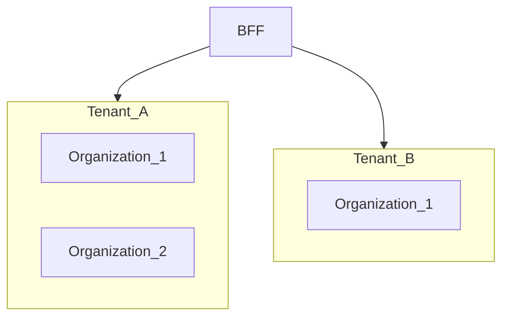

# How to Set Up Multi-Tenant Isolation

> **Volume:** 3 | **Chapter ID:** v3-48 | **Status:** reviewed

## What You Will Accomplish

You will configure tenant isolation across the BFF, application services, and database so each tenant's data is invisible to others. When finished, every query is scoped by tenant context, and cross-tenant access attempts return `404`.

## Prerequisites

- [Project Setup](01-project-setup.md) and [Create New Service](04-create-new-service.md) completed
- [Authentication Integration](46-authentication-integration.md) and [Authorization Integration](47-authorization-integration.md) configured
- Familiarity with [Entity Standards](../Volume-1-Foundation/16-entity-standards.md)

## Tenant Model

A **tenant** is an isolated organizational partition in a multi-tenant deployment. Each tenant has its own users, resources, and configuration. An **organization** is a hierarchy within a tenant (departments, branches).



## Steps

### Step 1: Define tenant context propagation

Tenant ID is extracted from the authenticated token at the BFF — never from client request body.

```typescript
// apps/bff-web/middleware/tenant-context.ts
export function extractTenantContext(req: Request): PlatformContext {
  const claims = validateToken(req.headers.authorization);
  return {
    tenantId: claims.tenant_id,    // from JWT — not from body
    userId: claims.sub,
    organizationId: claims.org_id, // optional hierarchy scope
    correlationId: req.headers['x-correlation-id'] ?? generateId(),
  };
}
```

Forward to downstream services:

```typescript
const headers = {
  Authorization: req.headers.authorization,
  'X-Tenant-Id': context.tenantId,
  'X-Correlation-Id': context.correlationId,
};
```

**Expected result:** Every downstream call carries `X-Tenant-Id` from the token.

### Step 2: Reject client-supplied tenant IDs

Strip `tenantId` from request DTOs. Clients must not choose their tenant.

```typescript
// Request DTO — no tenantId field
export interface CreateResourceRequest {
  code: string;
  name: string;
  // tenantId: NEVER include this
}

// Controller — inject from context
async create(req: Request) {
  const { tenantId, userId } = req.platformContext;
  return this.service.create(req.body, tenantId, userId);
}
```

Add validation middleware that rejects requests with `tenantId` in body or query string.

**Expected result:** `POST` with `{ "tenantId": "other-tenant" }` in body is ignored or rejected.

### Step 3: Add tenant_id to persistence entities

Every table that stores tenant-owned data includes `tenant_id`:

```sql
CREATE TABLE resources (
  id            UUID PRIMARY KEY DEFAULT gen_random_uuid(),
  tenant_id     UUID NOT NULL,
  code          VARCHAR(64) NOT NULL,
  name          VARCHAR(256) NOT NULL,
  status        VARCHAR(32) NOT NULL DEFAULT 'ACTIVE',
  created_at    TIMESTAMPTZ NOT NULL DEFAULT now(),
  created_by    UUID NOT NULL,
  updated_at    TIMESTAMPTZ NOT NULL DEFAULT now(),
  updated_by    UUID NOT NULL,
  version       INT NOT NULL DEFAULT 1,
  deleted_at    TIMESTAMPTZ,
  UNIQUE (tenant_id, code)   -- uniqueness scoped to tenant
);

CREATE INDEX idx_resources_tenant_id ON resources (tenant_id);
CREATE INDEX idx_resources_tenant_status ON resources (tenant_id, status);
```

**Expected result:** Migration creates `tenant_id` column with composite unique constraints.

### Step 4: Enforce tenant filter in every query

Repository layer must always filter by tenant — no unscoped queries.

```typescript
// persistence/repositories/resource.repository.ts
async findById(id: string, tenantId: string): Promise<ResourceEntity | null> {
  return this.db.queryOne(
    'SELECT * FROM resources WHERE id = $1 AND tenant_id = $2 AND deleted_at IS NULL',
    [id, tenantId]
  );
}

async list(tenantId: string, filters: ListFilters): Promise<ResourceEntity[]> {
  return this.db.query(
    'SELECT * FROM resources WHERE tenant_id = $1 AND deleted_at IS NULL ORDER BY created_at DESC LIMIT $2',
    [tenantId, filters.limit]
  );
}
```

Use a repository base class or ORM global filter to prevent accidental unscoped access.

**Expected result:** `findById` with wrong `tenantId` returns `null`.

### Step 5: Validate tenant at the service layer

Defense in depth — service layer verifies tenant context is present:

```typescript
async getById(id: string, tenantId: string): Promise<Resource> {
  if (!tenantId) throw new AppError('UNAUTHORIZED', 'Missing tenant context');

  const entity = await this.repository.findById(id, tenantId);
  if (!entity) throw new AppError('RESOURCE_NOT_FOUND', `Resource ${id} not found`);

  return this.mapper.toDomain(entity);
}
```

Return `404` for cross-tenant access — not `403` — to avoid leaking resource existence.

**Expected result:** Cross-tenant ID lookup returns `RESOURCE_NOT_FOUND`.

### Step 6: Scope events and audit logs

Every published event and audit record includes `tenantId`:

```typescript
await this.eventPublisher.publish({
  type: 'ResourceCreated',
  tenantId,
  data: { resourceId: resource.id, code: resource.code },
  correlationId: context.correlationId,
});
```

Audit service queries must also filter by `tenant_id`. Platform audit is tenant-scoped by default.

**Expected result:** Event payloads and audit records contain `tenantId`.

### Step 7: Configure tenant-scoped caching

Cache keys must include tenant ID:

```typescript
const cacheKey = `resource:${tenantId}:${resourceId}`;
// NOT: `resource:${resourceId}`
```

Redis databases or key prefixes per tenant are optional for large deployments. Key-level isolation is mandatory.

**Expected result:** Tenant A's cached data is never served to Tenant B.

### Step 8: Add tenant isolation tests

Unit test:

```typescript
it('does not return resource from another tenant', async () => {
  repository.seed({ id: 'r1', tenantId: 'tenant-a' });
  await expect(service.getById('r1', 'tenant-b')).rejects.toMatchObject({
    code: 'RESOURCE_NOT_FOUND',
  });
});
```

Integration test:

```typescript
it('returns 404 for cross-tenant resource access', async () => {
  const tokenA = issueTestToken({ tenantId: 'tenant-a' });
  const tokenB = issueTestToken({ tenantId: 'tenant-b' });
  const created = await createResource(tokenA, { code: 'ISO-001' });
  const response = await getResource(tokenB, created.id);
  expect(response.status).toBe(404);
});
```

**Expected result:** Both unit and integration tests verify isolation.

### Step 9: Provision a new tenant (platform operation)

Tenant creation is a platform operation — not an application API:

```bash
# Platform CLI or admin API
epb tenant create \
  --name "Acme Corp" \
  --slug acme \
  --admin-email admin@acme.example
```

Provisioning steps:

1. Create tenant record in identity service
2. Create default organization hierarchy
3. Assign admin user and roles
4. Seed tenant-specific configuration (feature flags, limits)
5. Verify isolation with smoke test

**Expected result:** New tenant can log in and sees only its own data.

### Step 10: Document tenant limits and configuration

Per-tenant configuration lives in the platform config service:

| Setting | Example |
|---------|---------|
| Max resources | 10,000 |
| API rate limit | 100 req/min |
| Feature flags | `{ "export": true }` |
| Data retention | 365 days |

**Expected result:** Tenant limits enforced at BFF (rate limit) and service (quota check).

## Verification

- [ ] Tenant ID extracted from token at BFF, not from client input
- [ ] `tenant_id` column on all tenant-owned tables with indexes
- [ ] Every repository query filters by `tenant_id`
- [ ] Cross-tenant access returns `404`
- [ ] Events and audit logs include `tenantId`
- [ ] Cache keys are tenant-scoped
- [ ] Unit and integration isolation tests pass
- [ ] Tenant provisioning documented and tested

## Troubleshooting

| Symptom | Cause | Fix |
|---------|-------|-----|
| User sees another tenant's data | Missing `tenant_id` filter | Audit all repository queries; add ORM global filter |
| 403 on own resources | Wrong tenant in token | Verify identity service issues correct `tenant_id` claim |
| Duplicate code across tenants fails | Global unique constraint | Change to `UNIQUE (tenant_id, code)` |
| Cache cross-tenant leak | Key missing tenant | Add `tenantId` to all cache keys |
| Background job processes wrong tenant | Missing tenant in job payload | Include `tenantId` in every job message |
| Migration missing `tenant_id` | New table without tenant column | Add migration; backfill from context |

## Reference

| Topic | Location |
|-------|----------|
| Entity schema | [Entity Standards](../Volume-1-Foundation/16-entity-standards.md) |
| Auth wiring | [Authentication Integration](46-authentication-integration.md) |
| Org hierarchy | [Organization Hierarchy Setup](49-organization-hierarchy-setup.md) |
| Testing | [Integration Testing Guide](17-integration-testing-guide.md) |
| API behavior | [API Standards](../Volume-1-Foundation/18-api-standards.md) |

## Related Chapters

- [Previous: Authorization Integration](47-authorization-integration.md)
- [Next: Organization Hierarchy Setup](49-organization-hierarchy-setup.md)
- [BFF Aggregation Patterns](44-bff-aggregation-patterns.md)
- [EPB Glossary](../docs/GLOSSARY.md)

---

*Enterprise Platform Blueprint — Volume 3*
