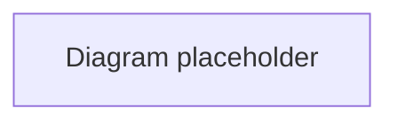

# {TITLE}

> **Volume:** {VOLUME} | **Chapter ID:** {ID} | **Status:** draft

## Purpose

{One paragraph: what this chapter covers and why it matters to platform builders.}

## Overview

{2-3 paragraphs introducing the topic in domain-neutral terms.}

## Architecture

{How this capability fits in the layered EPB architecture. Include Mermaid diagram when helpful.}

## Responsibilities

- {Responsibility 1}
- {Responsibility 2}
- {Responsibility 3}

## Design Principles

- {Principle aligned with EPB philosophy}
- {Principle aligned with EPB philosophy}

## Implementation Guidelines

{Concrete, framework-agnostic guidance.}

## Best Practices

1. {Practice}
2. {Practice}
3. {Practice}

## Anti-Patterns

| Anti-Pattern | Why It Fails | Preferred Approach |
|--------------|--------------|-------------------|
| {pattern} | {reason} | {fix} |

## Related Chapters

- [Previous: {prev}]({prev-link})
- [Next: {next}]({next-link})
- See also: {cross-refs}

---

*Enterprise Platform Blueprint — Volume {VOLUME}*
