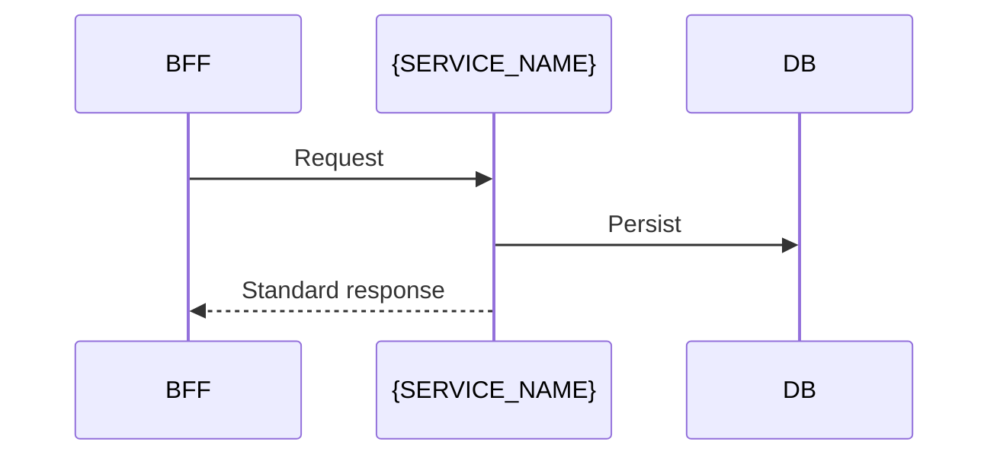

# {SERVICE_NAME} Platform Service

> **Volume:** 2 — Platform Services | **Chapter ID:** {ID} | **Status:** draft

## Purpose

{What problem this platform service solves. Domain-neutral.}

## Architecture

{Service boundaries, dependencies, deployment model.}

```mermaid
flowchart LR
  Client[BFF_or_Service] --> API[{SERVICE_NAME}_API]
  API --> DB[(Service_Database)]
  API --> Events[Event_Bus]
```

## Responsibilities

### In Scope

- {responsibility}

### Out of Scope

- {explicitly not this service's job}

## API Design

### Base Path

`/{service-name}/v1`

### Core Endpoints

| Method | Path | Description |
|--------|------|-------------|
| GET | /resources | List with pagination |
| POST | /resources | Create resource |

### Request/Response Standards

Follow [API Standards](../Volume-1-Foundation/18-api-standards.md) and [Error Handling](../Volume-1-Foundation/19-error-handling.md).

## Database Design

### Core Tables

| Table | Purpose |
|-------|---------|
| {table} | {purpose} |

### Ownership Rule

This service owns its data. No other service accesses this database directly.

## Folder Structure

```text
services/{service-name}/
├── api/
├── domain/
├── persistence/
├── mappers/
└── tests/
```

## Sequence Diagrams



## Extension Points

- {How consuming applications extend or configure this service}

## Integration

- **Events published:** {event types}
- **Events consumed:** {event types}
- **Dependencies:** {other platform services}

## Best Practices

1. {practice}
2. {practice}

## Anti-Patterns

| Anti-Pattern | Preferred Approach |
|--------------|-------------------|
| {bad} | {good} |

## Related Chapters

- [Previous]({prev})
- [Next]({next})

---

*Enterprise Platform Blueprint — Volume 2*
